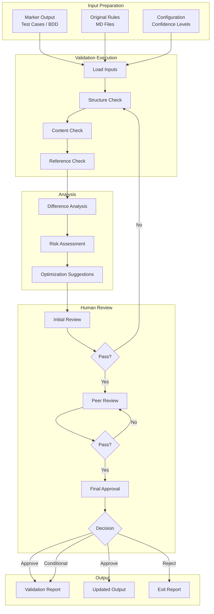
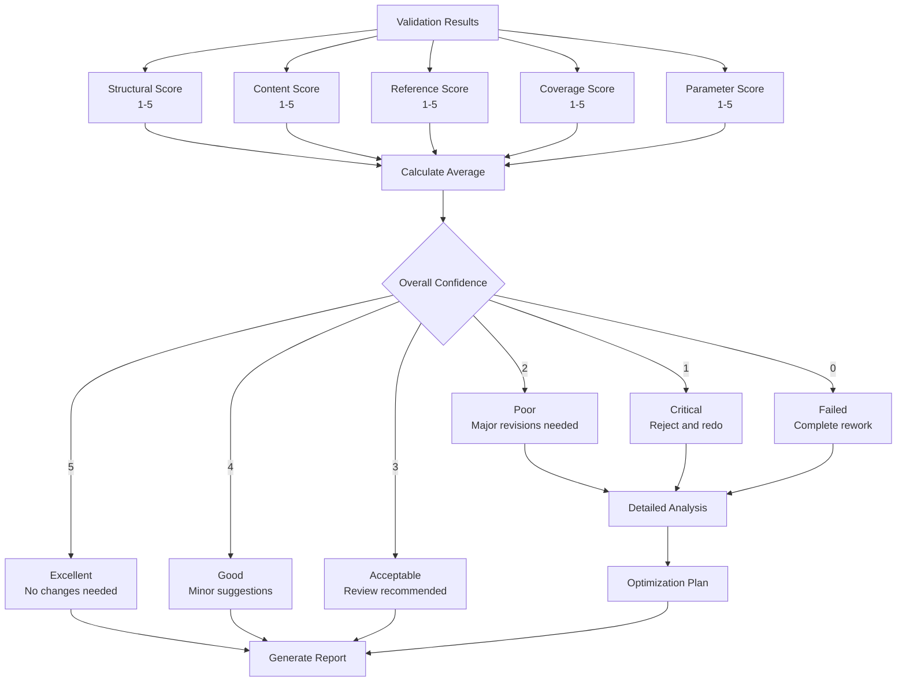
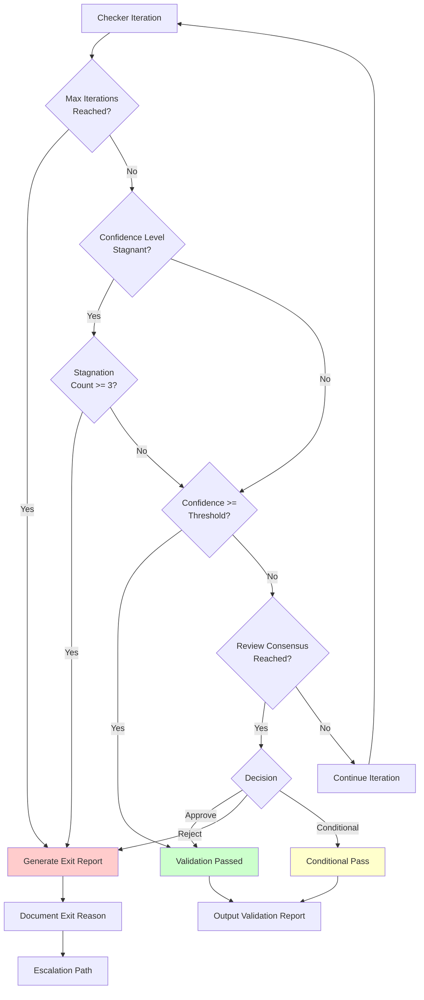
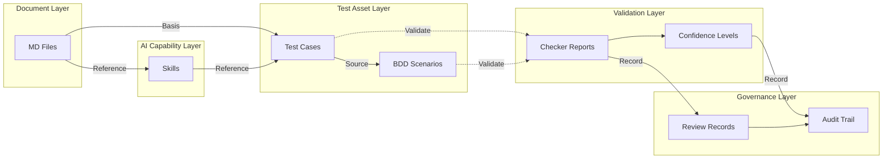
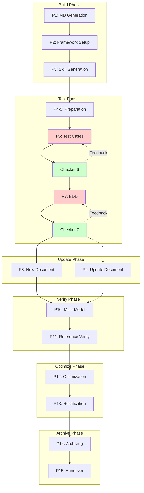

# Complete Prompt Workflow Flowchart

**Version**: 2.1.0
**Last Updated**: 2026-03-18
**Author**: System Administrator

## Overview

This document illustrates the complete workflow of all 15 prompts plus the LLM Checker System, showing dependencies, data flow, and validation checkpoints. This version includes enhanced monitoring, security, and parameterized configuration features.

## Complete System Architecture

```mermaid
graph TB
    subgraph "Source Documents"
        SRC[Initial Margin Calculation Guide HKv14<br/>(PDF, Word, Excel, Email, etc.)]
    end

    subgraph "Configuration & Monitoring"
        CFG[Configuration<br/>Parameterized Settings]
        MON[Monitoring System<br/>Real-time Tracking]
        SEC[Security Layer<br/>Access Control]
    end

    subgraph "Phase I: Knowledge Base Foundation"
        P1[Prompt 1<br/>MD Generation]
        P2[Prompt 2<br/>Framework Setup]
    end

    subgraph "Phase II: AI Capability & Test Assets"
        P3[Prompt 3<br/>Skill Generation]
        P4[Prompt 4<br/>BDD Framework]
        P5[Prompt 5<br/>Template Learning]
        P6[Prompt 6<br/>Test Case Generation<br/>⭐ MARKER]
        P7[Prompt 7<br/>BDD Generation<br/>⭐ MARKER]
    end

    subgraph "Validation Layer"
        CH6[Checker Prompt 6<br/>Test Case Validation]
        CH7[Checker Prompt 7<br/>BDD Validation]
    end

    subgraph "Phase III: Synchronization"
        P8[Prompt 8<br/>New Document Addition]
        P9[Prompt 9<br/>Document Update]
    end

    subgraph "Phase IV: Verification"
        P10[Prompt 10<br/>Multi-Model Verification]
        P11[Prompt 11<br/>Reference Verification]
    end

    subgraph "Phase V: Optimization"
        P12[Prompt 12<br/>Optimization Suggestions]
        P13[Prompt 13<br/>Rectification]
    end

    subgraph "Phase VI: Completion"
        P14[Prompt 14<br/>Version Archiving]
        P15[Prompt 15<br/>Handover]
    end

    SRC --> P1
    CFG --> P1
    CFG --> P2
    CFG --> P3
    CFG --> P4
    CFG --> P5
    CFG --> P6
    CFG --> P7
    CFG --> P8
    CFG --> P9
    CFG --> P10
    CFG --> P11
    CFG --> P12
    CFG --> P13
    CFG --> P14
    CFG --> P15

    P1 --> P2
    P2 --> P3
    P2 --> P4
    P4 --> P5
    P3 --> P6
    P5 --> P6
    P6 --> P7

    P6 -.->|Validate| CH6
    P7 -.->|Validate| CH7

    CH6 -.->|Feedback| P6
    CH7 -.->|Feedback| P7

    P7 --> P8
    P7 --> P9

    P8 --> P10
    P9 --> P10
    P10 --> P11
    P11 --> P12
    P12 --> P13
    P13 --> P14
    P14 --> P15

    P1 -.->|Monitor| MON
    P2 -.->|Monitor| MON
    P3 -.->|Monitor| MON
    P4 -.->|Monitor| MON
    P5 -.->|Monitor| MON
    P6 -.->|Monitor| MON
    P7 -.->|Monitor| MON
    P8 -.->|Monitor| MON
    P9 -.->|Monitor| MON
    P10 -.->|Monitor| MON
    P11 -.->|Monitor| MON
    P12 -.->|Monitor| MON
    P13 -.->|Monitor| MON
    P14 -.->|Monitor| MON
    P15 -.->|Monitor| MON

    P1 -.->|Secure| SEC
    P2 -.->|Secure| SEC
    P3 -.->|Secure| SEC
    P4 -.->|Secure| SEC
    P5 -.->|Secure| SEC
    P6 -.->|Secure| SEC
    P7 -.->|Secure| SEC
    P8 -.->|Secure| SEC
    P9 -.->|Secure| SEC
    P10 -.->|Secure| SEC
    P11 -.->|Secure| SEC
    P12 -.->|Secure| SEC
    P13 -.->|Secure| SEC
    P14 -.->|Secure| SEC
    P15 -.->|Secure| SEC

    MON -.->|Alert| SEC

    style P6 fill:#ffcccc
    style P7 fill:#ffcccc
    style CH6 fill:#ccffcc
    style CH7 fill:#ccffcc
    style CFG fill:#e6f3ff
    style MON fill:#fff4e6
    style SEC fill:#ffe6e6
```

## Phase I: Knowledge Base Foundation

```mermaid
graph LR
    subgraph "Input"
        PDF[Source Document<br/>(PDF, Word, Excel, Email, etc.)]
    end

    subgraph "Prompt 1"
        P1A[Document Analysis]
        P1B[Modular Splitting]
        P1C[Paragraph ID Assignment]
        P1D[MD File Generation]
    end

    subgraph "Output P1"
        MD1[Introduction-Overview.md]
        MD2[Risk-Parameter-File.md]
        MD3[Input-Data.md]
        MD4[Market-Risk.md]
        MD5[Margin-Adjustment.md]
        MD6[Other-Risk.md]
        MD7[Position-Processing.md]
        MD8[Collateral-Management.md]
        MD9[Corporate-Action.md]
        MD10[Calculation-Examples.md]
    end

    subgraph "Prompt 2"
        P2A[Directory Structure Creation]
        P2B[Configuration Generation]
        P2C[Template Preparation]
    end

    subgraph "Output P2"
        DIR[7-Layer Framework]
        CFG[Framework Config]
        TPL[Templates]
    end

    PDF --> P1A
    P1A --> P1B
    P1B --> P1C
    P1C --> P1D
    P1D --> MD1
    P1D --> MD2
    P1D --> MD3
    P1D --> MD4
    P1D --> MD5
    P1D --> MD6
    P1D --> MD7
    P1D --> MD8
    P1D --> MD9
    P1D --> MD10

    MD1 --> P2A
    MD2 --> P2A
    P2A --> P2B
    P2B --> P2C
    P2C --> DIR
    P2C --> CFG
    P2C --> TPL
```

## Phase II: AI Capability & Test Assets (with Checker)

```mermaid
graph TB
    subgraph "Input"
        MD[MD Files from P1]
        CFG[Framework from P2]
    end

    subgraph "Prompt 3: Skill Generation"
        P3A[Skill Definition]
        P3B[Reference Embedding]
        P3C[Script Generation]
    end

    subgraph "Prompt 4-5: Preparation"
        P4[BDD Framework Setup]
        P5[Template Learning]
    end

    subgraph "Prompt 6: Test Cases (MARKER)"
        P6A[Rule Analysis]
        P6B[Test Case Design]
        P6C[Reference Embedding]
        P6D[Test Case Output]
    end

    subgraph "Checker 6: Validation"
        C6A[Structure Validation]
        C6B[Content Validation]
        C6C[Reference Validation]
        C6D[Confidence Assessment]
        C6E{Pass?}
    end

    subgraph "Prompt 7: BDD (MARKER)"
        P7A[Scenario Design]
        P7B[Gherkin Syntax]
        P7C[Step Definitions]
        P7D[BDD Output]
    end

    subgraph "Checker 7: Validation"
        C7A[Syntax Validation]
        C7B[Traceability Check]
        C7C[Executable Check]
        C7D[Confidence Assessment]
        C7E{Pass?}
    end

    MD --> P3A
    CFG --> P3A
    P3A --> P3B
    P3B --> P3C
    P3C --> P4
    P4 --> P5
    P5 --> P6A

    P3C --> P6A
    P6A --> P6B
    P6B --> P6C
    P6C --> P6D

    P6D --> C6A
    C6A --> C6B
    C6B --> C6C
    C6C --> C6D
    C6D --> C6E
    C6E -->|No| P6B
    C6E -->|Yes| P7A

    P6D --> P7A
    P7A --> P7B
    P7B --> P7C
    P7C --> P7D

    P7D --> C7A
    C7A --> C7B
    C7B --> C7C
    C7C --> C7D
    C7D --> C7E
    C7E -->|No| P7A
    C7E -->|Yes| OUT[Output to Phase III]

    style P6D fill:#ffcccc
    style P7D fill:#ffcccc
    style C6E fill:#ccffcc
    style C7E fill:#ccffcc
```



## Checker System Detailed Flow



## Confidence Level Assessment Flow



## Exit Criteria Decision Flow



## Data Flow Between Components



## Complete Lifecycle with Feedback Loops



## Key

- 🔴 **Red Nodes**: Marker LLM outputs (Prompt 6 & 7)
- 🟢 **Green Nodes**: Checker LLM validation
- 🟡 **Yellow Nodes**: Conditional/Alternative paths
- **Solid Lines**: Primary workflow
- **Dotted Lines**: Validation/Feedback loops

## File Locations

| Component | Location |
|-----------|----------|
| Prompt Definitions | `chat-prompt-en.md` |
| Checker Prompts | `governance/checker/prompts/` |
| Checker Templates | `governance/checker/templates/` |
| Checker Config | `governance/checker/config/` |
| Checker How-To | `governance/checker/CHECKER-HOW-TO.md` |
| This Flowchart | `PROMPT-WORKFLOW-FLOWCHART.md` |
