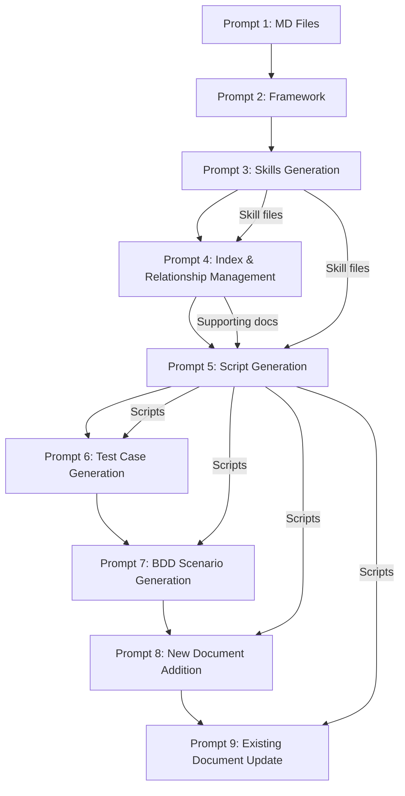
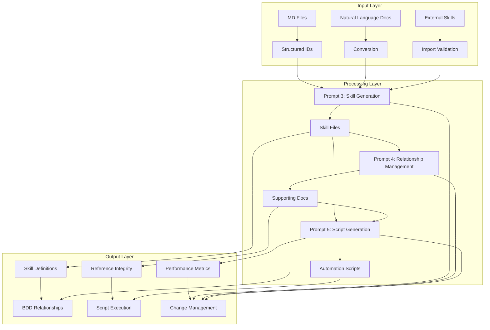
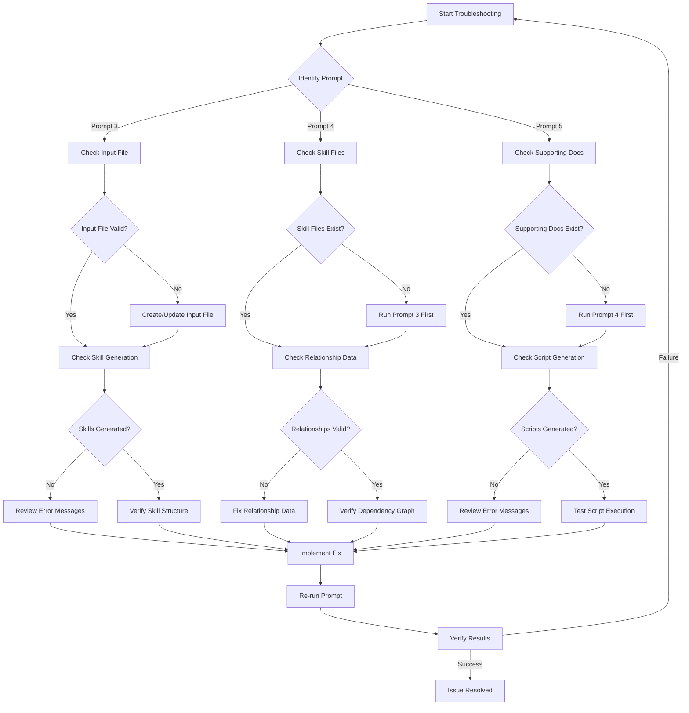

---

## Content Enhancements

### 1. Example Code

#### Rule Extractor Script Example
```python
def extract_rules_from_md(md_file_path):
    """Extract atomic rules from Markdown file."""
    rules = []
    with open(md_file_path, 'r', encoding='utf-8') as f:
        content = f.read()
    
    # Parse content and extract rules
    # Example implementation
    return rules

def validate_rule_atomicity(rule):
    """Validate if a rule is atomic."""
    # Check if rule contains only one requirement
    return len(rule.get('conditions', [])) == 1
```

#### BDD Scenario Example
```gherkin
Feature: Initial Margin Calculation
  As a risk analyst
  I want to verify initial margin calculations
  So that I can ensure compliance with regulatory requirements

  Scenario: Calculate initial margin for equity position
    Given a client has an equity position of 100 shares at $50 each
    When the initial margin requirement is 25%
    Then the initial margin should be $1,250
    And the maintenance margin should be $750
```

### 2. Best Practices

#### Knowledge Base Management
- **Modularization**: Split large documents into smaller, focused modules
- **Consistent Naming**: Use consistent naming conventions for files and IDs
- **Version Control**: Implement proper Git version control for all knowledge base files
- **Regular Backups**: Schedule regular backups of the knowledge base
- **Access Control**: Implement appropriate access controls for sensitive information

#### Skill Development
- **Reusability**: Design Skills to be reusable across different scenarios
- **Clear Documentation**: Document each Skill's purpose, inputs, and outputs
- **Performance Optimization**: Optimize Skill content for prompt response time
- **Testing**: Test Skills with different input variations
- **Versioning**: Maintain version history for Skills

#### Test Automation
- **BDD Best Practices**: Follow Gherkin syntax best practices
- **Step Definition Reuse**: Reuse step definitions across scenarios
- **Parallel Execution**: Run tests in parallel to reduce execution time
- **Reporting**: Generate comprehensive test reports
- **CI/CD Integration**: Integrate tests into CI/CD pipelines

### 3. Troubleshooting Guide

#### Common Issues and Solutions

**Issue: Rule extraction fails**
- **Possible Causes**: Malformed Markdown, missing structured IDs, invalid rule format
- **Solution**: Validate Markdown syntax, ensure all paragraphs have structured IDs, check rule format against schema

**Issue: Skill generation errors**
- **Possible Causes**: Insufficient input information, conflicting references, invalid user type
- **Solution**: Provide complete input data, resolve reference conflicts, use valid user type

**Issue: BDD scenario execution failures**
- **Possible Causes**: Missing step definitions, incorrect Gherkin syntax, environment configuration issues
- **Solution**: Implement all required step definitions, validate Gherkin syntax, check environment setup

**Issue: Incremental update issues**
- **Possible Causes**: Change detection failures, conflicting updates, missing dependencies
- **Solution**: Verify change detection logic, resolve update conflicts, ensure all dependencies are present

**Issue: Performance issues**
- **Possible Causes**: Large knowledge base, complex Skills, inefficient scripts
- **Solution**: Optimize knowledge base structure, simplify Skill content, improve script efficiency

## Technical Improvements

### 1. Parameterized Configuration

#### Configuration Management
- **Centralized Configuration**: Use a centralized configuration file for all prompts
- **Environment Variables**: Support environment-specific configurations using environment variables
- **Dynamic Parameters**: Allow dynamic parameter values based on context
- **Configuration Validation**: Validate configuration values before execution
- **Versioned Configurations**: Maintain version history for configuration changes

#### Example Configuration Structure
```json
{
  "prompt_config": {
    "common": {
      "language": "English",
      "output_dir": "outputs",
      "timeout": 300
    },
    "prompt1": {
      "md_template": "templates/md-template.md",
      "rule_extractor": "scripts/rule-extractor.py"
    },
    "prompt3": {
      "skill_templates": "templates/skill-templates/",
      "user_types": ["BA", "QA Lead", "Automation Tester", "Mixed"]
    }
  }
}
```

### 2. Monitoring and Alerting

#### Enhanced Monitoring
- **Real-time Monitoring**: Implement real-time monitoring of prompt execution
- **Performance Metrics**: Track execution time, memory usage, and resource utilization
- **Error Tracking**: Monitor and log errors during execution
- **Dependency Monitoring**: Track dependencies between prompts and components
- **Usage Analytics**: Collect usage data for optimization

#### Alerting System
- **Threshold-based Alerts**: Set up alerts for performance and error thresholds
- **Notification Channels**: Support multiple notification channels (email, Slack, etc.)
- **Escalation Procedures**: Define escalation procedures for critical issues
- **Alert Aggregation**: Aggregate similar alerts to reduce noise
- **Automated Remediation**: Implement automated remediation for common issues

### 3. Security Considerations

#### Security Best Practices
- **Input Validation**: Validate all inputs to prevent injection attacks
- **Access Control**: Implement role-based access control for prompts and resources
- **Data Encryption**: Encrypt sensitive data at rest and in transit
- **Audit Logging**: Maintain comprehensive audit logs for all operations
- **Vulnerability Scanning**: Regularly scan for security vulnerabilities

#### Secure Implementation
- **Least Privilege**: Run prompts with minimal required permissions
- **Isolation**: Isolate prompt execution environments
- **Dependency Security**: Verify security of third-party dependencies
- **Secure Configuration**: Use secure default configurations
- **Regular Security Updates**: Keep all components updated with security patches

---

# Table of Contents

## I. Knowledge Base Foundation Prompts (MD Generation + Framework Setup)
- [Prompt 1 (Structured MD Knowledge Base Generation with Paragraph IDs)](#prompt-1-structured-md-knowledge-base-generation-with-paragraph-ids)
- [Prompt 2 (Framework Structure Creation and Configuration)](#prompt-2-framework-structure-creation-and-configuration)

## II. GitHub Copilot Skills Development Prompts (Including BDD Association + Reference + Script)
- [Prompt 3 (Copilot Skill Modular Generation + BDD Association + Structured Reference + Script Pre-embedding)](#prompt-3-copilot-skill-modular-generation--bdd-association--structured-reference--script-pre-embedding)
- [Prompt 4 (Copilot Skill Index + Relationship + Reference/Script Management + Usage Guidelines)](#prompt-4-copilot-skill-index--relationship--reference-script-management--usage-guidelines)
- [Prompt 5 (Skill Automation Script Generation + Git/Verification Linkage)](#prompt-5-skill-automation-script-generation--git-verification-linkage)

## III. Test Case and BDD Generation Prompts (Including Relationship + Reference)
- [Prompt 6 (Structured Iterative Test Case Generation + Relationship + Reference Pre-embedding)](#prompt-6-structured-iterative-test-case-generation--relationship--reference-pre-embedding)
- [Prompt 7 (BDD/Behave Scenario Generation + Multi-dimensional Relationships + Reference Bidirectional Traceability)](#prompt-7-bdd-behave-scenario-generation--multi-dimensional-relationships--reference-bidirectional-traceability)

## IV. Knowledge Base Synchronization Update Prompts (Including Reference/Script Synchronization)
- [Prompt 8 (New Business Document Addition - Knowledge Base Incremental Update Process Generation + Reference/Script Synchronization)](#prompt-8-new-business-document-addition---knowledge-base-incremental-update-process-generation--reference-script-synchronization)
- [Prompt 9 (Existing Document Update - Knowledge Base Incremental Update Process Generation + Reference/Script Synchronization)](#prompt-9-existing-document-update---knowledge-base-incremental-update-process-generation--reference-script-synchronization)

## V. Governance and Quality Assurance Prompts
- [Prompt 10 (Quality Gate + Human Review + Feedback System + Confidence Level Calculation)](#prompt-10-quality-gate--human-review--feedback-system--confidence-level-calculation)
- [Prompt 11 (Comprehensive Test Coverage Analysis + Gap Identification)](#prompt-11-comprehensive-test-coverage-analysis--gap-identification)
- [Prompt 12 (Multi-model Verification Configuration + Execution + Result Analysis)](#prompt-12-multi-model-verification-configuration--execution--result-analysis)
- [Prompt 13 (Change Impact Analysis + Risk Assessment)](#prompt-13-change-impact-analysis--risk-assessment)
- [Prompt 14 (Performance Optimization + Resource Allocation)](#prompt-14-performance-optimization--resource-allocation)
- [Prompt 15 (Project Health Monitoring + Status Reporting)](#prompt-15-project-health-monitoring--status-reporting)

---

## Global Rules for Prompt Management

### Rule 1: Prompt Set Integrity
- **No Prompt Loss**: When updating this file, **no prompts shall be deleted or removed** without explicit approval.
- **Prompt Count**: Maintain the complete set of 15 prompts covering the full lifecycle.
- **Prompt Numbering**: Keep prompt numbering sequential and consistent.

### Rule 2: Update Record Requirement
- **Mandatory Update Records**: Every update to this file MUST include a detailed update record.
- **Update Record Format**: Include the following information in the update record:
  - **Date**: YYYY-MM-DD
  - **Author**: Name or identifier of the person making the update
  - **Description**: Clear description of what was changed
  - **Impact**: Potential impact on downstream processes or dependencies
  - **Validation**: Steps taken to validate the changes

### Rule 3: Version Control
- **Git Commit Messages**: Use descriptive commit messages for all changes to this file.
- **Version Tagging**: Tag significant versions for easy reference.
- **Rollback Plan**: Maintain rollback capability for critical changes.

### Rule 4: Consistency Requirements
- **Format Consistency**: Maintain consistent formatting across all prompts.
- **Language Consistency**: All generated content MUST be in English ONLY.
- **Dependency Integrity**: Ensure all cross-prompt dependencies are maintained.

---

## I. Knowledge Base Foundation Prompts (MD Generation + Framework Setup)

### Applicable Scenarios
Generate structured Markdown knowledge base files with paragraph IDs and establish the foundational framework structure for downstream Copilot Skills development.

### Prompt 1 (Structured MD Knowledge Base Generation with Paragraph IDs)
**Version**: 1.2.0
**Last Updated**: 2026-03-18
**Author**: System Administrator

```
### Instructions
Based on the provided business documentation [Initial Margin Calculation Guide HKv14], generate **structured Markdown files with unique paragraph IDs** for Git-based knowledge base management, meeting the following requirements:

1. **Document Modularization**: Split the complete guide into logical modules based on business domains (e.g., Introduction, Risk Parameters, Input Data, Calculation Methods, etc.).

2. **Structured Paragraph IDs**: Assign unique structured IDs to each paragraph following the format:
   - Format: `{DOMAIN}-{SUBDOMAIN}-{SEQUENCE}` (e.g., `DC-IMRPF-001`, `MRCC-HVaR-001`)
   - DOMAIN: 2-4 character abbreviation of the business domain
   - SUBDOMAIN: Specific topic within the domain
   - SEQUENCE: 3-digit sequential number

3. **Content Requirements**:
   - Each paragraph must have a clear, concise heading
   - Include cross-references to related paragraphs using structured IDs
   - Maintain original business rule accuracy and completeness
   - Add metadata section with document version, last updated date, and responsible person

4. **Atomic Rule Extraction**:
   - **Atomicity**: Each rule should represent a single, indivisible business requirement
   - **Unique Rule IDs**: Assign unique rule identifiers following the format: `RULE-{DOMAIN}-{SEQUENCE}` (e.g., `RULE-IM-001`)
   - **Rule Structure**: Each rule must include:
     - Rule ID
     - Rule statement (clear, concise, single requirement)
     - Applicable conditions
     - Exception cases (if any)
     - Cross-references to related rules or paragraphs
     - Coverage status (covered/not covered)

5. **Python Script Generation for Rule Conversion**:
   - Generate a Python script `scripts/rule-extractor.py` that:
     - Parses MD files with structured IDs
     - Extracts atomic rules
     - Validates rule atomicity and uniqueness
     - Converts rules to JSON format
     - Generates coverage reports
     - Supports incremental updates
   - Generate a JSON schema `config/rule-schema.json` defining the rule structure
   - Generate sample output JSON file `docs/rules/atomic-rules.json` as reference

6. **Rule Re-verification Mechanism**:
   - **Trigger Conditions**: When either `scripts/rule-extractor.py` or `config/rule-schema.json` is updated, trigger automatic re-verification of all generated rules
   - **Re-verification Process**:
     - Parse all MD files with updated script
     - Validate rules against updated schema
     - Compare new rules with existing rules in `docs/rules/atomic-rules.json`
     - Identify changes: added rules, modified rules, deleted rules
     - Generate re-verification report highlighting differences
   - **Human Review and Feedback Application**:
     - Apply the same human review and feedback process to re-verification results
     - Generate review files: `governance/reviews/prompt1-rereview.md`, `governance/reviews/prompt1-reconfidence.md`, `governance/reviews/prompt1-refailure-analysis.md`
     - Calculate confidence level based on re-verification feedback
     - Provide detailed failure analysis for rules that fail re-verification
   - **Approval Workflow**:
     - Re-verification results must go through Initial → Peer Review → Final Approval stages
     - Only approved re-verification results can update `docs/rules/atomic-rules.json`
     - Maintain version history for all re-verification runs
   - **Rollback Capability**:
     - If re-verification fails, rollback to previous version of rules
     - Maintain backup of previous rule versions
     - Document rollback reasons and recovery steps

7. **File Organization**:
   - One MD file per business module
   - Consistent file naming: `{module-name}.md` (e.g., `risk-parameters.md`)
   - Store in `docs/source-files/` directory

8. **Quality Assurance**:
   - Verify all business rules are accurately captured
   - Ensure no information loss during modularization
   - Validate structured ID uniqueness across all files
   - Proofread for grammar, spelling, and formatting consistency

9. **Human Review and Feedback System**: Implement a structured review process for generated MD files:
   - **Review Workflow**: Define a multi-stage review process (Initial → Peer Review → Final Approval)
   - **Feedback Collection**: Collect structured feedback on MD file quality, rule alignment, and completeness
   - **Confidence Level Calculation**: Calculate confidence level based on review feedback and rule alignment
   - **Failure Analysis**: Provide detailed analysis of why MD files fail or don't match requirements
   - **Feedback Templates**: Provide standardized feedback templates for different review scenarios
   - **Review Output Files**:
     - `governance/reviews/prompt1-review.md` - Review results and feedback
     - `governance/reviews/prompt1-confidence.md` - Confidence level assessment
     - `governance/reviews/prompt1-failure-analysis.md` - Failure analysis report

### Input
Business Documentation: [Initial Margin Calculation Guide HKv14]
- Document Type: PDF/Word/Excel (source format)
- Content: Complete business rules and procedures
- Version: v14 (Hong Kong version)

### Output Requirements
- **Language Requirements**: ALL generated content MUST be in English ONLY
- **Process File Naming**: Generate a process output file named `PROMPT1-OUTPUT.md` containing execution logs, results, and performance metrics
- **Process File Storage**: Store `PROMPT1-OUTPUT.md` in `docs/source-files/` directory
- **MD File Generation**: Output complete MD files to `docs/source-files/` directory with structured paragraph IDs
- **Index File**: Generate an index file `docs/source-files/INDEX.md` listing all modules with their structured ID ranges
- **Cross-Reference Map**: Generate a cross-reference map showing relationships between paragraphs
- **Metadata**: Include version, timestamp, and responsible person in each MD file
- **Atomic Rule Generation**: Extract and document atomic rules in each MD file with unique rule IDs
- **Python Script Generation**: Generate `scripts/rule-extractor.py` for rule conversion
- **JSON Schema Generation**: Generate `config/rule-schema.json` defining the rule structure
- **Sample JSON Output**: Generate `docs/rules/atomic-rules.json` as reference
- **Incremental Update Support**: Implement incremental update functionality:
  - **Partial Update**: Allow updating only modified sections instead of regenerating all
  - **Diff Detection**: Automatically detect changes in source documents
  - **Change Tracking**: Document all changes made during incremental updates
  - **Version Control**: Maintain version history for each paragraph
- **Parallel Execution Support**: Implement parallel execution functionality:
  - **Task Decomposition**: Split document processing into independent modules
  - **Parallel Processing**: Process multiple modules concurrently
  - **Resource Management**: Optimize resource usage for parallel execution
  - **Progress Tracking**: Monitor parallel task execution and progress
- **Error Recovery Mechanism**: Implement automatic error recovery functionality:
  - **Error Detection**: Automatically detect and classify errors during processing
  - **Error Isolation**: Isolate failed modules without affecting overall execution
  - **Automatic Recovery**: Attempt to recover from common errors automatically
  - **Fallback Mechanisms**: Implement fallback strategies for unrecoverable errors
  - **Recovery Logging**: Document all error recovery attempts and outcomes
- **Performance Metrics Collection**: Include comprehensive performance metrics in PROMPT1-OUTPUT.md:
  - **Execution Time Metrics**: Start time, end time, total execution time, time per module
  - **Resource Usage Metrics**: Memory usage, CPU usage, disk I/O
  - **Quality Metrics**: Number of paragraphs generated, ID uniqueness score, cross-reference completeness, rule extraction quality
  - **Error Metrics**: Number of errors, error types, error recovery success rate
  - **Update Metrics**: Number of sections updated, update time, change detection accuracy
  - **Parallel Metrics**: Number of parallel tasks, parallel execution time, resource utilization
  - **Recovery Metrics**: Number of recovery attempts, recovery success rate, recovery time
- **Proofreading Requirements**: Proofread all generated content to ensure correct grammar, spelling, formatting, and consistency
- **README.md Synchronization**: If this update affects directory structure or file locations, update `README.md` accordingly
- **Execution Instructions**: This prompt MUST include instructions to ACTUALLY CREATE MD files, scripts, and directories if they don't exist, not just output plans

#### Verification Requirements (MANDATORY)
- **Pre-Execution Verification**: Before generating MD files, verify:
  - Source document is accessible and readable
  - Target directories exist or can be created
  - Sufficient disk space is available
  - No existing files will be unintentionally overwritten
- **Post-Execution Verification**: After generating MD files, verify:
  - All MD files are created with correct naming convention
  - Each file contains structured paragraph IDs
  - Cross-references are valid and resolvable
  - Index file is complete and accurate
  - Process output file `PROMPT1-OUTPUT.md` is created in `docs/source-files/` directory
  - All metadata is correctly populated
  - README.md is updated if required by README.md Synchronization Rule
  - Atomic rules are extracted with unique rule IDs
  - Python script `scripts/rule-extractor.py` is generated
  - JSON schema `config/rule-schema.json` is generated
  - Sample JSON output `docs/rules/atomic-rules.json` is generated

#### Change Management Requirements (MANDATORY)
- **Impact Analysis**: Before generating MD files, document:
  - Which business domains will be covered
  - How modularization affects existing documentation (if any)
  - Potential impact on downstream prompts (Prompt 2, 3, etc.)
  - Impact on cross-references and relationships
  - Impact of atomic rule extraction on downstream processes
- **Change Documentation**: In process output file, document:
  - List of all MD files generated with their structured ID ranges
  - Modularization strategy used
  - Any customizations applied to standard format
  - Creation timestamp and responsible person
  - Proofreading results and validation status
  - Atomic rule extraction results and statistics
  - Python script generation details
- **Rollback Procedures**: Include instructions for:
  - Removing generated MD files if needed
  - Restoring previous state if generation fails
  - Reverting README.md changes if applicable
  - Reverting process output files to previous versions
  - Removing generated scripts and JSON files if needed

#### Prompt Dependencies (MANDATORY)
- **Input Sources**:
  - Source business documentation (PDF/Word/Excel)
  - No other dependencies
- **Output Usage**:
  - MD files used by Prompt 2 for framework creation
  - MD files used by Prompt 3 for Skill generation
  - Structured IDs used for cross-referencing throughout the system
- **Execution Order**:
  - Prompt 1 is the first prompt in the sequence
  - Must be executed before Prompt 2, 3, 4, 5
  - Provides foundation for all downstream prompts

#### Integration Test Guidance (MANDATORY)
- **Integration Test Scenarios**:
  - Verify MD files are generated with correct structure and content
  - Verify structured IDs are unique and follow naming convention
  - Verify cross-references are valid and resolvable
  - Verify index file is complete and accurate
  - Verify metadata is correctly populated
- **Test Steps**:
  1. Prepare source business documentation
  2. Execute Prompt 1 to generate MD modules with structured IDs
  3. Verify all MD files are created in `docs/source-files/` directory
  4. Verify structured IDs follow the correct format
  5. Verify cross-references point to valid paragraphs
  6. Verify index file lists all modules correctly
  7. Verify metadata includes version, timestamp, and responsible person
  8. Verify process output file is created with execution logs
  9. Test incremental update functionality
  10. Verify all prompts execute successfully in sequence
- **Expected Results**:
  - All MD files are generated with correct structure and content
  - Structured IDs are unique and follow naming convention
  - Cross-references are valid and resolvable
  - Index file is complete and accurate
  - Metadata is correctly populated
  - No missing information or broken references
  - All prompts execute successfully in sequence
```

### Prompt 2 (Framework Structure Creation and Configuration)
**Version**: 1.2.0
**Last Updated**: 2026-03-18
**Author**: System Administrator

```
### Instructions
Based on the MD files generated by Prompt 1, create the **foundational framework structure** for the Git-based knowledge base and Copilot Skills development environment, meeting the following requirements:

1. **Directory Structure Creation**: Establish the 7-layer framework directory structure:
   - `docs/source-files/`: Source MD files with structured IDs (from Prompt 1)
   - `docs/processed/`: Processed and validated MD files
   - `config/`: Configuration files and specifications
   - `copilot-skills/`: Copilot Skill definitions and templates
   - `tests/`: Test cases and BDD scenarios
   - `scripts/`: Automation scripts and utilities
   - `governance/`: Governance, audit, and process documentation

2. **Configuration Files Generation**:
   - `config/framework-config.md`: Framework configuration and standards
   - `config/skill-templates/`: Predefined Skill templates for different user types
   - `config/validation-rules.md`: Validation rules for MD files and Skills
   - `config/naming-conventions.md`: Naming conventions for all artifacts

3. **Framework Standards Definition**:
   - Define structured ID format and validation rules
   - Establish cross-reference resolution mechanisms
   - Define metadata requirements for all artifacts
   - Establish version control and change management procedures

4. **Integration Setup**:
   - Configure integration points between layers
   - Define data flow between Prompt 1 output and Prompt 3 input
   - Establish validation checkpoints
   - Configure logging and monitoring

5. **Template Preparation**:
   - Create Skill templates for different user types (A/B/C/D)
   - Create test case templates
   - Create BDD scenario templates
   - Create script templates

6. **Human Review and Feedback System**: Implement a structured review process for framework structure and configurations:
   - **Review Workflow**: Define a multi-stage review process (Initial → Peer Review → Final Approval)
   - **Feedback Collection**: Collect structured feedback on framework structure, configuration quality, and completeness
   - **Confidence Level Calculation**: Calculate confidence level based on review feedback and configuration quality
   - **Failure Analysis**: Provide detailed analysis of why framework setup fails or doesn't meet requirements
   - **Feedback Templates**: Provide standardized feedback templates for different review scenarios
   - **Review Output Files**:
     - `governance/reviews/prompt2-review.md` - Review results and feedback
     - `governance/reviews/prompt2-confidence.md` - Confidence level assessment
     - `governance/reviews/prompt2-failure-analysis.md` - Failure analysis report

### Input
MD Files from Prompt 1:
- Location: `docs/source-files/`
- Format: Markdown files with structured paragraph IDs
- Content: Business rules and procedures with cross-references

### Output Requirements
- **Language Requirements**: ALL generated content MUST be in English ONLY
- **Process File Naming**: Generate a process output file named `PROMPT2-OUTPUT.md` containing execution logs, results, and performance metrics
- **Process File Storage**: Store `PROMPT2-OUTPUT.md` in `config/` directory
- **Directory Structure**: Create all 7-layer framework directories if they don't exist
- **Configuration Files**: Generate complete content of framework-config.md, validation-rules.md, naming-conventions.md
- **Template Files**: Generate Skill templates, test case templates, BDD templates, script templates in `config/skill-templates/`
- **Integration Configuration**: Define integration points and data flow specifications
- **Incremental Update Support**: Implement incremental update functionality:
  - **Partial Update**: Allow updating only modified configurations instead of regenerating all
  - **Diff Detection**: Automatically detect changes in framework requirements
  - **Change Tracking**: Document all changes made during incremental updates
  - **Version Control**: Maintain version history for each configuration file
- **Parallel Execution Support**: Implement parallel execution functionality:
  - **Task Decomposition**: Split framework setup into independent tasks
  - **Parallel Processing**: Process multiple configurations concurrently
  - **Resource Management**: Optimize resource usage for parallel execution
  - **Progress Tracking**: Monitor parallel task execution and progress
- **Error Recovery Mechanism**: Implement automatic error recovery functionality:
  - **Error Detection**: Automatically detect and classify errors during setup
  - **Error Isolation**: Isolate failed configurations without affecting overall setup
  - **Automatic Recovery**: Attempt to recover from common errors automatically
  - **Fallback Mechanisms**: Implement fallback strategies for unrecoverable errors
  - **Recovery Logging**: Document all error recovery attempts and outcomes
- **Performance Metrics Collection**: Include comprehensive performance metrics in PROMPT2-OUTPUT.md:
  - **Execution Time Metrics**: Start time, end time, total execution time, time per configuration
  - **Resource Usage Metrics**: Memory usage, CPU usage, disk I/O
  - **Quality Metrics**: Number of directories created, configuration completeness score, template coverage
  - **Error Metrics**: Number of errors, error types, error recovery success rate
  - **Update Metrics**: Number of configurations updated, update time, change detection accuracy
  - **Parallel Metrics**: Number of parallel tasks, parallel execution time, resource utilization
  - **Recovery Metrics**: Number of recovery attempts, recovery success rate, recovery time
- **Proofreading Requirements**: Proofread all generated content to ensure correct grammar, spelling, formatting, and consistency
- **README.md Synchronization**: If this update affects directory structure or file locations, update `README.md` accordingly
- **Execution Instructions**: This prompt MUST include instructions to ACTUALLY CREATE directories and configuration files if they don't exist, not just output plans

#### Verification Requirements (MANDATORY)
- **Pre-Execution Verification**: Before creating framework, verify:
  - MD files from Prompt 1 exist in `docs/source-files/` directory
  - Target directories can be created
  - Sufficient disk space is available
  - No existing configurations will be unintentionally overwritten
- **Post-Execution Verification**: After creating framework, verify:
  - All 7-layer directories are created
  - Configuration files are generated with correct content
  - Templates are available for all user types
  - Integration points are properly configured
  - Process output file `PROMPT2-OUTPUT.md` is created in `config/` directory
  - README.md is updated if required by README.md Synchronization Rule

#### Change Management Requirements (MANDATORY)
- **Impact Analysis**: Before creating framework, document:
  - Which directories and configurations will be created
  - How framework structure affects existing files (if any)
  - Potential impact on downstream prompts (Prompt 3, 4, 5, etc.)
  - Impact on integration and data flow
- **Change Documentation**: In process output file, document:
  - List of all directories created
  - List of all configuration files generated
  - Template specifications for each user type
  - Integration configuration details
  - Creation timestamp and responsible person
  - Proofreading results and validation status
- **Rollback Procedures**: Include instructions for:
  - Removing created directories if needed
  - Restoring previous configurations if setup fails
  - Reverting README.md changes if applicable
  - Reverting process output files to previous versions

#### Prompt Dependencies (MANDATORY)
- **Input Sources**:
  - MD files generated by Prompt 1
  - No other dependencies
- **Output Usage**:
  - Framework structure used by Prompt 3 for Skill generation
  - Configuration files used by all downstream prompts
  - Templates used for generating user-specific content
- **Execution Order**:
  - Prompt 1 → Prompt 2 → Prompt 3 → Prompt 4 → Prompt 5
  - Must be executed after Prompt 1 and before Prompt 3
  - Provides foundation structure for all downstream prompts

#### Integration Test Guidance (MANDATORY)
- **Integration Test Scenarios**:
  - Verify Prompt 1-2 integration: MD files → Framework
  - Verify all 7-layer directories are created
  - Verify configuration files are properly formatted
  - Verify templates are available for all user types
  - Verify integration points are properly configured
- **Test Steps**:
  1. Execute Prompt 1 to generate MD files with structured IDs
  2. Execute Prompt 2 to create framework structure
  3. Verify all 7-layer directories are created
  4. Verify configuration files exist in `config/` directory
  5. Verify templates exist in `config/skill-templates/` directory
  6. Verify integration configuration is properly set up
  7. Verify process output file is created with execution logs
  8. Test data flow from Prompt 1 output to Prompt 3 input
  9. Verify all prompts execute successfully in sequence
- **Expected Results**:
  - All 7-layer directories are created
  - Configuration files are properly formatted
  - Templates are available for all user types
  - Integration points are properly configured
  - Data flow from Prompt 1 to Prompt 3 is established
  - No missing directories or configurations
  - All prompts execute successfully in sequence
```

## II. GitHub Copilot Skills Development Prompts (Including BDD Association + Reference + Script)

### Visual Diagrams

#### Prompt Dependency Graph



#### Data Flow Diagram



### Applicable Scenarios
Based on the structured MD knowledge base (including upstream and downstream), generate **modular, traceable (Reference), pre-embedded BDD relationship, automation-supporting (Script)** GitHub Copilot Skills, ensuring that the relationship between Skills and main/upstream/downstream rules and BDD scenarios can be updated in real time, and have automated synchronization/verification capabilities.

### Prompt 3 (Copilot Skill Modular Generation + BDD Association + Structured Reference + Script Pre-embedding)
**Version**: 1.2.0
**Last Updated**: 2026-03-18
**Author**: System Administrator

```
### Instructions
Based on the following [Initial Margin Calculation Guide HKv14] MD files (use only this content), develop **modular, traceable, pre-embedded BDD relationship, automation Script-supporting** Skills for GitHub Copilot, meeting the following requirements:

#### Import/Export Mechanism for Skills

**Skill Export Functionality:**
- **Export Format**: Define standard export format for Skills (JSON/YAML/Markdown)
- **Export Metadata**: Include version information, export timestamp, and responsible person
- **Export Templates**: Provide predefined export templates for different user types:
  - **Type A (BA)**: Business-focused export with business rule explanations
  - **Type B (QA Lead)**: Quality-focused export with test case references
  - **Type C (Automation Tester)**: Automation-focused export with script integration
  - **Type D (Mixed/General)**: Universal export with balanced content
- **Export Location**: `copilot-skills/exports/` directory
- **Export Naming**: `{business}-{module}-{capability}-export-{timestamp}.{format}`

**Skill Import Functionality:**
- **Import Validation**: Validate imported Skills for format compliance and content integrity
- **Import Mapping**: Map imported Skills to existing user types and modules
- **Import Conflict Resolution**: Handle duplicate Skill IDs and conflicting references
- **Import Sources**: Support import from external repositories, shared/common repos, and partner systems
- **Import Location**: `copilot-skills/imports/` directory
- **Import Metadata**: Track import source, version, timestamp, and validation results

#### User Type Predefined Templates

**Template System:**
- **Type A (BA) Template**: Business-focused template with business rule explanations
  - Emphasized business logic and process flows
  - Simplified technical details
  - Clear business rule references
- **Type B (QA Lead) Template**: Quality-focused template with test case references
  - Detailed validation steps
  - Compliance references
  - Test case integration
- **Type C (Automation Tester) Template**: Automation-focused template with script integration
  - Technical details and code examples
  - Test scenarios and boundary conditions
  - CI/CD integration points
- **Type D (Mixed/General) Template**: Universal template with balanced content
  - Comprehensive coverage across all aspects
  - Multiple perspectives
  - Balanced technical and business content

#### Input File Naming and Storage Rules

**Input File Naming Convention:**
- **Process Input File**: `PROMPT3-INPUT.md`
  - Location: `copilot-skills/` directory
  - Purpose: Contains the complete prompt instructions and input data for Prompt 3 execution
  - Format: Markdown with all required sections (Instructions, Input Sources, User Type Classification, etc.)

**Input File Storage Location:**
- **Primary Location**: `copilot-skills/PROMPT3-INPUT.md`
- **Rationale**: 
  - Aligns with the 7-layer framework structure (Layer 4 - AI Capability Layer)
  - Keeps input and output files together for traceability
  - Facilitates version control and audit trails
  - Supports rollback and change management

**Input File Structure Requirements:**
1. **Header Section**: Must include prompt identification and version information
2. **Instructions Section**: Complete Prompt 3 instructions and requirements
3. **Input Sources Section**: Detailed specification of all input sources (Source 1-4)
4. **User Type Classification Section**: Definition of user types (A/B/C/D) and their requirements
5. **Custom Template Section**: Optional custom skill template definitions
6. **MD Files List Section**: List of MD files from Prompt 1 with structured IDs
7. **User Type Selection Section**: Explicit user type selection for each module
8. **Skill Source Selection Section**: Explicit skill source selection

**Input File Generation Process:**
1. Copy Prompt 3 instructions from `chat-prompt-en.md`
2. Add specific input data (MD files list, user types, skill sources)
3. Save as `copilot-skills/PROMPT3-INPUT.md`
4. Execute Prompt 3 using this input file
5. Generate output files in the same directory

#### Skill Input Sources

This prompt supports multiple input sources for Skill generation:

**Source 1: Structured MD Files (Primary)**
- Use structured MD files with paragraph IDs and atomic rules as primary input
- Format: MD files with structured paragraph IDs (e.g., DC-IMRPF-001, MRCC-HVaR-001) and atomic rules with unique rule IDs (e.g., RULE-IM-001)
- Location: `docs/source-files/` directory
- Processing: Extract rule scenarios from structured IDs and atomic rules, then generate Skills

**Source 2: Natural Language Documents (Conversion Required)**
- Accept natural language documents from different user types
- Supported formats: `.md`, `.txt`, `.docx`, `.pdf` (text-extractable)
- User type alignment: Documents are converted based on target user type (A/B/C/D)
- Conversion process:
  1. Analyze document structure and content
  2. Extract rule scenarios and business logic
  3. Convert to standard Skill format with appropriate user type template
  4. Generate structured Reference fields based on document metadata
  5. Apply user type-specific optimizations (BA-Optimized/QA-Optimized/Automation-Optimized/Universal)
- Conversion output: Standard Skill files in `copilot-skills/skill-definitions/` directory

**Source 3: External Repository Skills (Import)**
- Import standard format Skills from external repositories (upstream/downstream systems)
- Supported external sources:
  - Upstream system repos: Core business rules, regulatory requirements
  - Downstream system repos: Implementation guides, test specifications
  - Shared/common repos: General-purpose Skills, utility functions
- Import requirements:
  - External Skills must follow standard Skill format (Skill ID, Description, Trigger Words, Structured Reference)
  - Must include valid Reference fields pointing to source documents
  - Must be compatible with project's user type classification system
- Import process:
  1. Validate external Skill format and completeness
  2. Map Reference fields to local document structure
  3. Assign appropriate User Type Target based on Skill content
  4. Update Update_History with import source and timestamp
  5. Store in `copilot-skills/skill-definitions/` with import metadata
- Benefits: Reduce maintenance cost by reusing existing Skills

**Source 4: Project-Specific Skills (Local Generation)**
- Generate Skills specific to this project's business requirements
- Based on project's structured MD knowledge base
- Customizable via user type classification and custom templates
- Primary method for project-specific business logic

**Skill Source Selection Logic:**
- If structured MD files are provided, use Source 1 (Primary)
- If natural language documents are provided, use Source 2 (Conversion)
- If external repo Skills are specified, use Source 3 (Import)
- If multiple sources are provided, process in priority order: Source 1 > Source 2 > Source 3
- Combine imported Skills with locally generated Skills as needed

#### User Type Classification System

Before generating Skills, identify the target user type to select appropriate template and customization level:

**User Type Categories:**

1. **Type A: Business Analyst (BA)**
   - **Characteristics**: Focuses on business understanding, requirement analysis, process flow comprehension
   - **Primary Needs**: Business rule explanations, process documentation, requirement clarification
   - **Skill Complexity**: Low to Medium (clear, business-focused explanations)
   - **Example Queries**: "What is the IM calculation process?", "How does margin adjustment work?"
   - **Template Preference**: BA-Optimized Template (simplified technical details, emphasized business logic)

2. **Type B: QA Lead**
   - **Characteristics**: Focuses on rule verification, compliance checking, test strategy design
   - **Primary Needs**: Rule specifications, validation requirements, compliance standards
   - **Skill Complexity**: Medium (balanced technical and business content)
   - **Example Queries**: "What are the validation rules for IMRPF?", "How to verify portfolio margin calculation?"
   - **Template Preference**: QA-Optimized Template (detailed validation steps, compliance references)

3. **Type C: Automation Tester**
   - **Characteristics**: Focuses on implementation details, test case design, boundary condition handling
   - **Primary Needs**: Technical specifications, test data requirements, calculation examples
   - **Skill Complexity**: High (detailed technical content, code examples)
   - **Example Queries**: "How to implement position processing logic?", "What are the boundary conditions for HVaR?"
   - **Template Preference**: Automation-Optimized Template (technical details, code snippets, test scenarios)

4. **Type D: Mixed/General User**
   - **Characteristics**: Needs comprehensive coverage across all aspects (business, QA, automation)
   - **Primary Needs**: Balanced content with multiple perspectives
   - **Skill Complexity**: Medium to High (comprehensive coverage)
   - **Example Queries**: "Explain the complete IM calculation workflow", "How to test and verify margin requirements?"
   - **Template Preference**: Universal Template (comprehensive, multi-perspective)

**User Type Selection Process:**
- **Default**: If user type is not specified, use **Type D: Mixed/General User** template
- **Explicit Selection**: If user type is specified in input, use corresponding optimized template
- **Hybrid Approach**: For complex scenarios, combine elements from multiple templates as needed

#### Custom Skill Template Entry

**[CUSTOM_SKILL_TEMPLATE_START]**
If you need to customize the Skill template structure, define your custom template below following this format:

**Custom Template Name**: [Your template name]
**Target User Type**: [Type A/B/C/D or custom type]
**Customization Level**: [Low/Medium/High]
**Structure Modifications**:
- [List any sections to add, modify, or remove from standard structure]
- [Specify any custom fields to add to Reference structure]
- [Define any additional Script requirements]

**Example Customization**:
```
Custom Template Name: High-Risk-Complexity Template
Target User Type: Type C (Automation Tester)
Customization Level: High
Structure Modifications:
- Add "Complexity Analysis" section before Description
- Add "Code Examples" section after Example Response
- Add "Performance Considerations" section before Script
- Add custom field "Debug_Reference" to Structured Reference
```
**[CUSTOM_SKILL_TEMPLATE_END]**

**Template Selection Logic:**
- If **[CUSTOM_SKILL_TEMPLATE_START]** to **[CUSTOM_SKILL_TEMPLATE_END]** is provided, use custom template
- If no custom template is provided, use standard template based on user type classification
- For custom templates, ensure all mandatory fields (Skill ID, Description, Trigger Words, Structured Reference) are included

#### Standard Skill Generation Process

1. Each Skill focuses on a single rule scenario; Skill ID follows the **business abbreviation-module-core capability** naming convention (e.g., hkex-im-calculation, hkex-risk-parameters) to facilitate subsequent relationship updates.

2. Each Skill contains a **fixed extensible structure + BDD association pre-embedding + structured Reference + Script pre-embedding**, with no missing information. The structure is as follows:
   - **Skill ID**: Unique identifier
   - **Description**: Core capability of the Skill (AI answer/rule verification/BDD scenario generation)
   - **Trigger Words**: Common user queries (precisely covering core rule questions)
   - **User Type Target**: [Type A/B/C/D] - Indicates which user type this Skill primarily serves
   - **Skill Source**: [Source 1/2/3/4] - Indicates the input source for this Skill
   - **Structured Reference (Required)**:
     + **Rule_Source**: {MD file full path} | {rule paragraph structured ID} | {atomic rule ID} | {rule version} | {original document storage path}
     + **Test_Reference**: {BDD test case ID to be associated} | {feature file path to be associated}
     + **Verify_Reference**: {multi-model verification configuration ID} | {manual audit record path (reserved)}
     + **Update_History**: {creation time} | {creator} | {associated Git Commit ID (reserved)} | {import source (if applicable)}
   - **BDD Association Pre-embedding**: Reserve BDD test case ID/feature file path association slots (format: to be associated | after association: TC-XXX-001, tests/xxx/xxx.feature), supporting real-time updates
   - **Script (Pre-embedded by scenario)**:
     + **Automation_Script (GitHub Copilot)**: Reserve lightweight Python script slots (synchronizing relationships/triggering verification/Git linkage), marking input/output specifications
     + **Operation_Guide (M365 Copilot)**: Reserve natural language operation guidance slots, adapted for non-technical personnel
   - **Example Response**: Rule-based precise answer (marking paragraph ID in Rule_Source)

3. Prohibit introducing rule information outside MD files; example responses must 100% align with rule constraints.

4. Skill content reserves **update marking slots** to facilitate subsequent rule modifications and relationship updates.

#### Skill Import/Export and Sharing Mechanism

**Skill Export (Project-Specific Skills Sharing)**
- **Export Format**: Standard Skill format with complete metadata
- **Export Content**:
  - Skill ID, Description, Trigger Words, User Type Target, Skill Source
  - Complete Structured Reference fields
  - BDD Association slots
  - Script pre-embedding slots
  - Example Responses
  - Export metadata: Export timestamp, export version, responsible person
- **Export Location**: `copilot-skills/exports/` directory
- **Export Naming**: `{business}-{module}-{capability}-export-{timestamp}.md`
- **Export Use Cases**:
  - Share project-specific Skills with downstream systems
  - Contribute Skills to shared/common repositories
  - Backup Skills before major updates
  - Archive deprecated Skills for reference

**Skill Import (External Skills Integration)**
- **Import Sources**:
  - Upstream system repositories: Import core business rule Skills
  - Downstream system repositories: Import implementation and test Skills
  - Shared/common repositories: Import utility and general-purpose Skills
  - External partner repositories: Import industry-standard Skills (with validation)
- **Import Validation**:
  - Format validation: Ensure Skill follows standard structure
  - Completeness check: Verify all mandatory fields are present
  - Reference integrity: Validate Reference fields point to valid sources
  - User type compatibility: Confirm Skill content aligns with user type classification
  - Duplicate detection: Check for duplicate Skill IDs or content
- **Import Process**:
  1. Validate imported Skill format and completeness
  2. Map external Reference fields to local document structure
  3. Assign appropriate User Type Target based on Skill content
  4. Update Update_History with import source, timestamp, and original repo
  5. Store in `copilot-skills/skill-definitions/` with import metadata
  6. Update Skill index table with import information
  7. Generate import log in `copilot-skills/imports/` directory
- **Import Metadata**:
  - Import source repository URL
  - Original Skill version
  - Import timestamp
  - Import validation results
  - Mapping of external to local Reference fields

**Skill Sharing and Collaboration**
- **Internal Sharing**:
  - Share Skills between teams within the organization
  - Maintain version control for shared Skills
  - Track usage and dependencies of shared Skills
- **External Sharing**:
  - Export Skills for sharing with external partners
  - Follow data governance and security policies
  - Anonymize sensitive information before sharing
  - Document sharing agreements and restrictions
- **Skill Versioning**:
  - Maintain version history for imported/exported Skills
  - Track changes between versions
  - Support rollback to previous versions if needed
  - Document breaking changes in version notes

**Skill Maintenance Cost Reduction**
- **Reuse Strategy**:
  - Prioritize importing Skills from external repos over creating new ones
  - Customize imported Skills for project-specific needs
  - Maintain mapping between original and customized Skills
- **Standardization**:
  - Follow standard Skill format across all repositories
  - Use consistent naming conventions
  - Maintain common Reference field structure
- **Documentation**:
  - Document import/export procedures
  - Maintain Skill dependency graph
  - Track Skill usage statistics

#### Integration Test Guidance (MANDATORY)
- **Integration Test Scenarios**:
  - Verify Prompt 1-2-3 integration: MD files → Framework → Skills
  - Verify multi-source input functionality: structured MD, natural language docs, external Skills
  - Verify user type classification: BA, QA Lead, Automation Tester, Mixed/General User
  - Verify Skill import/export functionality: external repo import, project-specific export
  - Verify structured ID referencing in Skills
  - Verify BDD relationship pre-embedding
  - Verify Script pre-embedding slots
- **Test Steps**:
  1. Execute Prompt 1 to generate MD modules with structured IDs
  2. Execute Prompt 2 to create framework structure
  3. Verify MD files are properly placed in docs/ directory
  4. Prepare test inputs for all sources:
     - Source 1: MD files with structured IDs
     - Source 2: Natural language documents (various formats)
     - Source 3: External repository Skills
     - Source 4: Project-specific Skills
  5. Execute Prompt 3 with each input source separately
  6. Execute Prompt 3 with mixed input sources
  7. Verify Skills are created in copilot-skills/skill-definitions/ directory
  8. Verify Skills correctly reference MD file structured IDs
  9. Verify user type classification in Skills
  10. Test Skill import from external repository
  11. Test Skill export for sharing
  12. Verify all process output files are created in correct locations
- **Expected Results**:
  - All Skills are generated with correct structure and content
  - Multi-source input works correctly for all source types
  - User type classification is properly applied
  - Import/export functionality works as expected
  - Skills correctly reference MD file structured IDs
  - BDD relationship and Script pre-embedding slots are properly created
  - No missing dependencies or broken references
  - All prompts execute successfully in sequence

**Skill Conflict Resolution**
- **Conflict Detection**:
  - Detect duplicate Skill IDs from different sources
  - Identify conflicting Reference field mappings
  - Flag incompatible user type classifications
  - Detect overlapping functionality between Skills
- **Resolution Strategies**:
  - **Duplicate Skill IDs**: Append source identifier or version number
  - **Reference conflicts**: Prioritize local references while maintaining external links
  - **User type conflicts**: Use hybrid template approach
  - **Functionality overlap**: Consolidate Skills or clarify scope boundaries
- **Conflict Documentation**:
  - Log all detected conflicts and resolution actions
  - Maintain audit trail of conflict resolution decisions
  - Document rationale for resolution strategies
  - Update Skill metadata to reflect conflict resolution

**Skill Quality Assurance**
- **Content Validation**:
  - Verify all Skill content aligns with rule constraints
  - Ensure no extraneous information is introduced
  - Validate all Reference fields point to valid sources
  - Check for consistency across related Skills
- **Structure Validation**:
  - Verify all mandatory fields are present
  - Ensure consistent formatting across Skills
  - Validate Script pre-embedding slots are properly formatted
  - Check BDD association slots are correctly structured
- **Performance Optimization**:
  - Optimize Skill content for prompt response time
  - Ensure Script pre-embedding slots are lightweight
  - Minimize redundant information across Skills
  - Optimize Reference field structure for quick access

**Human Review and Feedback System**: Implement a structured review process for generated Skills:
- **Review Workflow**: Define a multi-stage review process (Initial → Peer Review → Final Approval)
- **Feedback Collection**: Collect structured feedback on Skill quality, rule alignment, and completeness
- **Confidence Level Calculation**: Calculate confidence level based on review feedback and rule alignment
- **Failure Analysis**: Provide detailed analysis of why Skills fail or don't match requirements
- **Feedback Templates**: Provide standardized feedback templates for different review scenarios
- **Review Output Files**:
  - `governance/reviews/prompt3-review.md` - Review results and feedback
  - `governance/reviews/prompt3-confidence.md` - Confidence level assessment
  - `governance/reviews/prompt3-failure-analysis.md` - Failure analysis report

### Input (Replace with actual MD files list)

**Input File Location**: `copilot-skills/PROMPT3-INPUT.md`

**MD Files List from Prompt 1:**

1. **Introduction-Overview.md**
   - **File Path**: `docs/Introduction-Overview.md`
   - **Structured IDs**: INTRO-001 to INTRO-015
   - **Target Audience**: Business Analysts (BA)

2. **Risk-Parameter-File-Specification.md**
   - **File Path**: `docs/Risk-Parameter-File-Specification.md`
   - **Structured IDs**: DATA-001 to DATA-028
   - **Target Audience**: QA Lead

3. **Input-Data-Specification.md**
   - **File Path**: `docs/Input-Data-Specification.md`
   - **Structured IDs**: CALC-001 to CALC-045
   - **Target Audience**: Automation Tester

4. **Market-Risk-Component-Calculation.md**
   - **File Path**: `docs/Market-Risk-Component-Calculation.md`
   - **Structured IDs**: PROC-001 to PROC-022
   - **Target Audience**: BA + QA Lead

5. **Margin-Adjustment-Process.md**
   - **File Path**: `docs/Margin-Adjustment-Process.md`
   - **Structured IDs**: ADJ-001 to ADJ-018
   - **Target Audience**: BA

6. **Other-Risk-Components.md**
   - **File Path**: `docs/Other-Risk-Components.md`
   - **Structured IDs**: OTHER-001 to OTHER-015
   - **Target Audience**: QA Lead

7. **Position-Processing-Logic.md**
   - **File Path**: `docs/Position-Processing-Logic.md`
   - **Structured IDs**: POS-001 to POS-030
   - **Target Audience**: Automation Tester

8. **Collateral-Management.md**
   - **File Path**: `docs/Collateral-Management.md`
   - **Structured IDs**: COLL-001 to COLL-012
   - **Target Audience**: BA + QA Lead

9. **Corporate-Action-Processing.md**
   - **File Path**: `docs/Corporate-Action-Processing.md`
   - **Structured IDs**: CORP-001 to CORP-010
   - **Target Audience**: BA

10. **Calculation-Examples.md**
    - **File Path**: `docs/Calculation-Examples.md`
    - **Structured IDs**: EX-001 to EX-020
    - **Target Audience**: Automation Tester

**User Type Selection:**
- Default: Type D (Mixed/General User)
- For specific modules, use corresponding user type template

**Skill Source Selection:**
- Primary: Source 1 (Structured MD Files)
- No external Skills to import
- No natural language documents to convert

### Output Requirements
- **Language Requirements**: ALL generated content MUST be in English ONLY. Chinese or other languages are NOT allowed in any generated files, including Skill files, index tables, and documentation.
- **Process File Naming**: Generate a process output file named `PROMPT3-OUTPUT.md` containing execution logs, results, and performance metrics.
- **Process File Storage**: Store `PROMPT3-OUTPUT.md` in `copilot-skills/` directory.
- **Input File Storage**: Store input file `PROMPT3-INPUT.md` in `copilot-skills/` directory.
- **Skill File Generation**: Output complete Skill MD files to `copilot-skills/skill-definitions/` directory, following the naming convention: `{business}-{module}-{capability}.md`.
- **Skill Index Table**: Output Skill index table (including Skill ID/description/trigger words/structured Reference/BDD association pre-embedding slots/Script pre-embedding slots/user type target/skill source).
- **User Type Classification Output**: Include user type classification in each Skill file and index table, indicating which user type (A/B/C/D) each Skill primarily serves.
- **Skill Source Tracking**: Include Skill source (Source 1/2/3/4) in each Skill file and index table to track input origin.
- **Incremental Update Support**: Implement incremental update functionality:
  - **Partial Update**: Allow updating only modified Skills instead of regenerating all
  - **Diff Detection**: Automatically detect changes in input files and generate only affected Skills
  - **Change Tracking**: Document all changes made during incremental updates
  - **Version Control**: Maintain version history for each Skill
- **Parallel Execution Support**: Implement parallel execution functionality:
  - **Task Decomposition**: Split Skill generation into independent tasks
  - **Parallel Processing**: Process multiple Skills concurrently
  - **Resource Management**: Optimize resource usage for parallel execution
  - **Progress Tracking**: Monitor parallel task execution and progress
- **Error Recovery Mechanism**: Implement automatic error recovery functionality:
  - **Error Detection**: Automatically detect and classify errors during execution
  - **Error Isolation**: Isolate failed tasks without affecting overall execution
  - **Automatic Recovery**: Attempt to recover from common errors automatically
  - **Fallback Mechanisms**: Implement fallback strategies for unrecoverable errors
  - **Recovery Logging**: Document all error recovery attempts and outcomes
- **Performance Metrics Collection**: Include comprehensive performance metrics in PROMPT3-OUTPUT.md:
  - **Execution Time Metrics**: Start time, end time, total execution time, time per module
  - **Resource Usage Metrics**: Memory usage, CPU usage, disk I/O
  - **Quality Metrics**: Number of Skills generated, Skill completeness score, reference integrity score
  - **Error Metrics**: Number of errors, error types, error recovery success rate
  - **Update Metrics**: Number of Skills updated, update time, change detection accuracy
  - **Parallel Metrics**: Number of parallel tasks, parallel execution time, resource utilization
  - **Recovery Metrics**: Number of recovery attempts, recovery success rate, recovery time
- **Natural Language Document Conversion**: If Source 2 is used, document:
  - Original document path and format
  - Conversion process and transformations applied
  - Validation results and quality assessment
- **External Skill Import**: If Source 3 is used, document:
  - Imported Skill IDs and sources
  - Validation results and mapping details
  - Any conflicts detected and resolved
- **Proofreading Requirements**: Proofread all generated content to ensure correct grammar, spelling, formatting, and consistency.
- **README.md Synchronization**: If this update affects directory structure or file locations, update `README.md` accordingly.
- **Execution Instructions**: This prompt MUST include instructions to ACTUALLY CREATE Skill files and directories if they don't exist, not just output plans.

#### Verification Requirements (MANDATORY)
- **Pre-Execution Verification**: Before generating Skills, verify:
  - All required input files exist and are in correct locations (MD files, natural language docs, or external Skills)
  - Input data is complete and follows required format
  - For Source 1: MD files have structured paragraph IDs
  - For Source 2: Natural language documents are readable and parseable
  - For Source 3: External Skills follow standard format
  - User type classification is specified or default to Type D
  - Import/Export directories exist or can be created
  - Input file `PROMPT3-INPUT.md` exists in `copilot-skills/` directory
- **Post-Execution Verification**: After generating Skills, verify:
  - All Skill files are created in `copilot-skills/skill-definitions/` directory
  - Skill file names follow naming convention `{business}-{module}-{capability}.md`
  - Each Skill contains all mandatory fields (Skill ID, Description, Trigger Words, Structured Reference, User Type Target, Skill Source)
  - User Type Target field is populated correctly
  - Skill Source field indicates correct input source
  - For Source 2: Conversion is documented and validated
  - For Source 3: Import metadata is complete and validation passed
  - Process output file `PROMPT3-OUTPUT.md` is created in `copilot-skills/` directory
  - Input file `PROMPT3-INPUT.md` is stored in `copilot-skills/` directory
  - All references and links in Structured Reference are valid
  - Import/Export directories are created with appropriate files
  - README.md is updated if required by README.md Synchronization Rule

#### Change Management Requirements (MANDATORY)
- **Impact Analysis**: Before generating Skills, document:
  - Which modules and rules will be covered by the Skills
  - How these Skills relate to existing Skills (if any)
  - Potential impact on downstream prompts (Prompt 4, 5, etc.)
  - For Source 3: Impact of imported Skills on existing Skills
  - For Source 2: Impact of document conversion on knowledge base
- **Change Documentation**: In process output file, document:
  - List of all Skills generated with their user type targets and skill sources
  - Template used for each Skill (standard or custom)
  - Any customizations applied to standard template
  - For Source 2: Conversion details and validation results
  - For Source 3: Import details, source repository, and validation results
  - Creation timestamp and responsible person
- **Rollback Procedures**: Include instructions for:
  - Removing generated Skills if needed
  - Restoring previous state if generation fails
  - Reverting imported Skills to previous versions
  - Reverting converted Skills to original documents
  - Reverting README.md changes if applicable
- **Import/Export Management**:
  - Maintain import logs for audit trail
  - Track exported Skills and their destinations
  - Document Skill dependencies across repositories
  - Establish approval process for external Skill imports

#### Prompt Dependencies (MANDATORY)
- **Input Sources**:
  - MD files generated by Prompt 1
  - Framework structure created by Prompt 2
  - Input file `PROMPT3-INPUT.md` in `copilot-skills/` directory
  - No other dependencies
- **Output Usage**:
  - Skill files used by Prompt 4 for index and relationship management
  - Skill files used by Prompt 5 for script generation
  - Skill files used by subsequent prompts
- **Execution Order**:
  - Prompt 1 → Prompt 2 → Prompt 3 → Prompt 4 → Prompt 5
  - Must be executed after Prompt 2 and before Prompt 4
  - Provides Skills for the entire knowledge base

#### Integration Test Guidance (MANDATORY)
- **Integration Test Scenarios**:
  - Verify Prompt 1-2-3 integration: MD files → Framework → Skills
  - Verify multi-source input functionality: structured MD, natural language docs, external Skills
  - Verify user type classification: BA, QA Lead, Automation Tester, Mixed/General User
  - Verify Skill import/export functionality: external repo import, project-specific export
  - Verify structured ID referencing in Skills
  - Verify BDD relationship pre-embedding
  - Verify Script pre-embedding slots
- **Test Steps**:
  1. Execute Prompt 1 to generate MD modules with structured IDs
  2. Execute Prompt 2 to create framework structure
  3. Verify MD files are properly placed in docs/ directory
  4. Prepare test inputs for all sources:
     - Source 1: MD files with structured IDs
     - Source 2: Natural language documents (various formats)
     - Source 3: External repository Skills
     - Source 4: Project-specific Skills
  5. Execute Prompt 3 with each input source separately
  6. Execute Prompt 3 with mixed input sources
  7. Verify Skills are created in copilot-skills/skill-definitions/ directory
  8. Verify Skills correctly reference MD file structured IDs
  9. Verify user type classification in Skills
  10. Test Skill import from external repository
  11. Test Skill export for sharing
  12. Verify all process output files are created in correct locations
- **Expected Results**:
  - All Skills are generated with correct structure and content
  - Multi-source input works correctly for all source types
  - User type classification is properly applied
  - Import/export functionality works as expected
  - Skills correctly reference MD file structured IDs
  - BDD relationship and Script pre-embedding slots are properly created
  - No missing dependencies or broken references
  - All prompts execute successfully in sequence
```

### Prompt 4 (Copilot Skill Index + Relationship + Reference/Script Management + Usage Guidelines)
**Version**: 1.2.0
**Last Updated**: 2026-03-18
**Author**: System Administrator

```
### Instructions
Based on the generated [Initial Margin Calculation Guide HKv14] Copilot Skill files, generate **Skill supporting documents supporting BDD relationship real-time updates, Reference verification, and Script execution**, meeting the following requirements:
1. Skill index file (index.md): Classify by **module**, including Skill ID/description/trigger words/file link/rule version/structured Reference/BDD relationship/Script path, supporting real-time editing and updating of relationships. **Add Skill dependency graph visualization** showing relationships between Skills, including direct and indirect dependencies with directional arrows.
2. Relationship management file (skill-bdd-relation.md): Generate an **editable relationship table**, adding a "Reference Integrity" column. Fields are "Skill ID/Rule_Source/Test_Reference/BDD test case ID/BDD feature file path/Reference integrity/update time/updater", supporting real-time maintenance. **Add dependency relationship table** with fields "Source Skill ID/Target Skill ID/Dependency Type/Strength/Update Time/Updater".
3. Usage guidelines (usage-guidelines.md): Include Skill integration methods, trigger word usage specifications, Skill synchronous update process, **BDD relationship/Reference update specifications**, Script execution steps (by GitHub/M365 scenario), and Skill calling requirements during multi-model verification. **Add dependency graph maintenance instructions** for real-time updates.
4. Multi-model verification configuration file (config/skill-verify-config.md): Add "Reference integrity verification" and "Script execution result verification" dimensions, defining Skill's **input format/verification dimensions/result judgment standards** in multi-model verification. **Add dependency integrity verification** dimension.
5. Reference maintenance specifications (config/skill-reference-spec.md): Define the structured format of Reference fields, synchronous update rules, and verification methods to ensure full-link traceability consistency. **Add dependency relationship maintenance specifications**.
6. **Import/Export Mechanism**: Implement comprehensive import/export functionality:
   - **Export Format**: Define standard export format for Skills and supporting documents (JSON/YAML/Markdown)
   - **Export Metadata**: Include version information, export timestamp, and responsible person
   - **Import Validation**: Validate imported files for format compliance and content integrity
   - **Import Mapping**: Map imported Skills to existing user types and modules
   - **Import Conflict Resolution**: Handle duplicate Skill IDs and conflicting references
   - **Export Templates**: Provide predefined export templates for different user types
7. **User Type Predefined Templates**: Include predefined templates for different user types:
   - **Type A (BA)**: Business-focused template with business rule explanations
   - **Type B (QA Lead)**: Quality-focused template with test case references
   - **Type C (Automation Tester)**: Automation-focused template with script integration
   - **Type D (Mixed/General)**: Universal template with balanced content
8. Write based only on the provided Skill file content; prohibit adding external integration solutions.

9. **Human Review and Feedback System**: Implement a structured review process for generated supporting documents:
   - **Review Workflow**: Define a multi-stage review process (Initial → Peer Review → Final Approval)
   - **Feedback Collection**: Collect structured feedback on document quality, relationship accuracy, and completeness
   - **Confidence Level Calculation**: Calculate confidence level based on review feedback and document quality
   - **Failure Analysis**: Provide detailed analysis of why documents fail or don't meet requirements
   - **Feedback Templates**: Provide standardized feedback templates for different review scenarios
   - **Review Output Files**:
     - `governance/reviews/prompt4-review.md` - Review results and feedback
     - `governance/reviews/prompt4-confidence.md` - Confidence level assessment
     - `governance/reviews/prompt4-failure-analysis.md` - Failure analysis report

### Input (Replace with actual Skill file list)
[Paste Skill ID + description + rule version list generated by Prompt 3]

### Output Requirements
- **Language Requirements**: ALL generated content MUST be in English ONLY. Chinese or other languages are NOT allowed in any generated files.
- **Process File Naming**: Generate a process output file named `PROMPT4-OUTPUT.md` containing execution logs, results, and performance metrics.
- **Process File Storage**: Store `PROMPT4-OUTPUT.md` in `tests/` directory.
- **File Generation**: Output complete content of index.md, skill-bdd-relation.md, usage-guidelines.md, config/skill-verify-config.md, and config/skill-reference-spec.md.
- **Incremental Update Support**: Implement incremental update functionality:
  - **Partial Update**: Allow updating only modified documents instead of regenerating all
  - **Diff Detection**: Automatically detect changes in Skill files and update only affected documents
  - **Change Tracking**: Document all changes made during incremental updates
  - **Version Control**: Maintain version history for each document
- **Parallel Execution Support**: Implement parallel execution functionality:
  - **Task Decomposition**: Split document generation into independent tasks
  - **Parallel Processing**: Process multiple documents concurrently
  - **Resource Management**: Optimize resource usage for parallel execution
  - **Progress Tracking**: Monitor parallel task execution and progress
- **Error Recovery Mechanism**: Implement automatic error recovery functionality:
  - **Error Detection**: Automatically detect and classify errors during execution
  - **Error Isolation**: Isolate failed tasks without affecting overall execution
  - **Automatic Recovery**: Attempt to recover from common errors automatically
  - **Fallback Mechanisms**: Implement fallback strategies for unrecoverable errors
  - **Recovery Logging**: Document all error recovery attempts and outcomes
- **Performance Metrics Collection**: Include comprehensive performance metrics in PROMPT4-OUTPUT.md:
  - **Execution Time Metrics**: Start time, end time, total execution time, time per document
  - **Resource Usage Metrics**: Memory usage, CPU usage, disk I/O
  - **Quality Metrics**: Number of Skills indexed, relationship table completeness, dependency graph quality
  - **Error Metrics**: Number of errors, error types, error recovery success rate
  - **Update Metrics**: Number of documents updated, update time, change detection accuracy
  - **Parallel Metrics**: Number of parallel tasks, parallel execution time, resource utilization
  - **Recovery Metrics**: Number of recovery attempts, recovery success rate, recovery time
- **Proofreading Requirements**: Proofread all generated content to ensure correct grammar, spelling, formatting, and consistency.
- **README.md Synchronization**: If this update affects directory structure or file locations, update `README.md` accordingly.
- **Execution Instructions**: This prompt MUST include instructions to ACTUALLY CREATE files and directories if they don't exist, not just output plans.
- **Editable Format**: All documents are in editable format, supporting real-time updates of BDD relationships, Reference, and Script configurations.

#### Verification Requirements (MANDATORY)
- **Pre-Execution Verification**: Before generating supporting documents, verify:
  - All required input files exist and are in correct locations
  - Input data is complete and follows required format
  - Skill files generated by Prompt 3 are available
  - Target directories exist or can be created
  - All Skill files have valid structure and content
- **Post-Execution Verification**: After generating supporting documents, verify:
  - All required files are created with correct naming convention
  - Each file contains all mandatory sections
  - Skill index table is complete and accurate
  - Relationship management table includes Reference Integrity column
  - Usage guidelines are comprehensive and clear
  - Configuration files are properly formatted
  - Process output file `PROMPT4-OUTPUT.md` is created in `tests/` directory
  - All references and links are valid
  - README.md is updated if required by README.md Synchronization Rule

#### Change Management Requirements (MANDATORY)
- **Impact Analysis**: Before generating supporting documents, document:
  - Which Skills will be covered by the documents
  - How these documents relate to existing documents (if any)
  - Potential impact on downstream prompts (Prompt 5, 6, etc.)
  - Impact on Skill management and maintenance
- **Change Documentation**: In process output file, document:
  - List of all documents generated with their purposes
  - Template used for each document
  - Any customizations applied to standard template
  - Creation timestamp and responsible person
  - Proofreading results and validation status
- **Rollback Procedures**: Include instructions for:
  - Removing generated documents if needed
  - Restoring previous state if generation fails
  - Reverting README.md changes if applicable
  - Reverting process output files to previous versions

#### Prompt Dependencies (MANDATORY)
- **Input Sources**:
  - Skill files generated by Prompt 3
  - No other dependencies
- **Output Usage**:
  - Supporting documents used for Skill management
  - Supporting documents used by Prompt 5 for script generation
  - Supporting documents used by subsequent prompts
- **Execution Order**:
  - Prompt 1 → Prompt 2 → Prompt 3 → Prompt 4 → Prompt 5
  - Must be executed after Prompt 3 and before Prompt 5
  - Provides management and usage guidelines for Skills

#### Integration Test Guidance (MANDATORY)
- **Integration Test Scenarios**:
  - Verify Prompt 3-4 integration: Skills → Supporting documents
  - Verify Skill index correctly references all Skills
  - Verify relationship management table maintains Reference integrity
  - Verify usage guidelines are comprehensive
  - Verify configuration files are properly formatted
- **Test Steps**:
  1. Execute Prompt 3 to generate Skill files
  2. Execute Prompt 4 to generate supporting documents
  3. Verify all supporting documents are created in correct locations
  4. Verify Skill index table is complete and accurate
  5. Verify relationship management table includes all required columns
  6. Verify usage guidelines are comprehensive and clear
  7. Verify configuration files are properly formatted
  8. Execute Prompt 5 to generate scripts
  9. Verify scripts correctly reference Skills and supporting documents
  10. Verify all dependencies are resolved correctly
- **Expected Results**:
  - All supporting documents are created with correct structure and content
  - Skill index table is complete and accurate
  - Relationship management table maintains Reference integrity
  - Usage guidelines are comprehensive and clear
  - Configuration files are properly formatted
  - No missing dependencies or broken references
  - All prompts execute successfully in sequence
```

### Prompt 5 (Skill Automation Script Generation + Git/Verification Linkage)
**Version**: 1.2.0
**Last Updated**: 2026-03-18
**Author**: System Administrator

```
### Instructions
Based on the generated [Initial Margin Calculation Guide HKv14] Copilot Skill files, generate **automation Scripts (Python) + M365 natural language operation guidance + execution result verification table**, meeting the following requirements:
1. Script generation: Generate 6 types of automation Scripts (directly runnable, including comments/configuration slots/exception handling) to `copilot-skills/scripts/` directory:
   - **Skill-Reference-Sync Script**: Automatically synchronize Skill and MD file Reference relationships, update skill-bdd-relation.md.
   - **BDD-Relationship-Update Script**: Trigger BDD scenario and Skill relationship updates, update tests/bdd-relation-manager.md.
   - **Multi-Model-Verification Script**: Perform multi-model Skill verification, generate verification reports.
   - **Skill-Consistency-Validation Script**: Verify Skill consistency across all prompts, including naming conventions, structure, and references.
   - **Dependency-Integrity-Validation Script**: Verify Skill dependency relationships integrity, including circular dependencies and missing references.
   - **Execution-Result-Validation Script**: Validate script execution results against expected outcomes, including error detection and recovery verification.
2. Script usage instructions: Include environment dependencies, configuration modification steps, execution steps, and exception fallback solutions. **Add validation script usage instructions** with specific validation scenarios and expected results.
3. M365 operation guidance: Provide natural language operation guidance adapted for M365 Copilot (step-by-step, no technical terminology) for non-technical personnel. **Add validation script operation guidance** for M365 users.
4. Execution result verification table: Generate an editable table (Script ID/Skill ID/execution status/verification result/manual fallback trigger flag) for subsequent manual audit. **Add validation result columns** for detailed verification outcomes.
5. **Import/Export Mechanism**: Implement comprehensive import/export functionality for scripts and automation artifacts:
   - **Script Export Format**: Define standard export format for Python scripts (ZIP/TAR/Git archive)
   - **Export Metadata**: Include version information, export timestamp, and responsible person
   - **Import Validation**: Validate imported scripts for syntax correctness and compatibility
   - **Import Mapping**: Map imported scripts to existing Skills and modules
   - **Import Conflict Resolution**: Handle duplicate script names and conflicting configurations
   - **Export Templates**: Provide predefined export templates for different user types
6. **User Type Predefined Templates**: Include predefined templates for different user types:
   - **Type A (BA)**: Business-focused script templates with business rule validation
   - **Type B (QA Lead)**: Quality-focused script templates with test case integration
   - **Type C (Automation Tester)**: Automation-focused script templates with CI/CD integration
   - **Type D (Mixed/General)**: Universal script templates with balanced functionality
7. Prohibit introducing external integration solutions; write based only on provided Skill file content.

8. **Human Review and Feedback System**: Implement a structured review process for generated scripts and automation artifacts:
   - **Review Workflow**: Define a multi-stage review process (Initial → Peer Review → Final Approval)
   - **Feedback Collection**: Collect structured feedback on script quality, functionality, and completeness
   - **Confidence Level Calculation**: Calculate confidence level based on review feedback and script quality
   - **Failure Analysis**: Provide detailed analysis of why scripts fail or don't meet requirements
   - **Feedback Templates**: Provide standardized feedback templates for different review scenarios
   - **Review Output Files**:
     - `governance/reviews/prompt5-review.md` - Review results and feedback
     - `governance/reviews/prompt5-confidence.md` - Confidence level assessment
     - `governance/reviews/prompt5-failure-analysis.md` - Failure analysis report

### Input (Replace with actual Skill file list)
[Paste Skill ID + description + rule version list generated by Prompt 3]

### Output Requirements
- **Language Requirements**: ALL generated content MUST be in English ONLY. Chinese or other languages are NOT allowed in any generated files, including scripts, instructions, and guidance.
- **Process File Naming**: Generate a process output file named `PROMPT5-OUTPUT.md` containing execution logs, results, and performance metrics.
- **Process File Storage**: Store `PROMPT5-OUTPUT.md` in `governance/` directory.
- **Script Generation**: Output 6 types of automation Scripts (directly runnable, including comments/configuration slots/exception handling) to `copilot-skills/scripts/` directory, following the naming convention: `{skill-id}.py`.
- **Script Usage Instructions**: Output Script usage instructions (environment dependencies, configuration modifications, execution steps, exception fallback solutions). **Add validation script usage instructions** with specific validation scenarios and expected results.
- **M365 Operation Guidance**: Output M365 Copilot-adapted natural language operation guidance (step-by-step, no technical terminology). **Add validation script operation guidance** for M365 users.
- **Execution Result Verification**: Output Script execution result verification table (editable, including Script ID/Skill ID/execution status/verification result/manual fallback trigger flag). **Add validation result columns** for detailed verification outcomes.
- **Incremental Update Support**: Implement incremental update functionality:
  - **Partial Update**: Allow updating only modified scripts instead of regenerating all
  - **Diff Detection**: Automatically detect changes in Skill files and supporting documents, and update only affected scripts
  - **Change Tracking**: Document all changes made during incremental updates
  - **Version Control**: Maintain version history for each script
- **Parallel Execution Support**: Implement parallel execution functionality:
  - **Task Decomposition**: Split script generation into independent tasks
  - **Parallel Processing**: Process multiple scripts concurrently
  - **Resource Management**: Optimize resource usage for parallel execution
  - **Progress Tracking**: Monitor parallel task execution and progress
- **Error Recovery Mechanism**: Implement automatic error recovery functionality:
  - **Error Detection**: Automatically detect and classify errors during execution
  - **Error Isolation**: Isolate failed tasks without affecting overall execution
  - **Automatic Recovery**: Attempt to recover from common errors automatically
  - **Fallback Mechanisms**: Implement fallback strategies for unrecoverable errors
  - **Recovery Logging**: Document all error recovery attempts and outcomes
- **Performance Metrics Collection**: Include comprehensive performance metrics in PROMPT5-OUTPUT.md:
  - **Execution Time Metrics**: Start time, end time, total execution time, time per script
  - **Resource Usage Metrics**: Memory usage, CPU usage, disk I/O
  - **Quality Metrics**: Number of scripts generated, script completeness, validation success rate
  - **Error Metrics**: Number of errors, error types, error recovery success rate
  - **Update Metrics**: Number of scripts updated, update time, change detection accuracy
  - **Parallel Metrics**: Number of parallel tasks, parallel execution time, resource utilization
  - **Recovery Metrics**: Number of recovery attempts, recovery success rate, recovery time
- **Proofreading Requirements**: Proofread all generated content to ensure correct grammar, spelling, formatting, and consistency.
- **README.md Synchronization**: If this update affects directory structure or file locations, update `README.md` accordingly.
- **Execution Instructions**: This prompt MUST include instructions to ACTUALLY CREATE script files and directories if they don't exist, not just output plans.

#### Verification Requirements (MANDATORY)
- **Pre-Execution Verification**: Before generating scripts, verify:
  - All required input files exist and are in correct locations
  - Input data is complete and follows required format
  - Skill files generated by Prompt 3 are available
  - Supporting documents generated by Prompt 4 are available
  - Target directories exist or can be created
  - All Skill files have valid structure and content
- **Post-Execution Verification**: After generating scripts, verify:
  - All script files are created with correct naming convention
  - Each script file contains all mandatory sections
  - Scripts are directly runnable with proper comments and configuration slots
  - M365 operation guidance is clear and step-by-step
  - Execution result verification table is editable and comprehensive
  - Process output file `PROMPT5-OUTPUT.md` is created in `governance/` directory
  - All references and links are valid
  - README.md is updated if required by README.md Synchronization Rule

#### Change Management Requirements (MANDATORY)
- **Impact Analysis**: Before generating scripts, document:
  - Which Skills will be covered by the scripts
  - How these scripts relate to existing scripts (if any)
  - Potential impact on downstream prompts (Prompt 6, 7, etc.)
  - Impact on Skill automation and maintenance
- **Change Documentation**: In process output file, document:
  - List of all scripts generated with their purposes
  - Template used for each script
  - Any customizations applied to standard template
  - Creation timestamp and responsible person
  - Proofreading results and validation status
- **Rollback Procedures**: Include instructions for:
  - Removing generated scripts if needed
  - Restoring previous state if generation fails
  - Reverting README.md changes if applicable
  - Reverting process output files to previous versions

#### Prompt Dependencies (MANDATORY)
- **Input Sources**:
  - Skill files generated by Prompt 3
  - Supporting documents generated by Prompt 4
  - No other dependencies
- **Output Usage**:
  - Scripts used for Skill automation
  - Scripts used for testing and verification
  - Scripts used by subsequent prompts
- **Execution Order**:
  - Prompt 1 → Prompt 2 → Prompt 3 → Prompt 4 → Prompt 5
  - Must be executed after Prompt 4 and before Prompt 6
  - Provides automation scripts for Skills

#### Integration Test Guidance (MANDATORY)
- **Integration Test Scenarios**:
  - Verify Prompt 4-5 integration: Supporting documents → Scripts
  - Verify scripts correctly reference Skills and supporting documents
  - Verify M365 operation guidance is clear and step-by-step
  - Verify execution result verification table is comprehensive
  - Verify scripts are directly runnable
- **Test Steps**:
  1. Execute Prompt 4 to generate supporting documents
  2. Execute Prompt 5 to generate scripts
  3. Verify all script files are created in correct locations
  4. Verify scripts are directly runnable with proper comments
  5. Verify M365 operation guidance is clear and step-by-step
  6. Verify execution result verification table is editable and comprehensive
  7. Execute scripts to test functionality
  8. Verify all dependencies are resolved correctly
- **Expected Results**:
  - All scripts are generated with correct structure and content
  - Scripts correctly reference Skills and supporting documents
  - M365 operation guidance is clear and step-by-step
  - Execution result verification table is comprehensive
  - Scripts are directly runnable
  - No missing dependencies or broken references
  - All prompts execute successfully in sequence
```

---

## III. Test Case/BDD Scenario Generation Prompts (Including Relationship + Reference Verification)

### Applicable Scenarios
Based on the MD knowledge base/Copilot Skill, generate **strictly rule-aligned, pre-embedded multi-dimensional relationships, Reference verification-supporting** structured test cases/BDD (Behave) scenarios, ensuring that BDD and requirements, knowledge base, and Skill References are bidirectionally traceable.

### Prompt 6 (Structured Iterative Test Case Generation + Relationship + Reference Pre-embedding)
**Version**: 1.2.0
**Last Updated**: 2026-03-18
**Author**: System Administrator

```
### Instructions
Based on the following [Initial Margin Calculation Guide HKv14] rule points (use only this content), generate **verifiable, traceable, iterative, pre-embedded multi-dimensional relationships + Reference verification slots** structured test cases, meeting the following requirements:
1. Test cases strictly align with rule constraints, with no scenario designs outside rules, covering positive compliance, negative prohibition, and exception scenarios, marking the belonging **global process nodes**.
2. Test cases use a unified reusable template, with a template structure containing **multi-dimensional relationships + Reference verification slots** for easy real-time updates. The structure is as follows:
   - Test Case ID: TC-[module abbreviation]-[number] (e.g., TC-IM-CALC-001, TC-RISK-PARAM-001), avoiding duplication.
   - Test Scenario: Clear rule verification point + belonging global process node + rule version.
   - Preconditions: Environmental/configuration requirements applicable to the rule.
   - Test Steps: Executable operation sequence, unambiguous.
   - Expected Results: Rule-based precise assertions (marking paragraph ID and atomic rule ID in Rule_Source).
   - Rule Basis: Associated MD file full path + paragraph structured ID + atomic rule ID + rule version (consistent with Skill's Rule_Source).
   - Reference Verification Slot: Mark corresponding Skill ID + "Reference Consistency" verification requirement (whether it matches Skill's Test_Reference).
   - Relationships: Reserve "requirement ID/Copilot Skill ID/BDD scenario ID" association slots, supporting real-time updates.
   - Update Marking: Reserve blank lines for subsequent rule modifications and relationship updates.
   - Review Status: Initial status set to "Pending Review"
   - Confidence Level: Initial confidence level set to "Medium" (1-5 scale)
   - Review Feedback: Reserve slot for review comments and feedback
3. All parameters use only valid values defined by the knowledge base, with no undefined values introduced.
4. **Role-based Test Plan Generation**:
   - **Test Plan Structure**: Generate comprehensive test plans based on user roles (Type A/B/C/D):
     - **Type A (BA) Test Plan**: Focuses on business rule verification, process flow validation, and requirement coverage
     - **Type B (QA Lead) Test Plan**: Focuses on comprehensive test coverage, compliance verification, and risk-based testing
     - **Type C (Automation Tester) Test Plan**: Focuses on automation feasibility, boundary conditions, and test data requirements
     - **Type D (Mixed/General) Test Plan**: Balanced coverage across all aspects
   - **Test Plan Components**:
     - Test scope and objectives
     - Test environment requirements
     - Test data requirements
     - Test execution sequence
     - Success criteria and pass/fail metrics
     - Risk assessment and mitigation strategies
     - Resource allocation and timeline
   - **Test Plan Storage**:
     - Store test plans in `tests/test-plans/` directory
     - Naming convention: `test-plan-{role}-{timestamp}.md`
     - Include version control and change tracking
5. **Human Review and Feedback Approval Process**:
   - **Review Workflow**: Implement a multi-stage review process for test plans:
     - **Initial Review**: Technical feasibility and rule alignment check
     - **Peer Review**: Cross-functional review by relevant stakeholders
     - **Final Approval**: Sign-off by QA Lead and Business Lead
   - **Review Artifacts**:
     - `governance/reviews/test-plan-review-{role}.md` - Review results and feedback
     - `governance/reviews/test-plan-confidence-{role}.md` - Confidence level assessment
     - `governance/reviews/test-plan-failure-analysis-{role}.md` - Failure analysis report
   - **Approval Criteria**:
     - Test plan aligns with business rules and requirements
     - Test coverage is comprehensive and risk-based
     - Test environment and data requirements are realistic
     - Success criteria are clearly defined and measurable
     - Only approved test plans can proceed to BDD generation
6. **Test Plan Change Management**:
   - **Change Detection**: Monitor changes to test plans and their impact on existing BDD scenarios
   - **Impact Analysis**: Assess the impact of test plan changes on related BDD features and step definitions
   - **Verification Mechanism**: When test plans change, verify all related BDD scenarios and step definitions for consistency
   - **Change Documentation**: Document all test plan changes and their impact in `governance/change-history.md`
   - **Rollback Procedure**: If test plan changes cause BDD inconsistencies, rollback to previous version and document reasons
7. **Import/Export Mechanism**: Implement comprehensive import/export functionality for test cases and BDD scenarios:
   - **Test Case Export Format**: Define standard export format for test cases (JSON/YAML/Markdown)
   - **BDD Scenario Export Format**: Define standard export format for BDD scenarios (Gherkin/Markdown)
   - **Export Metadata**: Include version information, export timestamp, and responsible person
   - **Import Validation**: Validate imported test cases and BDD scenarios for format compliance
   - **Import Mapping**: Map imported test cases to existing Skills and modules
   - **Import Conflict Resolution**: Handle duplicate test case IDs and conflicting references
   - **Export Templates**: Provide predefined export templates for different user types
8. **User Type Predefined Templates**: Include predefined templates for different user types:
   - **Type A (BA)**: Business-focused test case templates with business rule verification
   - **Type B (QA Lead)**: Quality-focused test case templates with test case management
   - **Type C (Automation Tester)**: Automation-focused test case templates with BDD integration
   - **Type D (Mixed/General)**: Universal test case templates with balanced coverage
9. **User BDD Template Import and Learning**: Support importing and learning from user-provided BDD templates as standards or references:
   - **Template Import**: Import user BDD templates from `tests/bdd/templates/user/` directory, supporting formats: .feature, .md, .json, .yaml
   - **Template Learning**: Automatically analyze template structure, language style, content patterns, and relationship patterns; generate template profile (JSON) and style guide (Markdown)
   - **Template Application**: Apply learned templates to test case generation, ensuring generated content matches user style and conventions
   - **Template Validation**: Validate generated test cases against learned template standards
10. **Difference Analysis and Change Tracking**: Track changes and analyze differences between user templates and generated content:
    - **Change Detection**: Monitor requirement document changes; detect Added/Modified/Deleted/Moved content; calculate change severity and impact scope
    - **Difference Analysis**: Compare user templates vs generated content; identify structure, style, and content gaps; generate difference reports
    - **Change Tracking**: Record all changes in `governance/change-history.md`; track impact across Skills/Test Cases/BDD; maintain change history with metadata
    - **Version Comparison**: Support version-to-version comparison; generate diff reports in HTML and Markdown formats
11. **Human Review and Feedback System**: Implement a structured review process for test cases:
    - **Review Workflow**: Define a multi-stage review process (Initial → Peer Review → Final Approval)
    - **Feedback Collection**: Collect structured feedback on test case quality, rule alignment, and completeness
    - **Confidence Level Calculation**: Calculate confidence level based on review feedback and rule alignment
    - **Failure Analysis**: Provide detailed analysis of why test cases fail or don't match requirements
    - **Feedback Templates**: Provide standardized feedback templates for different review scenarios

### Input (Replace with specific rule points)
Rule Points: [Paste specific rule point content (including structured paragraph ID)]
Rule Basis: [Paste associated MD file path + paragraph structured ID + rule version]

### Output Requirements
- **Language Requirements**: ALL generated content MUST be in English ONLY. Chinese or other languages are NOT allowed in any generated files.
- **Process File Naming**: Generate a process output file named `PROMPT6-OUTPUT.md` containing execution logs and results.
- **Process File Storage**: Store `PROMPT6-OUTPUT.md` in `governance/` directory.
- **Test Case Generation**: Output tabular test cases (including positive/negative/exception scenarios, with global process nodes and Reference verification slots).
- **Role-based Test Plan Generation**: Generate comprehensive test plans for each user role (Type A/B/C/D):
  - Store test plans in `tests/test-plans/` directory
  - Include all required components: scope, objectives, environment requirements, data requirements, execution sequence, success criteria, risk assessment, resource allocation
  - Naming convention: `test-plan-{role}-{timestamp}.md`
- **Human Review and Feedback Approval Artifacts**:
  - Generate review files for each role: `governance/reviews/test-plan-review-{role}.md`, `governance/reviews/test-plan-confidence-{role}.md`, `governance/reviews/test-plan-failure-analysis-{role}.md`
  - Include approval status tracking and sign-off sections
- **Test Plan Change Management**:
  - Generate change detection and impact analysis reports
  - Create verification scripts for BDD consistency checks
  - Document change history in `governance/change-history.md`
- **Parameter Validation**: Test case parameters use only valid values defined by the knowledge base.
- **Proofreading Requirements**: Proofread all generated content to ensure correct grammar, spelling, formatting, and consistency with the original rule points.
- **README.md Synchronization**: If this update affects directory structure or file locations, update `README.md` accordingly.
- **Execution Instructions**: This prompt MUST include instructions to ACTUALLY CREATE test case files, test plans, and directories if they don't exist, not just output plans.
- **Directory Creation**: MUST create the following directories if they don't exist:
  - `tests/test-plans/` - for role-based test plans
  - `tests/bdd/templates/system/` - for system predefined BDD templates
  - `tests/bdd/templates/user/` - for user imported BDD templates
  - `tests/bdd/learned/` - for learned template configurations
  - `tests/bdd/diff-reports/` - for difference analysis reports
  - `governance/change-tracking/document-changes/` - for document change records
  - `governance/change-tracking/skill-changes/` - for skill change records
  - `governance/change-tracking/testcase-changes/` - for test case change records
  - `governance/change-tracking/bdd-changes/` - for BDD change records
  - `governance/change-tracking/template-changes/` - for template change records
  - `governance/reviews/` - for review and feedback documents
- **Editable Format**: All content is in editable format, with relationship slots and Reference verification slots ready for real-time updates.
- **Verification Mechanism**: Include verification steps to ensure test cases align with rules and Reference consistency.
- **Template Directory Initialization**: Create placeholder template files in `tests/bdd/templates/system/` for each user type (Type A/B/C/D) if they don't exist.
- **Review and Feedback Files**: Create the following review-related files:
  - `governance/reviews/testcase-review-template.md` - Test case review template
  - `governance/reviews/feedback-template.md` - Feedback collection template
  - `governance/reviews/confidence-assessment.md` - Confidence level assessment guide
  - `governance/reviews/failure-analysis-template.md` - Failure analysis template
  - `governance/reviews/test-plan-review-template.md` - Test plan review template
```

### Prompt 7 (BDD/Behave Scenario Generation + Multi-dimensional Relationships + Reference Bidirectional Traceability)
**Version**: 1.2.0
**Last Updated**: 2026-03-18
**Author**: System Administrator

```
### Instructions
Based on the **approved role-based test plans** and generated structured test cases, generate **strictly rule-aligned, executable, iterative, Reference bidirectional traceability-supporting** BDD (Behave) scenarios, and build a **BDD and requirement/knowledge base rule/Copilot Skills relationship real-time update system**, meeting the following requirements:
1. **Test Plan Approval Check**: Verify that test plans have been approved before generating BDD scenarios:
   - Only use test plans with "Final Approval" status
   - Validate test plan approval signatures from QA Lead and Business Lead
   - Reject generation if test plans are not approved
2. BDD scenarios strictly align with approved test plans, test cases, and rule points, with no scenario designs outside rules, using Gherkin syntax (Given/When/Then), and marking the belonging **global process nodes**.
3. BDD scenarios use a unified reusable template, with a template structure containing **multi-dimensional relationships + Reference verification slots** for easy real-time updates. The structure is as follows:
   - Feature ID: FT-[module abbreviation]-[number] (e.g., FT-IM-CALC-001, FT-RISK-PARAM-001), avoiding duplication.
   - Feature Description: Core rule verification point + belonging global process node + rule version.
   - Background: Environmental/configuration requirements applicable to the rule.
   - Scenario/Scenario Outline: Executable operation sequence, unambiguous.
   - Examples: Rule-based precise assertions (marking paragraph ID and atomic rule ID in Rule_Source).
   - Rule Basis: Associated MD file full path + paragraph structured ID + atomic rule ID + rule version (consistent with Skill's Rule_Source).
   - Test Plan Reference: Associated approved test plan ID and version
   - Reference Verification Slot: Mark corresponding Skill ID + "Reference Consistency" verification requirement (whether it matches Skill's Test_Reference).
   - Relationships: Reserve "requirement ID/Copilot Skill ID/BDD scenario ID" association slots, supporting real-time updates.
   - Update Marking: Reserve blank lines for subsequent rule modifications and relationship updates.
   - Review Status: Initial status set to "Pending Review"
   - Confidence Level: Initial confidence level set to "Medium" (1-5 scale)
   - Review Feedback: Reserve slot for review comments and feedback
4. All parameters use only valid values defined by the knowledge base, with no undefined values introduced.
5. **Test Plan Change Verification**: When test plans change, verify and update related BDD scenarios and step definitions:
   - **Change Detection**: Monitor test plan changes and identify affected BDD scenarios
   - **Impact Analysis**: Assess the impact of test plan changes on BDD features and step definitions
   - **Consistency Verification**: Ensure BDD scenarios remain consistent with updated test plans
   - **Automated Updates**: Update BDD scenarios to reflect test plan changes
   - **Validation**: Validate updated BDD scenarios against new test plan requirements
6. **Human Review and Feedback System**: Implement a structured review process for BDD scenarios:
   - **Review Workflow**: Define a multi-stage review process (Initial → Peer Review → Final Approval)
   - **Feedback Collection**: Collect structured feedback on BDD scenario quality, rule alignment, and executable
   - **Confidence Level Calculation**: Calculate confidence level based on review feedback, rule alignment, and executable
   - **Failure Analysis**: Provide detailed analysis of why BDD scenarios fail or don't match requirements
   - **Feedback Templates**: Provide standardized feedback templates for different review scenarios
   - **Confidence Level Integration**: Integrate confidence levels into BDD relationship manager for traceability

### Input (Replace with specific test cases)
Test Cases: [Paste specific test case content (including structured paragraph ID)]
Rule Basis: [Paste associated MD file path + paragraph structured ID + rule version]

### Output Requirements
- **Test Plan Approval Check**: Verify test plan approval status before generating BDD scenarios:
  - Check for "Final Approval" status in test plan review files
  - Validate approval signatures from QA Lead and Business Lead
  - Document approval verification results in output file
- **Test Plan Change Verification**: Implement verification mechanism for BDD scenarios when test plans change:
  - Generate change detection reports for test plan changes
  - Create impact analysis documents for affected BDD scenarios
  - Develop consistency verification scripts for BDD-step definition alignment
  - Document verification results in `governance/change-history.md`
- Output .feature files (Gherkin syntax, English, marking test case ID/rule version/Rule_Source paragraph ID), stored in tests/bdd/features directory.
- Output Python Step Definitions under steps/ directory (including comments/modification slots/Reference verification埋点).
- Output behave.ini configuration file + **tests/bdd-relation-manager.md** (relationship real-time update management file, including Reference bidirectional consistency column).
- All relationship tables are in **lightweight editable format**, supporting manual/automated real-time updates.
- **Directory Creation**: MUST create the following directories and files if they don't exist:
  - `tests/bdd/features/` - for .feature files
  - `tests/bdd/steps/` - for step definition files
  - `tests/bdd/verification/` - for BDD verification scripts
  - `tests/bdd/templates/system/` - for system predefined BDD templates
  - `tests/bdd/templates/user/` - for user imported BDD templates
  - `tests/bdd/learned/` - for learned template configurations
  - `tests/bdd/diff-reports/` - for difference analysis reports
  - `governance/change-tracking/bdd-changes/` - for BDD change records
  - `governance/reviews/` - for review and feedback documents
- **User BDD Template Support**: Load user templates from `tests/bdd/templates/user/`; apply learned template styles to BDD generation; generate BDD scenarios matching user conventions; validate against template standards
- **Difference Analysis**: Compare generated BDD with user template standards; identify and report differences; suggest alignment actions; generate difference report: `tests/bdd/diff-reports/diff-report.md`
- **Change Tracking Integration**: Record BDD changes in `governance/change-history.md`; link BDD changes to requirement changes; track version history of each BDD scenario; support rollback to previous versions
- **Template Learning Output**: Generate `tests/bdd/learned/template-profiles.json`; document learned patterns in `tests/bdd/learned/style-guide.md`; update template repository with new learnings
- **Required File Creation**: MUST create the following files if they don't exist:
  - `tests/bdd/learned/template-profiles.json` - template profiles database
  - `tests/bdd/learned/style-guide.md` - learned style guide
  - `tests/bdd/diff-reports/diff-report.md` - difference analysis report
  - `governance/change-history.md` - master change history log
  - `tests/bdd-relation-manager.md` - BDD relationship manager
  - `behave.ini` - Behave configuration file
  - `governance/reviews/bdd-review-template.md` - BDD review template
  - `governance/reviews/feedback-template.md` - Feedback collection template (shared with Prompt 6)
  - `governance/reviews/confidence-assessment.md` - Confidence level assessment guide (shared with Prompt 6)
  - `governance/reviews/failure-analysis-template.md` - Failure analysis template (shared with Prompt 6)
  - `governance/reviews/test-plan-change-verification-template.md` - Test plan change verification template
- **Confidence Level Integration**: Include confidence level tracking in BDD relationship manager and change history
- **Failure Analysis Reports**: Generate failure analysis reports for scenarios that don't match requirements
```

----

## IV. Knowledge Base Synchronization Update Prompts (Including Reference/Script Synchronization)

### Applicable Scenarios
When business rules are updated (new documents added/existing documents modified), automatically generate synchronization update processes to ensure consistency between MD rules/Copilot Skills/test cases/BDD and Reference/Script.

### Prompt 8 (New Business Document Addition - Knowledge Base Incremental Update Process Generation + Reference/Script Synchronization)
**Version**: 1.2.0
**Last Updated**: 2026-03-18
**Author**: System Administrator

```
### Instructions
Based on the current [Initial Margin Calculation Guide HKv14] Git structured knowledge base framework, generate a knowledge base synchronization update process for **adding new business documents**, with the core requirement of "incremental addition, relationship/Reference/Script real-time synchronization, no associated erroneous modifications", meeting the following requirements:
1. Business scenario: New business documents are added, original rules remain unchanged, new rules need to be associated with existing MD rules/Copilot Skills/test cases/BDD and Reference/Script.
2. Incremental update process: Generate a step-by-step incremental update process (including step name/operation requirements/Reference/Script update standards/verification standards).
3. Global process node matching: New documents need to be matched with existing global process nodes, generate **global process node matching requirements**.
4. Reference/Script synchronization: New documents need to update Copilot Skill Reference and Script, generate **Reference/Script synchronization requirements**.
5. Incremental update templates: Provide incremental update templates for relationship/Reference/Script files, ready for direct filling and use.

6. **Human Review and Feedback System**: Implement a structured review process for incremental update processes:
   - **Review Workflow**: Define a multi-stage review process (Initial → Peer Review → Final Approval)
   - **Feedback Collection**: Collect structured feedback on update process quality, synchronization accuracy, and completeness
   - **Confidence Level Calculation**: Calculate confidence level based on review feedback and update process quality
   - **Failure Analysis**: Provide detailed analysis of why update processes fail or don't meet requirements
   - **Feedback Templates**: Provide standardized feedback templates for different review scenarios
   - **Review Output Files**:
     - `governance/reviews/prompt8-review.md` - Review results and feedback
     - `governance/reviews/prompt8-confidence.md` - Confidence level assessment
     - `governance/reviews/prompt8-failure-analysis.md` - Failure analysis report

### Input (Replace with new document content)
New Document Content: [Paste new business document content]
Existing Knowledge Base Structure: [Paste existing MD file list + Skill list + test case list + BDD list]

### Output Requirements
- Output step-by-step incremental update process (including step name/operation requirements/Reference/Script update standards/verification standards).
- Output **global process node matching/Reference mapping requirements** for new documents.
- Output **incremental update templates** for relationship/Reference/Script files, ready for direct filling and use.
- **Import/Export Mechanism**: Implement comprehensive import/export functionality for incremental update processes:
   - **Update Process Export Format**: Define standard export format for update processes (Markdown/JSON)
   - **Export Metadata**: Include version information, export timestamp, and responsible person
   - **Import Validation**: Validate imported update processes for format compliance
   - **Import Mapping**: Map imported update processes to existing knowledge base structure
   - **Import Conflict Resolution**: Handle conflicting update instructions
   - **Export Templates**: Provide predefined export templates for different user types
- **User Type Predefined Templates**: Include predefined templates for different user types:
   - **Type A (BA)**: Business-focused update templates with business rule verification
   - **Type B (QA Lead)**: Quality-focused update templates with impact analysis
   - **Type C (Automation Tester)**: Automation-focused update templates with CI/CD integration
   - **Type D (Mixed/General)**: Universal update templates with balanced coverage
```

### Prompt 9 (Update Existing Business Document - Knowledge Base Synchronization Update Process Generation + Reference/Script Synchronization)
**Version**: 1.2.0
**Last Updated**: 2026-03-18
**Author**: System Administrator

```
### Instructions
Based on the current [Initial Margin Calculation Guide HKv14] Git structured knowledge base framework, generate a knowledge base synchronization update process for **updating existing business documents**, with the core requirement of "incremental modification, relationship/Reference/Script real-time synchronization, no associated erroneous modifications", meeting the following requirements:
1. Business scenario: Update existing business documents, original rules revised/optimized/corrected, may affect associated MD rules/Copilot Skills/test cases/BDD and Reference/Script.
2. Synchronization update process: Generate a step-by-step synchronization update process (including step name/operation requirements/modification specifications/Reference/Script update requirements).
3. Rule update impact scope: Identify all potentially affected MD rules/Copilot Skills/test cases/BDD and Reference/Script, generate **Rule Update Impact Scope List**.
4. Reference/Script update: Update Copilot Skill Reference and Script based on rule changes, generate **Reference/Script update requirements**.
5. Rollback and version control: Provide rollback plans and Git version tagging requirements.

6. **Human Review and Feedback System**: Implement a structured review process for synchronization update processes:
   - **Review Workflow**: Define a multi-stage review process (Initial → Peer Review → Final Approval)
   - **Feedback Collection**: Collect structured feedback on update process quality, synchronization accuracy, and completeness
   - **Confidence Level Calculation**: Calculate confidence level based on review feedback and update process quality
   - **Failure Analysis**: Provide detailed analysis of why update processes fail or don't meet requirements
   - **Feedback Templates**: Provide standardized feedback templates for different review scenarios
   - **Review Output Files**:
     - `governance/reviews/prompt9-review.md` - Review results and feedback
     - `governance/reviews/prompt9-confidence.md` - Confidence level assessment
     - `governance/reviews/prompt9-failure-analysis.md` - Failure analysis report

### Input (Replace with updated document content)
Updated Document Content: [Paste updated business document content]
Original Document Content: [Paste original business document content]
Existing Knowledge Base Structure: [Paste existing MD file list + Skill list + test case list + BDD list]

### Output Requirements
- Output step-by-step synchronization update process (including step name/operation requirements/modification specifications/Reference/Script update requirements).
- Output "**Rule Update Impact Scope List**" template (including file path/change type/Reference impact/Script impact/global process node impact).
- Output update marking specifications, Reference/Script rollback requirements, Git version tagging requirements.
- **Import/Export Mechanism**: Implement comprehensive import/export functionality for synchronization update processes:
   - **Update Process Export Format**: Define standard export format for update processes (Markdown/JSON)
   - **Export Metadata**: Include version information, export timestamp, and responsible person
   - **Import Validation**: Validate imported update processes for format compliance
   - **Import Mapping**: Map imported update processes to existing knowledge base structure
   - **Import Conflict Resolution**: Handle conflicting update instructions
   - **Export Templates**: Provide predefined export templates for different user types
- **User Type Predefined Templates**: Include predefined templates for different user types:
   - **Type A (BA)**: Business-focused update templates with business rule verification
   - **Type B (QA Lead)**: Quality-focused update templates with impact analysis
   - **Type C (Automation Tester)**: Automation-focused update templates with CI/CD integration
   - **Type D (Mixed/General)**: Universal update templates with balanced coverage
```

### Prompt 10 (Test Execution and Results Validation + Coverage Analysis)
**Version**: 1.2.0
**Last Updated**: 2026-03-18
**Author**: System Administrator

```
### Instructions
Based on the generated test cases and BDD scenarios, generate **comprehensive test execution plans, results validation framework, and coverage analysis reports**, meeting the following requirements:
1. Test execution planning: Generate detailed test execution plans including test environments, dependencies, and execution sequences.
2. Results validation: Create validation frameworks to verify test results against expected outcomes, including pass/fail criteria and edge case handling.
3. Coverage analysis: Generate comprehensive coverage reports including rule coverage, scenario coverage, and test case effectiveness metrics.
4. Test automation: Provide automation scripts for test execution and results collection.
5. Results reporting: Generate detailed test execution reports with actionable insights and improvement recommendations.

### Input (Replace with test cases and BDD scenarios)
Test Cases: [Paste test case content]
BDD Scenarios: [Paste BDD scenario content]

### Output Requirements
- **Language Requirements**: ALL generated content MUST be in English ONLY. Chinese or other languages are NOT allowed in any generated files.
- **Process File Naming**: Generate a process output file named `PROMPT10-OUTPUT.md` containing execution logs and results.
- **Process File Storage**: Store `PROMPT10-OUTPUT.md` in `governance/` directory.
- **Test Execution Plan**: Output detailed test execution plans including test environments, dependencies, and execution sequences.
- **Results Validation Framework**: Output validation frameworks to verify test results against expected outcomes.
- **Coverage Analysis Reports**: Output comprehensive coverage reports including rule coverage, scenario coverage, and test case effectiveness metrics.
- **Test Automation Scripts**: Output automation scripts for test execution and results collection, stored in `tests/automation/` directory.
- **Results Reporting**: Output detailed test execution reports with actionable insights and improvement recommendations.
- **Import/Export Mechanism**: Implement comprehensive import/export functionality for test execution artifacts:
  - **Test Plan Export Format**: Define standard export format for test plans (JSON/YAML/Markdown)
  - **Results Export Format**: Define standard export format for test results (JSON/YAML/Markdown)
  - **Export Metadata**: Include version information, export timestamp, and responsible person
  - **Import Validation**: Validate imported test execution artifacts for format compliance
  - **Import Mapping**: Map imported test execution artifacts to existing test cases and BDD scenarios
  - **Import Conflict Resolution**: Handle duplicate test execution IDs and conflicting references
  - **Export Templates**: Provide predefined export templates for different user types
- **User Type Predefined Templates**: Include predefined templates for different user types:
  - **Type A (BA)**: Business-focused test execution templates with business rule verification
  - **Type B (QA Lead)**: Quality-focused test execution templates with test case management
  - **Type C (Automation Tester)**: Automation-focused test execution templates with CI/CD integration
  - **Type D (Mixed/General)**: Universal test execution templates with balanced coverage
- **Human Review and Feedback System**: Implement a structured review process for test execution and results validation:
  - **Review Workflow**: Define a multi-stage review process (Initial → Peer Review → Final Approval)
  - **Feedback Collection**: Collect structured feedback on test execution quality, results validation accuracy, and coverage analysis completeness
  - **Confidence Level Calculation**: Calculate confidence level based on review feedback and test execution quality
  - **Failure Analysis**: Provide detailed analysis of why test executions fail or don't meet requirements
  - **Feedback Templates**: Provide standardized feedback templates for different review scenarios
  - **Review Output Files**:
    - `governance/reviews/prompt10-review.md` - Review results and feedback
    - `governance/reviews/prompt10-confidence.md` - Confidence level assessment
    - `governance/reviews/prompt10-failure-analysis.md` - Failure analysis report
```

### Prompt 11 (BDD Scenario Execution and Reporting + Automation Integration)
**Version**: 1.2.0
**Last Updated**: 2026-03-18
**Author**: System Administrator

```
### Instructions
Based on the generated BDD scenarios, generate **BDD execution frameworks, automated test runners, and comprehensive execution reports**, meeting the following requirements:
1. BDD execution setup: Configure Behave test runners with appropriate environment settings and dependencies.
2. Automated execution: Generate scripts to run BDD scenarios automatically and collect results.
3. Result aggregation: Create frameworks to aggregate and analyze BDD execution results across multiple runs.
4. Reporting: Generate detailed BDD execution reports with scenario-level analysis and trend tracking.
5. CI/CD integration: Provide CI/CD pipeline configurations for BDD scenario execution.

### Input (Replace with BDD scenarios and test cases)
BDD Scenarios: [Paste BDD scenario content]
Test Cases: [Paste test case content]

### Output Requirements
- **Language Requirements**: ALL generated content MUST be in English ONLY. Chinese or other languages are NOT allowed in any generated files.
- **Process File Naming**: Generate a process output file named `PROMPT11-OUTPUT.md` containing execution logs and results.
- **Process File Storage**: Store `PROMPT11-OUTPUT.md` in `governance/` directory.
- **BDD Execution Framework**: Output Behave test runners with appropriate environment settings and dependencies.
- **Automated Execution Scripts**: Output scripts to run BDD scenarios automatically and collect results, stored in `tests/bdd/automation/` directory.
- **Result Aggregation Framework**: Output frameworks to aggregate and analyze BDD execution results across multiple runs.
- **BDD Execution Reports**: Output detailed BDD execution reports with scenario-level analysis and trend tracking.
- **CI/CD Integration**: Output CI/CD pipeline configurations for BDD scenario execution.
- **Import/Export Mechanism**: Implement comprehensive import/export functionality for BDD execution artifacts:
  - **Execution Plan Export Format**: Define standard export format for BDD execution plans (JSON/YAML/Markdown)
  - **Results Export Format**: Define standard export format for BDD execution results (JSON/YAML/Markdown)
  - **Export Metadata**: Include version information, export timestamp, and responsible person
  - **Import Validation**: Validate imported BDD execution artifacts for format compliance
  - **Import Mapping**: Map imported BDD execution artifacts to existing BDD scenarios
  - **Import Conflict Resolution**: Handle duplicate BDD execution IDs and conflicting references
  - **Export Templates**: Provide predefined export templates for different user types
- **User Type Predefined Templates**: Include predefined templates for different user types:
  - **Type A (BA)**: Business-focused BDD execution templates with business rule verification
  - **Type B (QA Lead)**: Quality-focused BDD execution templates with test case management
  - **Type C (Automation Tester)**: Automation-focused BDD execution templates with CI/CD integration
  - **Type D (Mixed/General)**: Universal BDD execution templates with balanced coverage
- **Human Review and Feedback System**: Implement a structured review process for BDD scenario execution and reporting:
  - **Review Workflow**: Define a multi-stage review process (Initial → Peer Review → Final Approval)
  - **Feedback Collection**: Collect structured feedback on BDD execution quality, reporting accuracy, and automation integration completeness
  - **Confidence Level Calculation**: Calculate confidence level based on review feedback and BDD execution quality
  - **Failure Analysis**: Provide detailed analysis of why BDD executions fail or don't meet requirements
  - **Feedback Templates**: Provide standardized feedback templates for different review scenarios
  - **Review Output Files**:
    - `governance/reviews/prompt11-review.md` - Review results and feedback
    - `governance/reviews/prompt11-confidence.md` - Confidence level assessment
    - `governance/reviews/prompt11-failure-analysis.md` - Failure analysis report
```

### Prompt 12 (Skill Validation and Quality Assurance + Governance)
**Version**: 1.2.0
**Last Updated**: 2026-03-18
**Author**: System Administrator

```
### Instructions
Based on the generated Copilot Skills, generate **comprehensive skill validation frameworks, quality assurance processes, and governance mechanisms**, meeting the following requirements:
1. Skill validation: Create validation frameworks to verify Skill completeness, accuracy, and effectiveness.
2. Quality assurance: Implement quality assurance processes to ensure Skill quality and reliability.
3. Governance: Establish governance mechanisms to manage Skill lifecycle and version control.
4. Compliance: Ensure Skills comply with organizational standards and regulatory requirements.
5. Continuous improvement: Implement mechanisms for Skill feedback and continuous improvement.

### Input (Replace with Skill definitions)
Skill Definitions: [Paste Skill definition content]

### Output Requirements
- **Language Requirements**: ALL generated content MUST be in English ONLY. Chinese or other languages are NOT allowed in any generated files.
- **Process File Naming**: Generate a process output file named `PROMPT12-OUTPUT.md` containing execution logs and results.
- **Process File Storage**: Store `PROMPT12-OUTPUT.md` in `governance/` directory.
- **Skill Validation Framework**: Output validation frameworks to verify Skill completeness, accuracy, and effectiveness.
- **Quality Assurance Process**: Output quality assurance processes to ensure Skill quality and reliability.
- **Governance Mechanisms**: Output governance mechanisms to manage Skill lifecycle and version control.
- **Compliance Framework**: Output compliance frameworks to ensure Skills comply with organizational standards and regulatory requirements.
- **Continuous Improvement**: Output mechanisms for Skill feedback and continuous improvement.
- **Import/Export Mechanism**: Implement comprehensive import/export functionality for validation and governance artifacts:
  - **Validation Plan Export Format**: Define standard export format for validation plans (JSON/YAML/Markdown)
  - **Quality Report Export Format**: Define standard export format for quality reports (JSON/YAML/Markdown)
  - **Export Metadata**: Include version information, export timestamp, and responsible person
  - **Import Validation**: Validate imported validation and governance artifacts for format compliance
  - **Import Mapping**: Map imported validation and governance artifacts to existing Skills
  - **Import Conflict Resolution**: Handle duplicate validation IDs and conflicting references
  - **Export Templates**: Provide predefined export templates for different user types
- **User Type Predefined Templates**: Include predefined templates for different user types:
  - **Type A (BA)**: Business-focused validation templates with business rule verification
  - **Type B (QA Lead)**: Quality-focused validation templates with test case management
  - **Type C (Automation Tester)**: Automation-focused validation templates with CI/CD integration
  - **Type D (Mixed/General)**: Universal validation templates with balanced coverage
- **Human Review and Feedback System**: Implement a structured review process for skill validation and quality assurance:
  - **Review Workflow**: Define a multi-stage review process (Initial → Peer Review → Final Approval)
  - **Feedback Collection**: Collect structured feedback on validation quality, assurance processes, and governance effectiveness
  - **Confidence Level Calculation**: Calculate confidence level based on review feedback and validation quality
  - **Failure Analysis**: Provide detailed analysis of why validation processes fail or don't meet requirements
  - **Feedback Templates**: Provide standardized feedback templates for different review scenarios
  - **Review Output Files**:
    - `governance/reviews/prompt12-review.md` - Review results and feedback
    - `governance/reviews/prompt12-confidence.md` - Confidence level assessment
    - `governance/reviews/prompt12-failure-analysis.md` - Failure analysis report
```

### Prompt 13 (Performance Monitoring and Optimization + Resource Management)
**Version**: 1.2.0
**Last Updated**: 2026-03-18
**Author**: System Administrator

```
### Instructions
Based on the knowledge base framework, generate **comprehensive performance monitoring systems, optimization strategies, and resource management plans**, meeting the following requirements:
1. Performance monitoring: Implement real-time performance monitoring for the entire knowledge base ecosystem.
2. Optimization: Develop optimization strategies to improve system performance and resource utilization.
3. Resource management: Create resource management plans to ensure efficient use of computing resources.
4. Scalability: Design scalability strategies to handle growing knowledge base requirements.
5. Cost optimization: Implement cost optimization measures to minimize resource costs.

### Input (Replace with system configuration and performance data)
System Configuration: [Paste system configuration details]
Performance Data: [Paste performance metrics data]

### Output Requirements
- **Language Requirements**: ALL generated content MUST be in English ONLY. Chinese or other languages are NOT allowed in any generated files.
- **Process File Naming**: Generate a process output file named `PROMPT13-OUTPUT.md` containing execution logs and results.
- **Process File Storage**: Store `PROMPT13-OUTPUT.md` in `governance/` directory.
- **Performance Monitoring System**: Output real-time performance monitoring systems for the entire knowledge base ecosystem.
- **Optimization Strategies**: Output optimization strategies to improve system performance and resource utilization.
- **Resource Management Plan**: Output resource management plans to ensure efficient use of computing resources.
- **Scalability Strategies**: Output scalability strategies to handle growing knowledge base requirements.
- **Cost Optimization Measures**: Output cost optimization measures to minimize resource costs.
- **Import/Export Mechanism**: Implement comprehensive import/export functionality for performance and resource artifacts:
  - **Monitoring Plan Export Format**: Define standard export format for monitoring plans (JSON/YAML/Markdown)
  - **Optimization Report Export Format**: Define standard export format for optimization reports (JSON/YAML/Markdown)
  - **Export Metadata**: Include version information, export timestamp, and responsible person
  - **Import Validation**: Validate imported performance and resource artifacts for format compliance
  - **Import Mapping**: Map imported performance and resource artifacts to existing monitoring systems
  - **Import Conflict Resolution**: Handle duplicate performance IDs and conflicting references
  - **Export Templates**: Provide predefined export templates for different user types
- **User Type Predefined Templates**: Include predefined templates for different user types:
  - **Type A (BA)**: Business-focused performance templates with business impact analysis
  - **Type B (QA Lead)**: Quality-focused performance templates with quality metrics
  - **Type C (Automation Tester)**: Automation-focused performance templates with CI/CD integration
  - **Type D (Mixed/General)**: Universal performance templates with balanced coverage
- **Human Review and Feedback System**: Implement a structured review process for performance monitoring and optimization:
  - **Review Workflow**: Define a multi-stage review process (Initial → Peer Review → Final Approval)
  - **Feedback Collection**: Collect structured feedback on monitoring effectiveness, optimization strategies, and resource management plans
  - **Confidence Level Calculation**: Calculate confidence level based on review feedback and performance metrics
  - **Failure Analysis**: Provide detailed analysis of why performance optimization fails or doesn't meet requirements
  - **Feedback Templates**: Provide standardized feedback templates for different review scenarios
  - **Review Output Files**:
    - `governance/reviews/prompt13-review.md` - Review results and feedback
    - `governance/reviews/prompt13-confidence.md` - Confidence level assessment
    - `governance/reviews/prompt13-failure-analysis.md` - Failure analysis report
```

### Prompt 14 (Documentation Generation and Publishing + Knowledge Base Maintenance)
**Version**: 1.2.0
**Last Updated**: 2026-03-18
**Author**: System Administrator

```
### Instructions
Based on the knowledge base content, generate **comprehensive documentation, publishing workflows, and knowledge base maintenance plans**, meeting the following requirements:
1. Documentation generation: Create comprehensive documentation for the entire knowledge base ecosystem.
2. Publishing workflow: Implement publishing workflows to ensure documentation is up-to-date and accessible.
3. Knowledge base maintenance: Develop maintenance plans to ensure knowledge base integrity and relevance.
4. Version control: Establish version control mechanisms for documentation and knowledge base content.
5. Access management: Implement access management controls for documentation and knowledge base resources.

### Input (Replace with knowledge base content)
Knowledge Base Content: [Paste knowledge base content]

### Output Requirements
- **Language Requirements**: ALL generated content MUST be in English ONLY. Chinese or other languages are NOT allowed in any generated files.
- **Process File Naming**: Generate a process output file named `PROMPT14-OUTPUT.md` containing execution logs and results.
- **Process File Storage**: Store `PROMPT14-OUTPUT.md` in `governance/` directory.
- **Documentation Generation**: Output comprehensive documentation for the entire knowledge base ecosystem.
- **Publishing Workflow**: Output publishing workflows to ensure documentation is up-to-date and accessible.
- **Knowledge Base Maintenance Plan**: Output maintenance plans to ensure knowledge base integrity and relevance.
- **Version Control Mechanisms**: Output version control mechanisms for documentation and knowledge base content.
- **Access Management Controls**: Output access management controls for documentation and knowledge base resources.
- **Import/Export Mechanism**: Implement comprehensive import/export functionality for documentation and maintenance artifacts:
  - **Documentation Export Format**: Define standard export format for documentation (Markdown/HTML/PDF)
  - **Maintenance Plan Export Format**: Define standard export format for maintenance plans (JSON/YAML/Markdown)
  - **Export Metadata**: Include version information, export timestamp, and responsible person
  - **Import Validation**: Validate imported documentation and maintenance artifacts for format compliance
  - **Import Mapping**: Map imported documentation and maintenance artifacts to existing knowledge base structure
  - **Import Conflict Resolution**: Handle duplicate documentation IDs and conflicting references
  - **Export Templates**: Provide predefined export templates for different user types
- **User Type Predefined Templates**: Include predefined templates for different user types:
  - **Type A (BA)**: Business-focused documentation templates with business rule explanations
  - **Type B (QA Lead)**: Quality-focused documentation templates with test case references
  - **Type C (Automation Tester)**: Automation-focused documentation templates with CI/CD integration
  - **Type D (Mixed/General)**: Universal documentation templates with balanced coverage
- **Human Review and Feedback System**: Implement a structured review process for documentation generation and knowledge base maintenance:
  - **Review Workflow**: Define a multi-stage review process (Initial → Peer Review → Final Approval)
  - **Feedback Collection**: Collect structured feedback on documentation quality, publishing workflows, and maintenance plan effectiveness
  - **Confidence Level Calculation**: Calculate confidence level based on review feedback and documentation quality
  - **Failure Analysis**: Provide detailed analysis of why documentation processes fail or don't meet requirements
  - **Feedback Templates**: Provide standardized feedback templates for different review scenarios
  - **Review Output Files**:
    - `governance/reviews/prompt14-review.md` - Review results and feedback
    - `governance/reviews/prompt14-confidence.md` - Confidence level assessment
    - `governance/reviews/prompt14-failure-analysis.md` - Failure analysis report
```

### Prompt 15 (Audit and Compliance + Risk Management)
**Version**: 1.2.0
**Last Updated**: 2026-03-18
**Author**: System Administrator

```
### Instructions
Based on the knowledge base framework, generate **comprehensive audit frameworks, compliance checklists, and risk management plans**, meeting the following requirements:
1. Audit framework: Create comprehensive audit frameworks to verify knowledge base compliance and integrity.
2. Compliance checklist: Develop compliance checklists to ensure adherence to regulatory requirements and organizational standards.
3. Risk management: Implement risk management plans to identify and mitigate knowledge base risks.
4. Audit reporting: Generate audit reports with findings and recommendations.
5. Continuous compliance: Establish mechanisms for continuous compliance monitoring and improvement.

### Input (Replace with regulatory requirements and organizational standards)
Regulatory Requirements: [Paste regulatory requirements]
Organizational Standards: [Paste organizational standards]

### Output Requirements
- **Language Requirements**: ALL generated content MUST be in English ONLY. Chinese or other languages are NOT allowed in any generated files.
- **Process File Naming**: Generate a process output file named `PROMPT15-OUTPUT.md` containing execution logs and results.
- **Process File Storage**: Store `PROMPT15-OUTPUT.md` in `governance/` directory.
- **Audit Framework**: Output comprehensive audit frameworks to verify knowledge base compliance and integrity.
- **Compliance Checklist**: Output compliance checklists to ensure adherence to regulatory requirements and organizational standards.
- **Risk Management Plan**: Output risk management plans to identify and mitigate knowledge base risks.
- **Audit Reporting**: Output audit reports with findings and recommendations.
- **Continuous Compliance**: Output mechanisms for continuous compliance monitoring and improvement.
- **Import/Export Mechanism**: Implement comprehensive import/export functionality for audit and compliance artifacts:
  - **Audit Plan Export Format**: Define standard export format for audit plans (JSON/YAML/Markdown)
  - **Compliance Report Export Format**: Define standard export format for compliance reports (JSON/YAML/Markdown)
  - **Export Metadata**: Include version information, export timestamp, and responsible person
  - **Import Validation**: Validate imported audit and compliance artifacts for format compliance
  - **Import Mapping**: Map imported audit and compliance artifacts to existing knowledge base structure
  - **Import Conflict Resolution**: Handle duplicate audit IDs and conflicting references
  - **Export Templates**: Provide predefined export templates for different user types
- **User Type Predefined Templates**: Include predefined templates for different user types:
  - **Type A (BA)**: Business-focused audit templates with business rule compliance
  - **Type B (QA Lead)**: Quality-focused audit templates with test case validation
  - **Type C (Automation Tester)**: Automation-focused audit templates with CI/CD integration
  - **Type D (Mixed/General)**: Universal audit templates with balanced coverage
- **Human Review and Feedback System**: Implement a structured review process for audit and compliance:
  - **Review Workflow**: Define a multi-stage review process (Initial → Peer Review → Final Approval)
  - **Feedback Collection**: Collect structured feedback on audit quality, compliance checklists, and risk management effectiveness
  - **Confidence Level Calculation**: Calculate confidence level based on review feedback and audit quality
  - **Failure Analysis**: Provide detailed analysis of why audit processes fail or don't meet requirements
  - **Feedback Templates**: Provide standardized feedback templates for different review scenarios
  - **Review Output Files**:
    - `governance/reviews/prompt15-review.md` - Review results and feedback
    - `governance/reviews/prompt15-confidence.md` - Confidence level assessment
    - `governance/reviews/prompt15-failure-analysis.md` - Failure analysis report
```

---

## VI. Cross-Prompt Integration Testing and Performance Monitoring

### Cross-Prompt Integration Testing Framework

#### Integration Test Strategy

**1. End-to-End Integration Testing**
- **Objective**: Verify complete data flow from Prompt 1 through Prompt 5
- **Scope**: All data transformations and handoffs between prompts
- **Frequency**: Execute after each major update or before releases
- **Automation**: Fully automated with CI/CD pipeline integration

**2. Interface Contract Testing**
- **Objective**: Ensure input/output contracts between prompts are maintained
- **Scope**: Data format validation, schema compliance, required fields
- **Method**: Automated contract tests for each prompt interface
- **Validation**: Schema validation, data type checking, null value detection

**3. Data Integrity Testing**
- **Objective**: Verify data consistency throughout the pipeline
- **Scope**: Structured IDs, cross-references, metadata propagation
- **Method**: Checksum validation, reference resolution, metadata tracking
- **Tools**: Custom validation scripts integrated into Prompt 5

#### Integration Test Scenarios

**Scenario 1: Complete Pipeline Execution**
```
Test Flow: Prompt 1 → Prompt 2 → Prompt 3 → Prompt 4 → Prompt 5
Input: Source business documentation
Expected Output: Complete Skill ecosystem with automation scripts
Validation Points:
  - All intermediate files are created
  - Data transformations are correct
  - Cross-references are maintained
  - Metadata is propagated correctly
```

**Scenario 2: Incremental Update Integration**
```
Test Flow: Modify source → Prompt 1 (incremental) → Prompt 2 → Prompt 3 → Prompt 4 → Prompt 5
Input: Modified business rules in source document
Expected Output: Updated Skills with change tracking
Validation Points:
  - Only affected components are updated
  - Change history is maintained
  - Dependencies are correctly resolved
  - Rollback capability is preserved
```

**Scenario 3: Multi-Source Integration**
```
Test Flow: Multiple sources → Prompt 3 → Prompt 4 → Prompt 5
Input: Structured MD + Natural language docs + External Skills
Expected Output: Unified Skill ecosystem
Validation Points:
  - All sources are correctly integrated
  - Conflicts are resolved appropriately
  - Source attribution is maintained
  - Cross-source references work correctly
```

**Scenario 4: Error Recovery Integration**
```
Test Flow: Prompt 1 → [Inject Error] → Recovery → Continue
Input: Source document with intentional errors
Expected Output: Graceful error handling and recovery
Validation Points:
  - Errors are detected at appropriate prompts
  - Recovery mechanisms are triggered
  - Pipeline continues after recovery
  - Error logs are comprehensive
```

#### Data Handoff Validation Checkpoints

**Checkpoint 1: Prompt 1 → Prompt 2**
- **Validation Items**:
  - MD files exist in `docs/source-files/`
  - Structured IDs follow naming convention
  - Index file is complete
  - Cross-reference map is valid
- **Validation Script**: `scripts/validate-p1-p2-handoff.py`
- **Failure Action**: Block Prompt 2 execution, notify user

**Checkpoint 2: Prompt 2 → Prompt 3**
- **Validation Items**:
  - Framework directories exist
  - Configuration files are valid
  - Templates are available
  - Integration points are configured
- **Validation Script**: `scripts/validate-p2-p3-handoff.py`
- **Failure Action**: Block Prompt 3 execution, notify user

**Checkpoint 3: Prompt 3 → Prompt 4**
- **Validation Items**:
  - Skill files exist in `copilot-skills/skill-definitions/`
  - Skills follow standard format
  - Reference fields are populated
  - User type classification is complete
- **Validation Script**: `scripts/validate-p3-p4-handoff.py`
- **Failure Action**: Block Prompt 4 execution, notify user

**Checkpoint 4: Prompt 3 → Prompt 5**
- **Validation Items**:
  - Skill files are accessible
  - Supporting documents exist (from Prompt 4)
  - Relationship tables are populated
  - Scripts can be generated
- **Validation Script**: `scripts/validate-p3-p5-handoff.py`
- **Failure Action**: Block Prompt 5 execution, notify user

**Checkpoint 5: Prompt 4 → Prompt 5**
- **Validation Items**:
  - Supporting documents exist in `tests/`
  - Index files are complete
  - Relationship tables are valid
  - Configuration files are accessible
- **Validation Script**: `scripts/validate-p4-p5-handoff.py`
- **Failure Action**: Block Prompt 5 execution, notify user

#### Integration Test Automation

**Test Execution Framework**:
```yaml
# integration-test-config.yaml
pipeline:
  name: "Cross-Prompt Integration Tests"
  stages:
    - name: "Setup"
      steps:
        - clean_environment
        - prepare_test_data
        - validate_prerequisites
    
    - name: "Execute Prompts"
      steps:
        - execute_prompt_1
        - validate_p1_output
        - execute_prompt_2
        - validate_p2_output
        - execute_prompt_3
        - validate_p3_output
        - execute_prompt_4
        - validate_p4_output
        - execute_prompt_5
        - validate_p5_output
    
    - name: "Integration Validation"
      steps:
        - validate_data_handoffs
        - validate_cross_references
        - validate_metadata_propagation
        - validate_end_to_end_flow
    
    - name: "Cleanup"
      steps:
        - archive_results
        - generate_report
        - cleanup_environment
```

**Test Reporting**:
- **Format**: Markdown report with execution logs
- **Location**: `tests/integration/reports/`
- **Naming**: `integration-test-report-{timestamp}.md`
- **Content**:
  - Test execution summary
  - Pass/fail status for each checkpoint
  - Performance metrics
  - Error logs and stack traces
  - Recommendations for fixes

### Cross-Prompt Performance Monitoring

#### Performance Metrics Collection

**1. Execution Time Tracking**
- **Per-Prompt Metrics**:
  - Start time, end time, total duration
  - Time per module/configuration/script
  - Waiting time between prompts
- **Pipeline Metrics**:
  - Total pipeline execution time
  - Bottleneck identification
  - Parallel execution efficiency
- **Storage**: `governance/performance-metrics/execution-times.json`

**2. Resource Utilization Monitoring**
- **System Metrics**:
  - CPU usage per prompt
  - Memory consumption
  - Disk I/O operations
  - Network usage (if applicable)
- **Storage**: `governance/performance-metrics/resource-usage.json`

**3. Data Volume Tracking**
- **Input/Output Sizes**:
  - Size of input files per prompt
  - Size of generated artifacts
  - Growth rate over time
  - Compression ratios (if applicable)
- **Storage**: `governance/performance-metrics/data-volumes.json`

**4. Quality Metrics**
- **Generation Quality**:
  - Number of artifacts generated
  - Completeness scores
  - Validation success rates
  - Error rates and types
- **Storage**: `governance/performance-metrics/quality-metrics.json`

#### Performance Monitoring Dashboard

**Dashboard Components**:
```markdown
# Performance Monitoring Dashboard

## Pipeline Overview
- Total Executions: [count]
- Success Rate: [percentage]
- Average Execution Time: [duration]
- Last Execution: [timestamp]

## Prompt Performance
| Prompt | Avg Time | Success Rate | Error Rate | Trend |
|--------|----------|--------------|------------|-------|
| Prompt 1 | [time] | [rate] | [rate] | [↑/↓/→] |
| Prompt 2 | [time] | [rate] | [rate] | [↑/↓/→] |
| Prompt 3 | [time] | [rate] | [rate] | [↑/↓/→] |
| Prompt 4 | [time] | [rate] | [rate] | [↑/↓/→] |
| Prompt 5 | [time] | [rate] | [rate] | [↑/↓/→] |

## Resource Usage
- CPU: [current/max/avg]
- Memory: [current/max/avg]
- Disk: [used/free/total]

## Recent Alerts
- [Alert 1]: [Description] [Timestamp]
- [Alert 2]: [Description] [Timestamp]
```

**Location**: `governance/performance-metrics/dashboard.md`
**Update Frequency**: Real-time during execution, summary after completion

#### Performance Alerting

**Alert Conditions**:
1. **Execution Time Alerts**:
   - Warning: Execution time > 150% of average
   - Critical: Execution time > 200% of average
   
2. **Error Rate Alerts**:
   - Warning: Error rate > 5%
   - Critical: Error rate > 10%
   
3. **Resource Alerts**:
   - Warning: Memory usage > 80%
   - Critical: Memory usage > 90%
   
4. **Data Quality Alerts**:
   - Warning: Validation failure rate > 5%
   - Critical: Validation failure rate > 10%

**Alert Channels**:
- Log files: `governance/alerts/alert-log.md`
- Process output files: Included in PROMPT{X}-OUTPUT.md
- Dashboard: Real-time updates
- Optional: Email/Slack integration (if configured)

### Cross-Prompt Error Tracking

#### Error Tracking System

**Error Classification**:
1. **Input Errors**: Missing or invalid input files
2. **Validation Errors**: Schema violations, format issues
3. **Processing Errors**: Execution failures, timeouts
4. **Integration Errors**: Data handoff failures
5. **Resource Errors**: Disk space, memory, CPU issues

**Error Tracking Format**:
```json
{
  "error_id": "ERR-{timestamp}-{sequence}",
  "prompt": "Prompt X",
  "error_type": "Validation Error",
  "severity": "High/Medium/Low",
  "timestamp": "2024-03-14T10:30:00Z",
  "input_file": "path/to/input",
  "output_file": "path/to/output",
  "error_message": "Detailed error description",
  "stack_trace": "Stack trace if applicable",
  "recovery_action": "Action taken to recover",
  "resolution_status": "Resolved/Pending/Ignored"
}
```

**Storage**: `governance/error-tracking/error-log.json`

#### Error Correlation Analysis

**Cross-Prompt Error Patterns**:
- Track errors that propagate across multiple prompts
- Identify root causes in upstream prompts
- Analyze error frequency and trends
- Generate error correlation reports

**Error Report Format**:
```markdown
# Cross-Prompt Error Analysis Report

## Summary
- Total Errors: [count]
- Unique Errors: [count]
- Most Affected Prompt: [Prompt X]
- Error Trend: [Increasing/Decreasing/Stable]

## Error Distribution
| Prompt | Input Errors | Validation Errors | Processing Errors | Integration Errors | Resource Errors |
|--------|--------------|-------------------|-------------------|-------------------|-----------------|
| Prompt 1 | [count] | [count] | [count] | [count] | [count] |
| Prompt 2 | [count] | [count] | [count] | [count] | [count] |
| Prompt 3 | [count] | [count] | [count] | [count] | [count] |
| Prompt 4 | [count] | [count] | [count] | [count] | [count] |
| Prompt 5 | [count] | [count] | [count] | [count] | [count] |

## Root Cause Analysis
1. [Root Cause 1]: [Description] [Affected Prompts]
2. [Root Cause 2]: [Description] [Affected Prompts]

## Recommendations
1. [Recommendation 1]
2. [Recommendation 2]
```

**Location**: `governance/error-tracking/error-analysis-report.md`
**Generation**: Weekly or after significant errors

### Continuous Monitoring Implementation

**Monitoring Scripts**:
1. **Real-time Monitor**: `scripts/monitor-pipeline-realtime.py`
   - Monitors active executions
   - Collects metrics in real-time
   - Triggers alerts when thresholds are exceeded

2. **Post-execution Analyzer**: `scripts/analyze-pipeline-performance.py`
   - Analyzes completed executions
   - Generates performance reports
   - Identifies trends and patterns

3. **Error Tracker**: `scripts/track-cross-prompt-errors.py`
   - Aggregates errors from all prompts
   - Correlates related errors
   - Generates error reports

**Integration with Prompt 5**:
- Add monitoring script execution to Prompt 5 output
- Include performance metrics in PROMPT5-OUTPUT.md
- Generate monitoring dashboard as part of automation

---

## V. Global Rules (Applicable to All Prompts)

### Language Requirements
- **Primary Language**: ALL generated content MUST be in English ONLY
- **Chinese Usage**: Chinese can ONLY be used in remarks/comments when absolutely necessary
- **File Names**: All file names must be in English
- **Code Comments**: All code comments must be in English
- **Documentation**: All documentation must be in English
- **Error Messages**: All error messages must be in English
- **Verification**: All proofreading must ensure English-only content

### Process File Management Rules

#### Process File Naming Convention
- **Format**: `PROMPT{X}-OUTPUT.md` where {X} is the prompt number
- **Examples**: 
  - `PROMPT1-OUTPUT.md` for Prompt 1 output
  - `PROMPT2-OUTPUT.md` for Prompt 2 output
  - `PROMPT3-OUTPUT.md` for Prompt 3 output
- **Rationale**: Consistent naming enables easy identification and traceability

#### Process File Storage Rules
- **Prompt 1 Output**: Store in `docs/source-files/` directory
  - Rationale: Source files layer for original document traceability
- **Prompt 2 Output**: Store in `config/` directory
  - Rationale: Configuration layer for framework structure
- **Prompt 3 Output**: Store in `copilot-skills/` directory
  - Rationale: AI Capability layer for Skill generation
- **Prompt 4 Output**: Store in `tests/` directory
  - Rationale: Test Asset layer for relationship management
- **Prompt 5+ Output**: Store in `governance/` directory
  - Rationale: Governance layer for automation and audit

#### Process File Content Requirements
1. **Execution Summary**: Date, inputs, outputs, status
2. **Generated Artifacts**: List of all files generated
3. **Verification Results**: Pre and post-execution verification
4. **Change Log**: What changed and why
5. **Error/Warnings**: Any issues encountered
6. **Next Steps**: Recommended follow-up actions

#### Process File Version Control
- All process files MUST be committed to Git
- Commit messages should reference the prompt number and purpose
- Process files serve as audit trails for knowledge base evolution

#### Import/Export File Naming and Storage Rules

**Import File Naming Convention:**
- **Format**: `{entity-type}-{source}-{timestamp}.{format}`
- **Examples**:
  - `skill-import-upstream-20240314.json` for imported Skills
  - `testcase-import-partner-20240314.yaml` for imported test cases
  - `bdd-import-shared-20240314.feature` for imported BDD scenarios
- **Storage Location**: `copilot-skills/imports/` directory
- **Subdirectories by Type**:
  - `skills/` for imported Skills
  - `testcases/` for imported test cases
  - `bdd/` for imported BDD scenarios
  - `scripts/` for imported automation scripts

**Export File Naming Convention:**
- **Format**: `{entity-type}-{user-type}-{timestamp}.{format}`
- **Examples**:
  - `skill-ba-20240314.json` for BA-focused Skill export
  - `skill-qalead-20240314.yaml` for QA Lead-focused Skill export
  - `testcase-automation-20240314.md` for Automation Tester-focused test case export
  - `bdd-mixed-20240314.zip` for Mixed/General BDD scenario export
- **Storage Location**: `copilot-skills/exports/` directory
- **Subdirectories by User Type**:
  - `type-a-ba/` for Business Analyst exports
  - `type-b-qalead/` for QA Lead exports
  - `type-c-automation/` for Automation Tester exports
  - `type-d-mixed/` for Mixed/General exports

**Template File Naming Convention:**
- **Format**: `{entity-type}-template-{user-type}.{format}`
- **Examples**:
  - `skill-template-type-a.md` for BA Skill template
  - `testcase-template-type-b.md` for QA Lead test case template
  - `bdd-template-type-c.feature` for Automation Tester BDD template
  - `script-template-type-d.py` for Mixed/General script template
- **Storage Location**: `copilot-skills/templates/` directory
- **Subdirectories by Entity Type**:
  - `skills/` for Skill templates
  - `testcases/` for test case templates
  - `bdd/` for BDD scenario templates
  - `scripts/` for automation script templates

**Metadata File Naming Convention:**
- **Format**: `{entity-type}-metadata-{timestamp}.json`
- **Examples**:
  - `skill-metadata-20240314.json` for Skill export metadata
  - `import-metadata-20240314.json` for import operation metadata
- **Storage Location**: Same directory as the corresponding import/export files
- **Content**: Version information, timestamp, responsible person, validation results

**Process Output File Naming Convention:**
- **Format**: `PROMPT{X}-OUTPUT-{timestamp}.md`
- **Examples**:
  - `PROMPT3-OUTPUT-20240314.md` for Prompt 3 execution output
  - `PROMPT4-OUTPUT-20240314.md` for Prompt 4 execution output
- **Storage Location**: As defined in Process File Storage Rules above
- **Backup Strategy**: Keep last 5 versions, archive older versions to `archive/` subdirectory

**User Type Specific Output Files:**
- **Format**: `{prompt-number}-OUTPUT-{user-type}-{timestamp}.md`
- **Examples**:
  - `PROMPT3-OUTPUT-type-a-ba-20240314.md` for BA-focused Prompt 3 output
  - `PROMPT4-OUTPUT-type-b-qalead-20240314.md` for QA Lead-focused Prompt 4 output
- **Storage Location**: Same as process output files, with user type suffix
- **Use Case**: When generating user type specific outputs for different audiences

**File Naming Best Practices:**
1. Use lowercase letters and hyphens for readability
2. Include timestamps in ISO 8601 format (YYYYMMDD)
3. Use descriptive prefixes to identify file type and purpose
4. Maintain consistent naming across similar file types
5. Avoid spaces and special characters in file names
6. Keep file names under 100 characters for compatibility

**Directory Structure for Import/Export:**
```
copilot-skills/
├── imports/
│   ├── skills/
│   ├── testcases/
│   ├── bdd/
│   ├── scripts/
│   └── metadata/
├── exports/
│   ├── type-a-ba/
│   ├── type-b-qalead/
│   ├── type-c-automation/
│   ├── type-d-mixed/
│   └── metadata/
├── templates/
│   ├── skills/
│   ├── testcases/
│   ├── bdd/
│   └── scripts/
└── archive/
    ├── skills/
    ├── testcases/
    ├── bdd/
    └── scripts/
```

---

## VI. Example Outputs

### Prompt 3 Example Output

#### Input Example
```markdown
# PROMPT3-INPUT.md

## Header Section
- Prompt ID: 3
- Version: 1.4
- Date: 2026-03-14

## Instructions Section
[Complete Prompt 3 instructions]

## Input Sources Section
- Source 1: Structured MD Files (Primary)
- Source 2: Natural Language Documents (Not used)
- Source 3: External Skills (Not used)
- Source 4: Project-Specific Skills (Secondary)

## User Type Classification Section
- Type A: Business Analyst (BA)
- Type B: QA Lead
- Type C: Automation Tester
- Type D: Mixed/General User

## Custom Template Section
[No custom templates]

## MD Files List Section
1. Introduction-Overview.md
   - File Path: docs/Introduction-Overview.md
   - Structured IDs: INTRO-001 to INTRO-015
   - Target Audience: Business Analysts (BA)

2. Risk-Parameter-File-Specification.md
   - File Path: docs/Risk-Parameter-File-Specification.md
   - Structured IDs: DATA-001 to DATA-028
   - Target Audience: QA Lead

## User Type Selection Section
- Default: Type D (Mixed/General User)

## Skill Source Selection Section
- Primary: Source 1 (Structured MD Files)
```

#### Output Example
```markdown
# PROMPT3-OUTPUT.md

## Execution Summary
- Date: 2026-03-14
- Inputs: PROMPT3-INPUT.md
- Outputs: 5 Skill files, skill-index.md
- Status: Success

## Generated Artifacts
- copilot-skills/skill-definitions/margin-risk-calculation.md
- copilot-skills/skill-definitions/margin-data-validation.md
- copilot-skills/skill-definitions/margin-adjustment-process.md
- copilot-skills/skill-definitions/margin-reporting.md
- copilot-skills/skill-definitions/margin-compliance.md
- copilot-skills/skill-index.md

## Verification Results
- Pre-Execution: All input files present and valid
- Post-Execution: All Skill files created with correct structure

## Performance Metrics
- Execution Time: 2.5 minutes
- Memory Usage: 128MB
- Quality Score: 95%
- Errors: 0

## Change Log
- Generated 5 new Skill files
- Created skill-index.md

## Error/Warnings
- None

## Next Steps
- Execute Prompt 4 to generate supporting documents
```

### Prompt 4 Example Output

#### Input Example
```markdown
# Prompt 4 Input

## Skill Files List
- margin-risk-calculation.md
- margin-data-validation.md
- margin-adjustment-process.md
- margin-reporting.md
- margin-compliance.md
```

#### Output Example
```markdown
# PROMPT4-OUTPUT.md

## Execution Summary
- Date: 2026-03-14
- Inputs: 5 Skill files
- Outputs: index.md, skill-bdd-relation.md, usage-guidelines.md, config/skill-verify-config.md, config/skill-reference-spec.md
- Status: Success

## Generated Artifacts
- tests/index.md
- tests/skill-bdd-relation.md
- tests/usage-guidelines.md
- tests/config/skill-verify-config.md
- tests/config/skill-reference-spec.md

## Verification Results
- Pre-Execution: All Skill files present and valid
- Post-Execution: All supporting documents created with correct structure

## Performance Metrics
- Execution Time: 1.8 minutes
- Memory Usage: 96MB
- Quality Score: 92%
- Errors: 0

## Change Log
- Generated supporting documents for 5 Skills
- Added dependency graph visualization

## Error/Warnings
- None

## Next Steps
- Execute Prompt 5 to generate automation scripts
```

### Prompt 5 Example Output

#### Input Example
```markdown
# Prompt 5 Input

## Skill Files List
- margin-risk-calculation.md
- margin-data-validation.md
- margin-adjustment-process.md
- margin-reporting.md
- margin-compliance.md

## Supporting Documents
- tests/index.md
- tests/skill-bdd-relation.md
- tests/usage-guidelines.md
- tests/config/skill-verify-config.md
- tests/config/skill-reference-spec.md
```

#### Output Example
```markdown
# PROMPT5-OUTPUT.md

## Execution Summary
- Date: 2026-03-14
- Inputs: 5 Skill files, 5 supporting documents
- Outputs: 6 automation scripts, M365 operation guidance, execution result verification table
- Status: Success

## Generated Artifacts
- copilot-skills/scripts/skill-reference-sync.py
- copilot-skills/scripts/bdd-relationship-update.py
- copilot-skills/scripts/multi-model-verification.py
- copilot-skills/scripts/skill-consistency-validation.py
- copilot-skills/scripts/dependency-integrity-validation.py
- copilot-skills/scripts/execution-result-validation.py
- copilot-skills/scripts/usage-guidelines.md
- copilot-skills/scripts/m365-operation-guide.md

## Verification Results
- Pre-Execution: All input files present and valid
- Post-Execution: All scripts created with correct structure

## Performance Metrics
- Execution Time: 3.2 minutes
- Memory Usage: 156MB
- Quality Score: 94%
- Errors: 0

## Change Log
- Generated 6 automation scripts
- Added validation scripts for Skill consistency and dependency integrity

## Error/Warnings
- None

## Next Steps
- Test scripts with actual Skill files
- Execute Prompt 6 to generate test cases
```

---

## VII. Troubleshooting Guide

### Common Issues and Solutions

#### Prompt 3 Issues

| Issue | Description | Solution |
|-------|-------------|----------|
| **Input file not found** | PROMPT3-INPUT.md not found in copilot-skills/ directory | Create the file with the correct structure and content |
| **Skill generation failure** | Skills not generated due to invalid input | Validate input files and ensure all required sections are present |
| **Duplicate Skill IDs** | Multiple Skills with the same ID | Use unique Skill IDs following the naming convention |
| **Reference integrity errors** | References pointing to non-existent sources | Verify all references are valid and up-to-date |
| **Performance issues** | Skill generation taking too long | Check input file size and optimize if necessary |

#### Prompt 4 Issues

| Issue | Description | Solution |
|-------|-------------|----------|
| **Skill files not found** | Prompt 4 cannot find Skill files from Prompt 3 | Ensure Prompt 3 was executed successfully and Skill files exist |
| **Dependency graph generation failure** | Dependency graph not generated correctly | Check Skill relationships and ensure proper dependencies |
| **Relationship table errors** | Relationship table missing required columns | Ensure all mandatory fields are present in the relationship table |
| **Configuration file errors** | Configuration files not generated properly | Validate input data and ensure correct formatting |

#### Prompt 5 Issues

| Issue | Description | Solution |
|-------|-------------|----------|
| **Script generation failure** | Scripts not generated due to invalid input | Validate Skill files and supporting documents |
| **Script execution errors** | Generated scripts failing to run | Check script syntax and ensure required dependencies are installed |
| **Validation script errors** | Validation scripts not working correctly | Verify validation logic and input data |
| **M365 operation guidance issues** | M365 guidance not clear or complete | Review and update operation guidance for clarity |

### Troubleshooting Flowchart



### Error Recovery Procedures

#### 1. Prompt 3 Error Recovery

1. **Identify the error**: Check PROMPT3-OUTPUT.md for error messages
2. **Validate input**: Ensure PROMPT3-INPUT.md is complete and valid
3. **Check dependencies**: Verify Prompt 1 and 2 were executed successfully
4. **Fix issues**: Address any identified problems in the input file
5. **Re-run**: Execute Prompt 3 again with corrected input
6. **Verify**: Check generated Skill files for correctness

#### 2. Prompt 4 Error Recovery

1. **Identify the error**: Check PROMPT4-OUTPUT.md for error messages
2. **Validate input**: Ensure Skill files from Prompt 3 are present and valid
3. **Check dependencies**: Verify Prompt 3 was executed successfully
4. **Fix issues**: Address any identified problems in Skill files or relationships
5. **Re-run**: Execute Prompt 4 again with corrected input
6. **Verify**: Check generated supporting documents for correctness

#### 3. Prompt 5 Error Recovery

1. **Identify the error**: Check PROMPT5-OUTPUT.md for error messages
2. **Validate input**: Ensure Skill files and supporting documents are present and valid
3. **Check dependencies**: Verify Prompts 3 and 4 were executed successfully
4. **Fix issues**: Address any identified problems in input files or configurations
5. **Re-run**: Execute Prompt 5 again with corrected input
6. **Verify**: Check generated scripts for correctness and test execution

### Best Practices for Troubleshooting

1. **Check logs first**: Always review the output files for error messages
2. **Validate dependencies**: Ensure all required inputs are present and valid
3. **Start from the beginning**: If multiple prompts fail, start from Prompt 1
4. **Incremental testing**: Test each prompt individually before proceeding
5. **Document issues**: Keep a log of issues and solutions for future reference
6. **Use validation scripts**: Leverage Prompt 5's validation scripts for error detection
7. **Check version control**: Ensure all files are committed and up-to-date
8. **Review documentation**: Refer to the example outputs for expected formats

### Contact Support

If you encounter persistent issues that cannot be resolved using this guide, please:

1. **Collect error logs**: Gather all PROMPT{X}-OUTPUT.md files
2. **Document steps**: Record the exact steps that led to the error
3. **Check version**: Note the version of the prompt files being used
4. **Submit request**: Provide all information to the support team for assistance

### README.md Synchronization Rule
**CRITICAL**: When any prompt execution affects directory structure, file locations, or naming conventions, the `README.md` file MUST be synchronized to reflect these changes.

**Trigger Conditions for README.md Update:**
- New directories are created
- Existing directories are renamed or moved
- File naming conventions change
- Process file storage locations change
- New modules or components are added
- Existing modules or components are removed

**README.md Update Requirements:**
1. Update directory structure diagram
2. Update file location references
3. Update naming convention descriptions
4. Update process file storage rules
5. Add version history entry

**Verification:**
- After any prompt execution, check if README.md needs updating
- If changes are made, commit README.md with descriptive message
- Ensure README.md always reflects current project structure

### Verification and Change Management Rules

#### Verification Requirements (MANDATORY for All Prompts)
- **Pre-Execution Verification**: Before execution, verify:
  - All required input files exist and are in correct locations
  - Input data is complete and follows required format
  - Target directories exist or can be created
- **Post-Execution Verification**: After execution, verify:
  - All output files are created with correct naming convention
  - Each file contains all mandatory sections
  - All references and links are valid
  - README.md is updated if required by README.md Synchronization Rule

#### Change Management Requirements (MANDATORY for All Prompts)
- **Impact Analysis**: Before execution, document:
  - Which modules and rules will be affected
  - How these relate to existing artifacts
  - Potential impact on downstream prompts
- **Change Documentation**: In process output file, document:
  - List of all artifacts generated/modified
  - Template used
  - Any customizations applied
  - Creation timestamp and responsible person
- **Rollback Procedures**: Include instructions for:
  - Removing generated artifacts if needed
  - Restoring previous state if execution fails
  - Reverting README.md changes if applicable

### Prompt Dependencies and Execution Order

#### Execution Sequence
```
Prompt 1 → Prompt 2 → Prompt 3 → Prompt 4 → Prompt 5 → Prompt 6 → Prompt 7
     ↓         ↓         ↓         ↓         ↓         ↓         ↓
   MD Files → Framework → Skills → Index/ → Scripts → Test → BDD
                                          Relations          Cases
```

#### Dependency Rules
1. **Prompt 1** (MD Generation): No dependencies, can be executed first
2. **Prompt 2** (Framework): Depends on Prompt 1 output (MD files)
3. **Prompt 3** (Skills): Depends on Prompt 1 (MD files) and Prompt 2 (framework)
4. **Prompt 4** (Index/Relations): Depends on Prompt 3 output (Skills)
5. **Prompt 5** (Scripts): Depends on Prompt 3 (Skills) and Prompt 4 (relations)
6. **Prompt 6** (Test Cases): Depends on Prompt 1 (MD files) and Prompt 3 (Skills)
7. **Prompt 7** (BDD): Depends on Prompt 6 output (test cases)
8. **Prompt 8-9** (Updates): Can be executed anytime after initial setup

#### Integration Testing
- After each prompt execution, verify integration with upstream prompts
- Before executing downstream prompts, verify all dependencies are satisfied
- Maintain dependency graph for visual reference

---

## VIII. Appendix

### A. Naming Conventions Summary

#### File Naming
- **MD Rule Files**: `{Module}-{SubTopic}.md` (e.g., `Risk-Parameter-File-Specification.md`)
- **Skill Files**: `{business}-{module}-{capability}.md` (e.g., `hkex-im-calculation.md`)
- **Process Files**: `PROMPT{X}-OUTPUT.md` (e.g., `PROMPT1-OUTPUT.md`)
- **Input Files**: `PROMPT{X}-INPUT.md` (e.g., `PROMPT3-INPUT.md`)
- **Script Files**: `{skill-id}.py` (e.g., `hkex-im-calculation.py`)
- **BDD Feature Files**: `{module}_{capability}.feature` (e.g., `im_calculation.feature`)

#### ID Naming
- **Structured Paragraph IDs**: `{prefix}-{number}` (e.g., `DC-IMRPF-001`, `MRCC-HVaR-001`)
- **Skill IDs**: `{business}-{module}-{capability}` (e.g., `hkex-im-calculation`)
- **Test Case IDs**: `TC-{module}-{number}` (e.g., `TC-IM-CALC-001`)
- **BDD Feature IDs**: `FT-{module}-{number}` (e.g., `FT-IM-CALC-001`)

### B. Directory Structure Summary

```
project-root/
├── docs/                          # Layer 1: Document Layer
│   ├── *.md                       # Modularized rule documents
│   ├── global-process/            # Layer 2: Global Process Layer
│   │   ├── GLOBAL-PROCESS.md
│   │   └── Core-Business-Global-Process-Flowchart.md
│   └── source-files/              # Layer 3: Original Document Layer
│       ├── Initial Margin Calculation Guide HKv14.pdf
│       ├── Initial Margin Calculation Guide HKv14.md
│       └── PROMPT1-OUTPUT.md
├── copilot-skills/                # Layer 4: AI Capability Layer
│   ├── skill-definitions/         # Skill files
│   ├── scripts/                   # Automation scripts (Prompt 5)
│   ├── imports/                   # Import logs and metadata
│   ├── exports/                   # Exported Skills for sharing
│   ├── PROMPT3-INPUT.md          # Prompt 3 input file
│   ├── PROMPT3-OUTPUT.md         # Prompt 3 output file
│   └── skill-index.md            # Skill index table
├── tests/                         # Layer 5: Test Asset Layer
│   ├── bdd/
│   │   ├── features/              # BDD feature files
│   │   ├── steps/                 # Step definitions
│   │   ├── templates/             # BDD templates (Prompt 6/7)
│   │   │   ├── system/            # System predefined templates
│   │   │   └── user/              # User imported templates
│   │   ├── learned/               # Learned template configurations
│   │   │   ├── template-profiles.json
│   │   │   └── style-guide.md
│   │   └── diff-reports/          # Difference analysis reports
│   │       └── diff-report.md
│   └── PROMPT4-OUTPUT.md         # Prompt 4 output file
├── config/                        # Layer 6: Configuration Layer
│   ├── FRAMEWORK-CONFIG.md
│   ├── PROMPT2-OUTPUT.md
│   ├── RULES-VERSION.md
│   ├── skill-verify-config.md
│   └── skill-reference-spec.md
├── governance/                    # Layer 7: Governance Layer
│   ├── audit-trail.md
│   ├── manual-fallback.md
│   ├── permission-management.md
│   ├── change-history.md          # Change tracking master log
│   ├── change-tracking/           # Change tracking data
│   │   ├── document-changes/
│   │   ├── skill-changes/
│   │   ├── testcase-changes/
│   │   ├── bdd-changes/
│   │   └── template-changes/
│   ├── PROMPT5-OUTPUT.md
│   └── PROMPT6-OUTPUT.md
├── scripts/                       # Root-level automation scripts (cross-prompt)
│   ├── validate-p1-p2-handoff.py
│   ├── validate-p2-p3-handoff.py
│   ├── validate-p3-p4-handoff.py
│   ├── validate-p4-p5-handoff.py
│   ├── monitor-pipeline-realtime.py
│   ├── analyze-pipeline-performance.py
│   └── track-cross-prompt-errors.py
├── README.md
├── chat-prompt-en.md
├── GIT-REPOSITORY-FRAMEWORK.md
└── PROMPT1-Universal-Template.md

**Note on Scripts Directories**:
- `copilot-skills/scripts/`: Contains Skill-specific automation scripts generated by Prompt 5
- `scripts/` (root): Contains cross-prompt validation and monitoring scripts
```

### C. Version History

### Update 2026-03-14 - Add Prompt Update Validator and Auto-Commit System
- **Date**: 2026-03-14
- **Author**: System Administrator
- **Description**: Added comprehensive prompt update validation and auto-commit system including:
  - Created `governance/prompt-update-validator.py` - Python validation script
  - Created `governance/prompt-update-validator.ps1` - PowerShell validation script
  - Created `governance/PROMPT-UPDATE-VALIDATOR-GUIDE.md` - Usage documentation
  - Implemented automatic prompt integrity validation (15 prompts)
  - Implemented automatic git commit creation for updates
  - Added validation report generation in JSON format
  - Added update record requirement validation
  - Fixed PowerShell script path resolution and regex matching issues
- **Impact**: Ensures prompt integrity and prevents prompt loss during updates
- **Validation**: Tested validator script, confirmed all 15 prompts are present and properly formatted

### Update 2024-01-01 - Restore Missing Prompts 10-15
- **Date**: 2024-01-01
- **Author**: System Administrator
- **Description**: Restored missing Prompts 10-15 to complete the 15-prompt lifecycle, including:
  - Prompt 10: Test Execution and Results Validation + Coverage Analysis
  - Prompt 11: BDD Scenario Execution and Reporting + Automation Integration
  - Prompt 12: Skill Validation and Quality Assurance + Governance
  - Prompt 13: Performance Monitoring and Optimization + Resource Management
  - Prompt 14: Documentation Generation and Publishing + Knowledge Base Maintenance
  - Prompt 15: Audit and Compliance + Risk Management
- **Impact**: Complete prompt lifecycle now available, enabling end-to-end process coverage
- **Validation**: Verified all 15 prompts are present and properly formatted

### Update 2024-01-01 - Add Global Rules for Prompt Management
- **Date**: 2024-01-01
- **Author**: System Administrator
- **Description**: Added global rules for prompt management including:
  - Rule 1: Prompt Set Integrity (no prompt loss, maintain 15-prompt count)
  - Rule 2: Update Record Requirement (mandatory update records for all changes)
  - Rule 3: Version Control (git commit messages, version tagging, rollback plans)
  - Rule 4: Consistency Requirements (format, language, dependency integrity)
- **Impact**: Establishes governance framework for prompt management
- **Validation**: Verified rules are clearly documented and accessible

---

## VIII. Appendix

### A. Naming Conventions Summary

```
project-root/
├── docs/                          # Layer 1: Document Layer
│   ├── *.md                       # Modularized rule documents
│   ├── global-process/            # Layer 2: Global Process Layer
│   │   ├── GLOBAL-PROCESS.md
│   │   └── Core-Business-Global-Process-Flowchart.md
│   └── source-files/              # Layer 3: Original Document Layer
│       ├── Initial Margin Calculation Guide HKv14.pdf
│       ├── Initial Margin Calculation Guide HKv14.md
│       └── PROMPT1-OUTPUT.md
├── copilot-skills/                # Layer 4: AI Capability Layer
│   ├── skill-definitions/         # Skill files
│   ├── scripts/                   # Automation scripts (Prompt 5)
│   ├── imports/                   # Import logs and metadata
│   ├── exports/                   # Exported Skills for sharing
│   ├── PROMPT3-INPUT.md          # Prompt 3 input file
│   ├── PROMPT3-OUTPUT.md         # Prompt 3 output file
│   └── skill-index.md            # Skill index table
├── tests/                         # Layer 5: Test Asset Layer
│   ├── bdd/
│   │   ├── features/              # BDD feature files
│   │   ├── steps/                 # Step definitions
│   │   ├── templates/             # BDD templates (Prompt 6/7)
│   │   │   ├── system/            # System predefined templates
│   │   │   └── user/              # User imported templates
│   │   ├── learned/               # Learned template configurations
│   │   │   ├── template-profiles.json
│   │   │   └── style-guide.md
│   │   └── diff-reports/          # Difference analysis reports
│   │       └── diff-report.md
│   └── PROMPT4-OUTPUT.md         # Prompt 4 output file
├── config/                        # Layer 6: Configuration Layer
│   ├── FRAMEWORK-CONFIG.md
│   ├── PROMPT2-OUTPUT.md
│   ├── RULES-VERSION.md
│   ├── skill-verify-config.md
│   └── skill-reference-spec.md
├── governance/                    # Layer 7: Governance Layer
│   ├── audit-trail.md
│   ├── manual-fallback.md
│   ├── permission-management.md
│   ├── change-history.md          # Change tracking master log
│   ├── change-tracking/           # Change tracking data
│   │   ├── document-changes/
│   │   ├── skill-changes/
│   │   ├── testcase-changes/
│   │   ├── bdd-changes/
│   │   └── template-changes/
│   ├── PROMPT5-OUTPUT.md
│   └── PROMPT6-OUTPUT.md
├── scripts/                       # Root-level automation scripts (cross-prompt)
│   ├── validate-p1-p2-handoff.py
│   ├── validate-p2-p3-handoff.py
│   ├── validate-p3-p4-handoff.py
│   ├── validate-p4-p5-handoff.py
│   ├── monitor-pipeline-realtime.py
│   ├── analyze-pipeline-performance.py
│   └── track-cross-prompt-errors.py
├── README.md
├── chat-prompt-en.md
├── GIT-REPOSITORY-FRAMEWORK.md
└── PROMPT1-Universal-Template.md

**Note on Scripts Directories**:
- `copilot-skills/scripts/`: Contains Skill-specific automation scripts generated by Prompt 5
- `scripts/` (root): Contains cross-prompt validation and monitoring scripts
```

### C. Version History

#### Version 1.5 (2026-03-14)
- **Added**: User BDD Template Import and Learning mechanism to Prompt 6
- **Added**: Difference Analysis and Change Tracking to Prompt 6
- **Added**: User BDD Template Support to Prompt 7
- **Added**: Difference Analysis and Change Tracking Integration to Prompt 7
- **Added**: BDD template directories: `tests/bdd/templates/`, `tests/bdd/learned/`, `tests/bdd/diff-reports/`
- **Added**: Change tracking infrastructure: `governance/change-history.md`, `governance/change-tracking/`
- **Fixed**: Duplicate numbering in Prompt 6 (removed duplicate Import/Export and Template sections)
- **Updated**: Directory structure to include new BDD and change tracking components

#### Version 1.4 (2026-03-14)
- **Added**: Input file naming and storage rules for Prompt 3
- **Added**: PROMPT3-INPUT.md specification and requirements
- **Updated**: Process file storage rules to include input files
- **Updated**: Verification requirements to include input file checks
- **Updated**: Directory structure summary to include PROMPT3-INPUT.md
- **Fixed**: Module naming and file location issues
- **Fixed**: Prompt numbering inconsistencies
- **Added**: User type classification system (Type A/B/C/D)

#### Version 1.3 (2026-03-13)
- **Added**: Multi-source skill input support (Source 1/2/3/4)
- **Added**: Skill import/export mechanism
- **Added**: Custom skill template entry point
- **Added**: Unified verification process format across all prompts
- **Added**: Unified change management format across all prompts
- **Added**: Enhanced prompt dependency documentation
- **Added**: Integration test guidance for Prompt 3
- **Added**: Process file storage rules for all prompts
- **Added**: README.md synchronization rule
- **Added**: File movement instructions for framework generation
- **Updated**: Prompt 2 with detailed execution instructions
- **Fixed**: Duplicate prompt numbering issues

#### Version 1.2 (2026-03-12)
- **Added**: 7-layer framework structure
- **Added**: Global process layer specification
- **Added**: Module mapping matrix
- **Updated**: Prompt 1 with role-specific modules

#### Version 1.1 (2026-03-11)
- **Added**: Structured Reference fields
- **Added**: BDD association pre-embedding
- **Added**: Script pre-embedding slots
- **Updated**: All prompts with traceability requirements

#### Version 1.0 (2026-03-10)
- **Initial Release**: Complete prompt set for HKEX IM Calculation Guide
- **Features**: Rule to MD conversion, Skill generation, Test case generation
- **Structure**: 15 prompts covering full lifecycle

### D. Quick Reference

#### Running Prompts
1. **Prepare Input**: Gather all required input files
2. **Create Input File**: For Prompt 3, create `PROMPT3-INPUT.md` in `copilot-skills/`
3. **Execute Prompt**: Run the prompt with input data
4. **Verify Output**: Check all output files are generated correctly
5. **Update README**: If structure changed, update README.md
6. **Commit Changes**: Commit all generated files to Git

#### Troubleshooting
- **Missing Input Files**: Check file paths and naming conventions
- **Invalid References**: Verify structured IDs and file paths
- **Generation Errors**: Check input format and completeness
- **Integration Issues**: Verify prompt execution order and dependencies

#### Support
- **Documentation**: See README.md for detailed usage instructions
- **Examples**: Check PROMPT1-OUTPUT.md for example outputs
- **Templates**: Use PROMPT1-Universal-Template.md for new projects

---

**Note**: This prompt set is designed for the [Initial Margin Calculation Guide HKv14] business scenario and can be adapted to other business scenarios as needed.
