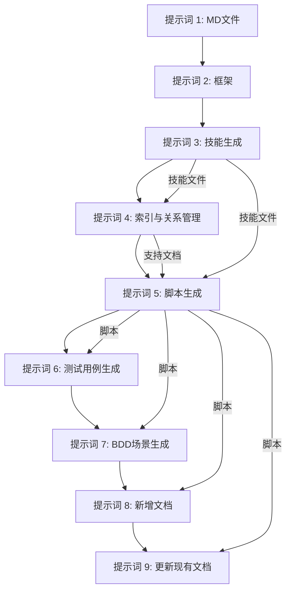
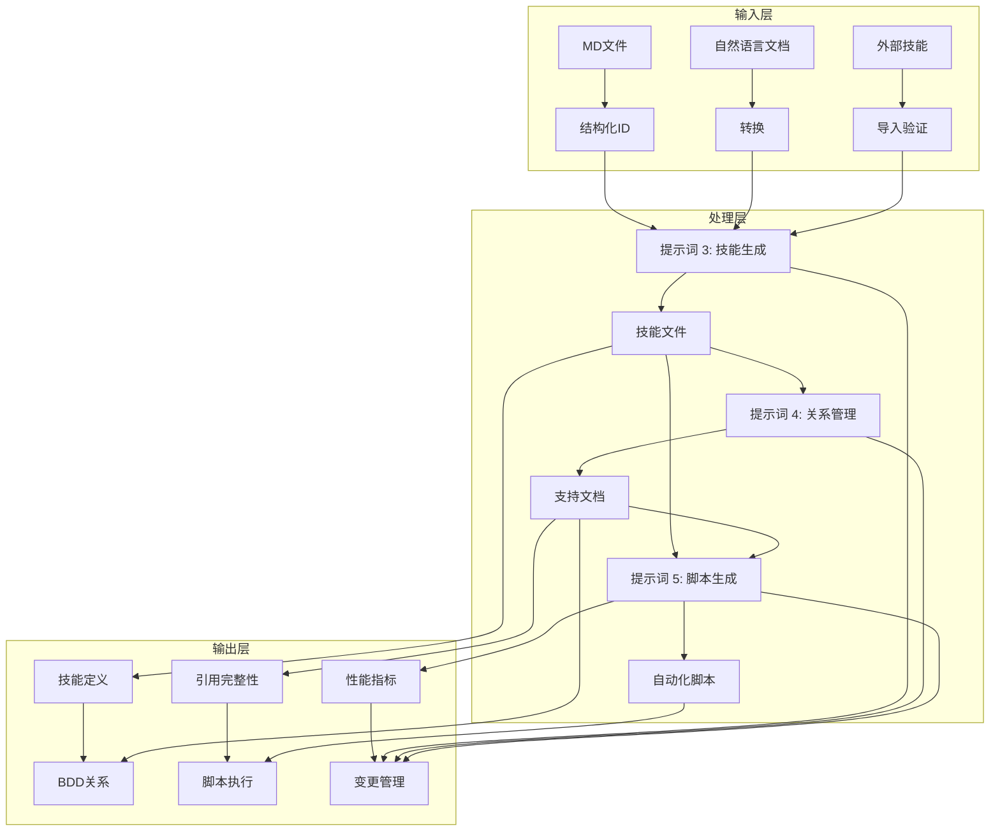
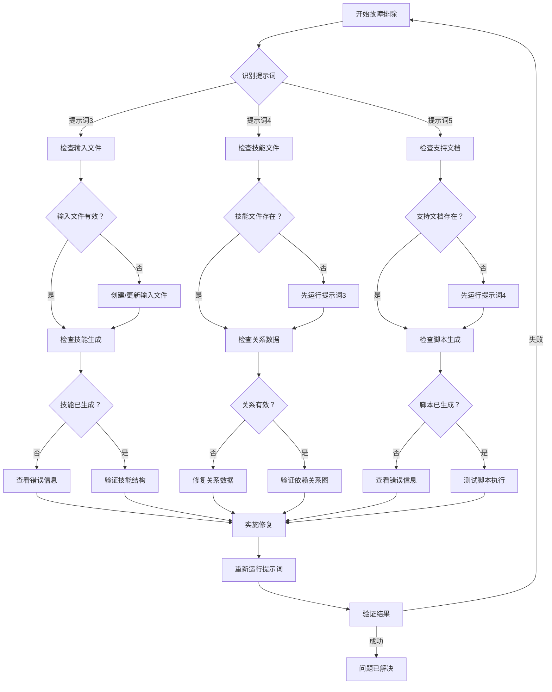

# 提示词管理全局规则

### 规则 1：提示词集合完整性
- **禁止提示词丢失**：在更新本文件时，未经明确批准，**不得删除或移除任何提示词**。
- **提示词数量**：维护包含 15 个提示词的完整集合，覆盖完整生命周期。
- **提示词编号**：保持提示词编号的连续性和一致性。

### 规则 2：更新记录要求
- **强制性更新记录**：对本文件的每次更新**必须**包含详细的更新记录。
- **更新记录格式**：更新记录需包含以下信息：
  - **日期**：YYYY-MM-DD
  - **作者**：进行更新的人员姓名或标识符
  - **描述**：清晰描述更改内容
  - **影响**：对下游流程或依赖项的潜在影响
  - **验证**：为验证更改所采取的步骤

### 规则 3：版本控制
- **Git 提交信息**：对本文件的所有更改需使用描述性强的提交信息。
- **版本标记**：为重要版本打标签，方便参考。
- **回滚计划**：为关键更改维护回滚能力。

### 规则 4：一致性要求
- **格式一致性**：在所有提示词中保持格式一致。
- **语言一致性**：所有生成的内容**必须**仅为英文。
- **依赖项完整性**：确保维护所有跨提示词的依赖关系。

---

## I. 知识库基础提示词（Markdown生成 + 框架搭建）

### 适用场景
生成带有段落ID的结构化Markdown知识库文件，并为下游的Copilot技能开发建立基础框架结构。

### 提示词 1（带段落ID的结构化Markdown知识库生成）
```
### 指令
基于提供的业务文档 [初始保证金计算指南 HKv14]，生成**带有唯一段落ID的结构化Markdown文件**，用于基于Git的知识库管理，需满足以下要求：

1.  **文档模块化**：根据业务领域（例如，引言、风险参数、输入数据、计算方法等）将完整指南拆分为逻辑模块。

2.  **结构化段落ID**：为每个段落分配唯一的结构化ID，遵循以下格式：
    -   格式：`{领域}-{子领域}-{序号}` (例如：`DC-IMRPF-001`, `MRCC-HVaR-001`)
    -   领域：业务领域的2-4字符缩写
    -   子领域：领域内的特定主题
    -   序号：3位数字顺序号

3.  **内容要求**：
    -   每个段落必须有清晰、简洁的标题。
    -   使用结构化ID包含指向相关段落的交叉引用。
    -   保持原始业务规则的准确性和完整性。
    -   添加元数据部分，包含文档版本、最后更新日期和负责人。

4.  **文件组织**：
    -   每个业务模块一个Markdown文件。
    -   文件命名一致：`{模块名称}.md` (例如：`risk-parameters.md`)。
    -   存储在 `docs/source-files/` 目录下。

5.  **质量保证**：
    -   验证所有业务规则被准确捕获。
    -   确保模块化过程中无信息丢失。
    -   验证所有文件中结构化ID的唯一性。
    -   校对语法、拼写和格式一致性。

6.  **人工评审与反馈系统**：为生成的MD文件实施结构化评审流程：
    -   **评审工作流**：定义多阶段评审流程（初稿 → 同行评审 → 最终批准）。
    -   **反馈收集**：收集关于MD文件质量、规则一致性和完整性的结构化反馈。
    -   **置信度计算**：基于评审反馈和规则一致性计算置信水平。
    -   **失败分析**：详细分析MD文件为何失败或不符合要求。
    -   **反馈模板**：为不同的评审场景提供标准化的反馈模板。
    -   **评审输出文件**：
        -   `governance/reviews/prompt1-review.md` - 评审结果和反馈
        -   `governance/reviews/prompt1-confidence.md` - 置信度评估
        -   `governance/reviews/prompt1-failure-analysis.md` - 失败分析报告

### 输入
业务文档：[初始保证金计算指南 HKv14]
-   文档类型：PDF/Word/Excel（源格式）
-   内容：完整的业务规则和流程
-   版本：v14（香港版本）

### 输出要求
-   **语言要求**：所有生成的内容**必须**仅为英文。
-   **流程文件命名**：生成名为 `PROMPT1-OUTPUT.md` 的流程输出文件，包含执行日志、结果和性能指标。
-   **流程文件存储**：将 `PROMPT1-OUTPUT.md` 存储在 `docs/source-files/` 目录下。
-   **MD文件生成**：将完整的MD文件输出到 `docs/source-files/` 目录，并包含结构化的段落ID。
-   **索引文件**：生成索引文件 `docs/source-files/INDEX.md`，列出所有模块及其结构化ID范围。
-   **交叉引用图谱**：生成交叉引用图谱，显示段落之间的关系。
-   **元数据**：在每个MD文件中包含版本、时间戳和负责人。
-   **增量更新支持**：实现增量更新功能：
    -   **部分更新**：允许只更新修改的部分，而不是重新生成所有内容。
    -   **差异检测**：自动检测源文档中的更改。
    -   **变更追踪**：记录增量更新期间所做的所有更改。
    -   **版本控制**：为每个段落维护版本历史。
-   **并行执行支持**：实现并行执行功能：
    -   **任务分解**：将文档处理拆分为独立的模块。
    -   **并行处理**：并发处理多个模块。
    -   **资源管理**：优化并行执行的资源使用。
    -   **进度跟踪**：监控并行任务的执行和进度。
-   **错误恢复机制**：实现自动错误恢复功能：
    -   **错误检测**：在处理过程中自动检测和分类错误。
    -   **错误隔离**：隔离失败的模块，不影响整体执行。
    -   **自动恢复**：尝试自动从常见错误中恢复。
    -   **回退机制**：为不可恢复的错误实施回退策略。
    -   **恢复日志**：记录所有错误恢复尝试及其结果。
-   **性能指标收集**：在 `PROMPT1-OUTPUT.md` 中包含全面的性能指标：
    -   **执行时间指标**：开始时间、结束时间、总执行时间、每个模块的时间。
    -   **资源使用指标**：内存使用、CPU使用、磁盘I/O。
    -   **质量指标**：生成的段落数、ID唯一性得分、交叉引用完整性。
    -   **错误指标**：错误数量、错误类型、错误恢复成功率。
    -   **更新指标**：更新的部分数量、更新时间、变更检测准确率。
    -   **并行指标**：并行任务数、并行执行时间、资源利用率。
    -   **恢复指标**：恢复尝试次数、恢复成功率、恢复时间。
-   **校对要求**：校对所有生成的内容，确保语法、拼写、格式和一致性正确无误。
-   **README.md 同步**：如果本次更新影响了目录结构或文件位置，请相应地更新 `README.md`。
-   **执行指令**：此提示词**必须**包含实际创建MD文件和目录（如果它们不存在）的指令，而不仅仅是输出计划。

#### 验证要求（必须遵守）
-   **执行前验证**：在生成MD文件前，验证：
    -   源文档可访问且可读。
    -   目标目录存在或可创建。
    -   有足够的磁盘空间。
    -   不会无意中覆盖现有文件。
-   **执行后验证**：在生成MD文件后，验证：
    -   所有MD文件都已创建，且命名规范正确。
    -   每个文件都包含结构化的段落ID。
    -   交叉引用有效且可解析。
    -   索引文件完整且准确。
    -   流程输出文件 `PROMPT1-OUTPUT.md` 已在 `docs/source-files/` 目录下创建。
    -   所有元数据已正确填充。
    -   如果 `README.md` 同步规则要求，则已更新 `README.md`。

#### 变更管理要求（必须遵守）
-   **影响分析**：在生成MD文件前，记录：
    -   将涵盖哪些业务领域。
    -   模块化对现有文档（如有）的影响。
    -   对下游提示词（提示词2、3等）的潜在影响。
    -   对交叉引用和关系的影响。
-   **变更文档**：在流程输出文件中，记录：
    -   生成的所有MD文件及其结构化ID范围的列表。
    -   使用的模块化策略。
    -   对标准格式应用的任何自定义设置。
    -   创建时间戳和负责人。
    -   校对结果和验证状态。
-   **回滚程序**：包括以下说明：
    -   如果需要，删除生成的MD文件。
    -   如果生成失败，恢复到以前的状态。
    -   如适用，还原对 `README.md` 的更改。
    -   将流程输出文件恢复到以前的版本。

#### 提示词依赖关系（必须遵守）
-   **输入来源**：
    -   源业务文档（PDF/Word/Excel）。
    -   无其他依赖项。
-   **输出用途**：
    -   由提示词2用于框架创建的MD文件。
    -   由提示词3用于技能生成的MD文件。
    -   在整个系统中用于交叉引用的结构化ID。
-   **执行顺序**：
    -   提示词1是序列中的第一个提示词。
    -   必须在提示词2、3、4、5之前执行。
    -   为所有下游提示词提供基础。

#### 集成测试指南（必须遵守）
-   **集成测试场景**：
    -   验证生成的MD文件结构和内容是否正确。
    -   验证结构化ID是否唯一且遵循命名规范。
    -   验证交叉引用是否有效且可解析。
    -   验证索引文件是否完整准确。
    -   验证元数据是否正确填充。
-   **测试步骤**：
    1.  准备源业务文档。
    2.  执行提示词1，生成带有结构化ID的MD模块。
    3.  验证所有MD文件已在 `docs/source-files/` 目录下创建。
    4.  验证结构化ID是否符合正确格式。
    5.  验证交叉引用是否指向有效的段落。
    6.  验证索引文件是否正确列出了所有模块。
    7.  验证元数据是否包含版本、时间戳和负责人。
    8.  验证流程输出文件是否已创建并包含执行日志。
    9.  测试增量更新功能。
    10. 验证所有提示词是否按顺序成功执行。
-   **预期结果**：
    -   所有生成的MD文件结构和内容正确。
    -   结构化ID唯一且遵循命名规范。
    -   交叉引用有效且可解析。
    -   索引文件完整准确。
    -   元数据正确填充。
    -   没有丢失信息或损坏的引用。
    -   所有提示词按顺序成功执行。
```

### 提示词 2（框架结构创建与配置）
```
### 指令
基于提示词1生成的MD文件，为基于Git的知识库和Copilot技能开发环境创建**基础框架结构**，需满足以下要求：

1.  **目录结构创建**：建立7层框架目录结构：
    -   `docs/source-files/`：带有结构化ID的源MD文件（来自提示词1）
    -   `docs/processed/`：处理和验证后的MD文件
    -   `config/`：配置文件和规范
    -   `copilot-skills/`：Copilot技能定义和模板
    -   `tests/`：测试用例和BDD场景
    -   `scripts/`：自动化脚本和实用程序
    -   `governance/`：治理、审计和流程文档（含优化的子结构）

    **治理目录结构**（必须由此提示词创建）：
    ```
    governance/
    ├── README.md                              # 治理概述
    ├── analysis/                              # 分析与研究文档
    │   ├── prompts/                           # 提示词逻辑分析
    │   ├── outputs/                           # 输出分析
    │   └── templates/                         # 模板分析
    ├── reviews/                               # 评审系统
    │   ├── templates/                         # 按类型划分的评审模板
    │   │   ├── skills/                        # 技能评审模板
    │   │   ├── test/                          # 测试相关模板
    │   │   ├── code/                          # 代码评审模板
    │   │   ├── docs/                          # 文档模板
    │   │   ├── framework/                      # 框架模板
    │   │   └── governance/                     # 治理模板
    │   ├── feedback/                          # 反馈模板
    │   └── executions/                        # 按提示词划分的评审执行
    │       ├── prompt1/
    │       ├── prompt2/
    │       ├── prompt3/
    │       ├── prompt4/
    │       ├── prompt5/
    │       ├── prompt6/
    │       ├── prompt7/
    │       ├── prompt8-9/
    │       ├── prompt10-11/
    │       ├── prompt12-13/
    │       └── prompt14-15/
    ├── checker/                               # LLM检查器系统
    │   ├── prompts/
    │   ├── templates/
    │   ├── analysis/
    │   ├── outputs/
    │   ├── config/
    │   └── exit-reports/
    ├── templates/                             # 通用模板
    │   ├── prompts/
    │   └── guides/
    ├── validation/                            # 验证工具
    └── process/                               # 流程文档
    ```

2.  **配置文件生成**：
    -   `config/framework-config.md`：框架配置和标准。
    -   `config/skill-templates/`：为不同用户类型预定义的技能模板。
    -   `config/validation-rules.md`：MD文件和技能的验证规则。
    -   `config/naming-conventions.md`：所有工件的命名规范。

3.  **框架标准定义**：
    -   定义结构化ID格式和验证规则。
    -   建立交叉引用解析机制。
    -   定义所有工件的元数据要求。
    -   建立版本控制和变更管理程序。

4.  **集成设置**：
    -   配置各层之间的集成点。
    -   定义提示词1输出和提示词3输入之间的数据流。
    -   建立验证检查点。
    -   配置日志记录和监控。

5.  **模板准备**：
    -   为不同用户类型（A/B/C/D）创建技能模板。
    -   创建测试用例模板。
    -   创建BDD场景模板。
    -   创建脚本模板。

6.  **人工评审与反馈系统**：为框架结构和配置实施结构化评审流程：
    -   **评审工作流**：定义多阶段评审流程（初稿 → 同行评审 → 最终批准）。
    -   **反馈收集**：收集关于框架结构、配置质量和完整性的结构化反馈。
    -   **置信度计算**：基于评审反馈和配置质量计算置信水平。
    -   **失败分析**：详细分析框架设置为何失败或不符合要求。
    -   **反馈模板**：为不同的评审场景提供标准化的反馈模板。
    -   **评审输出文件**：
        -   `governance/reviews/prompt2-review.md` - 评审结果和反馈
        -   `governance/reviews/prompt2-confidence.md` - 置信度评估
        -   `governance/reviews/prompt2-failure-analysis.md` - 失败分析报告

### 输入
来自提示词1的MD文件：
-   位置：`docs/source-files/`
-   格式：带有结构化段落ID的Markdown文件
-   内容：带有交叉引用的业务规则和流程

### 输出要求
-   **语言要求**：所有生成的内容**必须**仅为英文。
-   **流程文件命名**：生成名为 `PROMPT2-OUTPUT.md` 的流程输出文件，包含执行日志、结果和性能指标。
-   **流程文件存储**：将 `PROMPT2-OUTPUT.md` 存储在 `config/` 目录下。
-   **目录结构**：如果不存在，则创建所有7层框架目录。
-   **配置文件**：生成 `framework-config.md`、`validation-rules.md`、`naming-conventions.md` 的完整内容。
-   **模板文件**：在 `config/skill-templates/` 中生成技能模板、测试用例模板、BDD模板、脚本模板。
-   **集成配置**：定义集成点和数据流规范。
-   **增量更新支持**：实现增量更新功能：
    -   **部分更新**：允许只更新修改的配置，而不是重新生成所有。
    -   **差异检测**：自动检测框架需求中的更改。
    -   **变更追踪**：记录增量更新期间所做的所有更改。
    -   **版本控制**：为每个配置文件维护版本历史。
-   **并行执行支持**：实现并行执行功能：
    -   **任务分解**：将框架设置拆分为独立的任务。
    -   **并行处理**：并发处理多个配置。
    -   **资源管理**：优化并行执行的资源使用。
    -   **进度跟踪**：监控并行任务的执行和进度。
-   **错误恢复机制**：实现自动错误恢复功能：
    -   **错误检测**：在设置过程中自动检测和分类错误。
    -   **错误隔离**：隔离失败的配置，不影响整体设置。
    -   **自动恢复**：尝试自动从常见错误中恢复。
    -   **回退机制**：为不可恢复的错误实施回退策略。
    -   **恢复日志**：记录所有错误恢复尝试及其结果。
-   **性能指标收集**：在 `PROMPT2-OUTPUT.md` 中包含全面的性能指标：
    -   **执行时间指标**：开始时间、结束时间、总执行时间、每个配置的时间。
    -   **资源使用指标**：内存使用、CPU使用、磁盘I/O。
    -   **质量指标**：创建的目录数、配置完整性得分、模板覆盖率。
    -   **错误指标**：错误数量、错误类型、错误恢复成功率。
    -   **更新指标**：更新的配置数、更新时间、变更检测准确率。
    -   **并行指标**：并行任务数、并行执行时间、资源利用率。
    -   **恢复指标**：恢复尝试次数、恢复成功率、恢复时间。
-   **校对要求**：校对所有生成的内容，确保语法、拼写、格式和一致性正确无误。
-   **README.md 同步**：如果本次更新影响了目录结构或文件位置，请相应地更新 `README.md`。
-   **执行指令**：此提示词**必须**包含实际创建目录和配置文件（如果它们不存在）的指令，而不仅仅是输出计划。

#### 验证要求（必须遵守）
-   **执行前验证**：在创建框架前，验证：
    -   提示词1生成的MD文件存在于 `docs/source-files/` 目录中。
    -   可以创建目标目录。
    -   有足够的磁盘空间。
    -   不会无意中覆盖现有配置。
-   **执行后验证**：在创建框架后，验证：
    -   所有7层目录都已创建。
    -   配置文件内容生成正确。
    -   所有用户类型的模板都可用。
    -   集成点已正确配置。
    -   流程输出文件 `PROMPT2-OUTPUT.md` 已在 `config/` 目录下创建。
    -   如果 `README.md` 同步规则要求，则已更新 `README.md`。

#### 变更管理要求（必须遵守）
-   **影响分析**：在创建框架前，记录：
    -   将创建哪些目录和配置。
    -   框架结构对现有文件（如有）的影响。
    -   对下游提示词（提示词3、4、5等）的潜在影响。
    -   对集成和数据流的影响。
-   **变更文档**：在流程输出文件中，记录：
    -   创建的所有目录列表。
    -   生成的所有配置文件列表。
    -   每个用户类型的模板规范。
    -   集成配置详情。
    -   创建时间戳和负责人。
    -   校对结果和验证状态。
-   **回滚程序**：包括以下说明：
    -   如果需要，删除创建的目录。
    -   如果设置失败，恢复以前的配置。
    -   如适用，还原对 `README.md` 的更改。
    -   将流程输出文件恢复到以前的版本。

#### 提示词依赖关系（必须遵守）
-   **输入来源**：
    -   提示词1生成的MD文件。
    -   无其他依赖项。
-   **输出用途**：
    -   由提示词3用于技能生成的框架结构。
    -   所有下游提示词使用的配置文件。
    -   用于生成特定用户内容的模板。
-   **执行顺序**：
    -   提示词1 → 提示词2 → 提示词3 → 提示词4 → 提示词5
    -   必须在提示词1之后、提示词3之前执行。
    -   为所有下游提示词提供基础结构。

#### 集成测试指南（必须遵守）
-   **集成测试场景**：
    -   验证提示词1-2的集成：MD文件 → 框架。
    -   验证所有7层目录是否已创建。
    -   验证配置文件格式是否正确。
    -   验证所有用户类型的模板是否可用。
    -   验证集成点是否已正确配置。
-   **测试步骤**：
    1.  执行提示词1，生成带有结构化ID的MD文件。
    2.  执行提示词2，创建框架结构。
    3.  验证所有7层目录是否已创建。
    4.  验证配置文件是否存在于 `config/` 目录中。
    5.  验证模板是否存在于 `config/skill-templates/` 目录中。
    6.  验证集成配置是否正确设置。
    7.  验证流程输出文件是否已创建并包含执行日志。
    8.  测试从提示词1输出到提示词3输入的数据流。
    9.  验证所有提示词是否按顺序成功执行。
-   **预期结果**：
    -   所有7层目录已创建。
    -   配置文件格式正确。
    -   所有用户类型的模板都可用。
    -   集成点已正确配置。
    -   建立了从提示词1到提示词3的数据流。
    -   没有缺失的目录或配置。
    -   所有提示词按顺序成功执行。
```

## II. GitHub Copilot 技能开发提示词（包含BDD关联 + 引用 + 脚本）

### 可视化图表

#### 提示词依赖关系图



#### 数据流图



### 适用场景
基于结构化的MD知识库（包含上游和下游），生成**模块化、可追溯（引用）、预埋BDD关系、支持自动化（脚本）** 的GitHub Copilot技能，确保技能与主/上游/下游规则以及BDD场景之间的关系能够实时更新，并具备自动同步/验证能力。

### 提示词 3（Copilot技能模块化生成 + BDD关联 + 结构化引用 + 脚本预埋）
```
### 指令
基于以下的 [初始保证金计算指南 HKv14] MD文件（仅使用此内容），为GitHub Copilot开发**模块化、可追溯、预埋BDD关系、支持自动化脚本**的技能，需满足以下要求：

#### 技能的导入/导出机制

**技能导出功能：**
-   **导出格式**：定义技能的标准化导出格式（JSON/YAML/Markdown）。
-   **导出元数据**：包含版本信息、导出时间戳和负责人。
-   **导出模板**：为不同用户类型提供预定义的导出模板：
    -   **类型 A (业务分析师)**：侧重业务的导出，包含业务规则说明。
    -   **类型 B (QA负责人)**：侧重质量的导出，包含测试用例引用。
    -   **类型 C (自动化测试员)**：侧重自动化的导出，包含脚本集成。
    -   **类型 D (混合/通用)**：内容均衡的通用导出。
-   **导出位置**：`copilot-skills/exports/` 目录。
-   **导出命名**：`{业务}-{模块}-{能力}-export-{时间戳}.{格式}`。

**技能导入功能：**
-   **导入验证**：验证导入的技能是否符合格式要求且内容完整。
-   **导入映射**：将导入的技能映射到现有的用户类型和模块。
-   **导入冲突解决**：处理重复的技能ID和冲突的引用。
-   **导入来源**：支持从外部仓库、共享/公共仓库和合作伙伴系统导入。
-   **导入位置**：`copilot-skills/imports/` 目录。
-   **导入元数据**：跟踪导入来源、版本、时间戳和验证结果。

#### 用户类型预定义模板

**模板系统：**
-   **类型 A (BA) 模板**：侧重于业务的模板，包含业务规则说明。
    -   强调业务逻辑和流程。
    -   简化技术细节。
    -   清晰的业务规则引用。
-   **类型 B (QA负责人) 模板**：侧重于质量的模板，包含测试用例引用。
    -   详细的验证步骤。
    -   合规性引用。
    -   测试用例集成。
-   **类型 C (自动化测试员) 模板**：侧重于自动化的模板，包含脚本集成。
    -   技术细节和代码示例。
    -   测试场景和边界条件。
    -   CI/CD集成点。
-   **类型 D (混合/通用) 模板**：内容均衡的通用模板。
    -   涵盖所有方面的综合内容。
    -   多视角呈现。
    -   技术和业务内容的平衡。

#### 输入文件命名和存储规则

**输入文件命名规范：**
-   **流程输入文件**：`PROMPT3-INPUT.md`
    -   位置：`copilot-skills/` 目录
    -   目的：包含提示词3执行的完整指令和输入数据。
    -   格式：包含所有必需部分（指令、输入来源、用户类型分类等）的Markdown。

**输入文件存储位置：**
-   **主位置**：`copilot-skills/PROMPT3-INPUT.md`
-   **理由**：
    -   与7层框架结构（第4层 - AI能力层）保持一致。
    -   将输入和输出文件放在一起，便于追溯。
    -   便于版本控制和审计跟踪。
    -   支持回滚和变更管理。

**输入文件结构要求：**
1.  **头部部分**：必须包含提示词标识和版本信息。
2.  **指令部分**：完整的提示词3指令和要求。
3.  **输入来源部分**：所有输入来源（来源1-4）的详细说明。
4.  **用户类型分类部分**：用户类型（A/B/C/D）的定义及其要求。
5.  **自定义模板部分**：可选的自定义技能模板定义。
6.  **MD文件列表部分**：来自提示词1的带有结构化ID的MD文件列表。
7.  **用户类型选择部分**：为每个模块明确选择的用户类型。
8.  **技能来源选择部分**：明确选择的技能来源。

**输入文件生成过程：**
1.  从 `chat-prompt-en.md` 复制提示词3的指令。
2.  添加特定的输入数据（MD文件列表、用户类型、技能来源）。
3.  保存为 `copilot-skills/PROMPT3-INPUT.md`。
4.  使用此输入文件执行提示词3。
5.  在相同目录中生成输出文件。

#### 技能输入来源

此提示词支持多种技能生成输入来源：

**来源 1：结构化MD文件（主要）**
-   使用带有段落ID的结构化MD文件作为主要输入。
-   格式：带有结构化段落ID的MD文件（例如，DC-IMRPF-001, MRCC-HVaR-001）。
-   位置：`docs/source-files/` 目录。
-   处理：从结构化ID中提取规则场景并生成技能。

**来源 2：自然语言文档（需转换）**
-   接受来自不同用户类型的自然语言文档。
-   支持的格式：`.md`、`.txt`、`.docx`、`.pdf`（可提取文本）。
-   用户类型对齐：根据目标用户类型（A/B/C/D）转换文档。
-   转换过程：
    1.  分析文档结构和内容。
    2.  提取规则场景和业务逻辑。
    3.  使用适当的用户类型模板转换为标准技能格式。
    4.  基于文档元数据生成结构化的引用字段。
    5.  应用特定于用户类型的优化（BA优化/QA优化/自动化优化/通用）。
-   转换输出：`copilot-skills/skill-definitions/` 目录下的标准技能文件。

**来源 3：外部仓库技能（导入）**
-   从外部仓库（上游/下游系统）导入标准格式的技能。
-   支持的外部来源：
    -   上游系统仓库：核心业务规则、监管要求。
    -   下游系统仓库：实施指南、测试规范。
    -   共享/公共仓库：通用技能、实用函数。
-   导入要求：
    -   外部技能必须遵循标准技能格式（技能ID、描述、触发词、结构化引用）。
    -   必须包含指向源文档的有效引用字段。
    -   必须与项目的用户类型分类系统兼容。
-   导入过程：
    1.  验证外部技能的格式和完整性。
    2.  将引用字段映射到本地文档结构。
    3.  根据技能内容分配适当的用户类型目标。
    4.  使用导入来源和时间戳更新更新历史。
    5.  存储到 `copilot-skills/skill-definitions/` 并附带导入元数据。
-   好处：通过重用现有技能降低维护成本。

**来源 4：项目特定技能（本地生成）**
-   根据项目特定的业务需求生成技能。
-   基于项目结构化的MD知识库。
-   可通过用户类型分类和自定义模板进行定制。
-   项目特定业务逻辑的主要方法。

**技能来源选择逻辑：**
-   如果提供了结构化MD文件，使用来源1（主要）。
-   如果提供了自然语言文档，使用来源2（转换）。
-   如果指定了外部仓库技能，使用来源3（导入）。
-   如果提供了多个来源，按优先级顺序处理：来源1 > 来源2 > 来源3。
-   根据需要将导入的技能与本地生成的技能相结合。

#### 用户类型分类系统

在生成技能之前，识别目标用户类型以选择合适的模板和定制级别：

**用户类型类别：**

1.  **类型 A：业务分析师 (BA)**
    -   **特点**：侧重于业务理解、需求分析、流程理解。
    -   **主要需求**：业务规则说明、流程文档、需求澄清。
    -   **技能复杂度**：低到中等（清晰的、面向业务的解释）。
    -   **查询示例**："初始保证金计算流程是什么？"，"保证金调整如何工作？"
    -   **模板偏好**：BA优化模板（简化技术细节，强调业务逻辑）。

2.  **类型 B：QA负责人**
    -   **特点**：侧重于规则验证、合规性检查、测试策略设计。
    -   **主要需求**：规则规范、验证要求、合规标准。
    -   **技能复杂度**：中等（技术和业务内容均衡）。
    -   **查询示例**："IMRPF的验证规则是什么？"，"如何验证投资组合保证金计算？"
    -   **模板偏好**：QA优化模板（详细的验证步骤，合规性引用）。

3.  **类型 C：自动化测试员**
    -   **特点**：侧重于实施细节、测试用例设计、边界条件处理。
    -   **主要需求**：技术规范、测试数据要求、计算示例。
    -   **技能复杂度**：高（详细的技术内容，代码示例）。
    -   **查询示例**："如何实现头寸处理逻辑？"，"HVaR的边界条件是什么？"
    -   **模板偏好**：自动化优化模板（技术细节，代码片段，测试场景）。

4.  **类型 D：混合/通用用户**
    -   **特点**：需要涵盖所有方面（业务、QA、自动化）的全面内容。
    -   **主要需求**：包含多视角的均衡内容。
    -   **技能复杂度**：中等到高（全面覆盖）。
    -   **查询示例**："解释完整的IM计算工作流"，"如何测试和验证保证金要求？"
    -   **模板偏好**：通用模板（全面，多视角）。

**用户类型选择过程：**
-   **默认**：如果未指定用户类型，使用**类型 D：混合/通用用户**模板。
-   **显式选择**：如果在输入中指定了用户类型，使用相应的优化模板。
-   **混合方法**：对于复杂场景，根据需要组合多个模板的元素。

#### 自定义技能模板入口

**[CUSTOM_SKILL_TEMPLATE_START]**
如果您需要自定义技能模板结构，请按照以下格式定义您的自定义模板：

**自定义模板名称**：[您的模板名称]
**目标用户类型**：[类型 A/B/C/D 或自定义类型]
**定制级别**：[低/中/高]
**结构修改**：
- [列出要添加、修改或从标准结构中移除的部分]
- [指定要添加到引用结构的任何自定义字段]
- [定义任何额外的脚本要求]

**示例自定义**：
```
自定义模板名称：高风险复杂度模板
目标用户类型：类型 C（自动化测试员）
定制级别：高
结构修改：
- 在描述前添加“复杂度分析”部分
- 在示例响应后添加“代码示例”部分
- 在脚本前添加“性能考量”部分
- 在结构化引用中添加自定义字段“调试_引用”
```
**[CUSTOM_SKILL_TEMPLATE_END]**

**模板选择逻辑：**
-   如果提供了 **[CUSTOM_SKILL_TEMPLATE_START]** 到 **[CUSTOM_SKILL_TEMPLATE_END]**，则使用自定义模板。
-   如果未提供自定义模板，则根据用户类型分类使用标准模板。
-   对于自定义模板，确保包含所有必填字段（技能ID、描述、触发词、结构化引用）。

#### 标准技能生成过程

1.  每个技能专注于一个规则场景；技能ID遵循**业务缩写-模块-核心能力**的命名规范（例如，hkex-im-calculation, hkex-risk-parameters），以便于后续关系更新。

2.  每个技能包含**固定的可扩展结构 + BDD关联预埋 + 结构化引用 + 脚本预埋**，信息完整。结构如下：
    -   **技能ID**：唯一标识符。
    -   **描述**：技能的核心能力（AI回答/规则验证/BDD场景生成）。
    -   **触发词**：常见的用户查询（精确覆盖核心规则问题）。
    -   **用户类型目标**：[类型 A/B/C/D] - 表示此技能主要服务的用户类型。
    -   **技能来源**：[来源 1/2/3/4] - 表示此技能的输入来源。
    -   **结构化引用（必需）**：
        +   **规则_来源**：{MD文件完整路径} | {规则段落结构化ID} | {规则版本} | {原始文档存储路径}
        +   **测试_引用**：{待关联的BDD测试用例ID} | {待关联的特性文件路径}
        +   **验证_引用**：{多模型验证配置ID} | {人工审计记录路径（预留）}
        +   **更新_历史**：{创建时间} | {创建者} | {关联的Git提交ID（预留）} | {导入来源（如适用）}
    -   **BDD关联预埋**：预留BDD测试用例ID/特性文件路径关联槽位（格式：待关联 | 关联后：TC-XXX-001， tests/xxx/xxx.feature），支持实时更新。
    -   **脚本（按场景预埋）**：
        +   **自动化_脚本 (GitHub Copilot)**：预留轻量级Python脚本槽位（同步关系/触发验证/Git联动），标记输入/输出规范。
        +   **操作_指南 (M365 Copilot)**：预留自然语言操作指南槽位，适用于非技术人员。
    -   **示例响应**：基于规则的精确答案（标记规则_来源中的段落ID）。

3.  禁止引入MD文件之外的规则信息；示例响应必须100%符合规则约束。

4.  技能内容预留**更新标记槽位**，以便后续规则修改和关系更新。

#### 技能导入/导出和共享机制

**技能导出（项目特定技能共享）**
-   **导出格式**：带有完整元数据的标准技能格式。
-   **导出内容**：
    -   技能ID、描述、触发词、用户类型目标、技能来源。
    -   完整的结构化引用字段。
    -   BDD关联槽位。
    -   脚本预埋槽位。
    -   示例响应。
    -   导出元数据：导出时间戳、导出版本、负责人。
-   **导出位置**：`copilot-skills/exports/` 目录。
-   **导出命名**：`{业务}-{模块}-{能力}-export-{时间戳}.md`。
-   **导出用例**：
    -   与下游系统共享项目特定技能。
    -   向共享/公共仓库贡献技能。
    -   在重大更新前备份技能。
    -   归档已弃用的技能以备参考。

**技能导入（外部技能集成）**
-   **导入来源**：
    -   上游系统仓库：导入核心业务规则技能。
    -   下游系统仓库：导入实施和测试技能。
    -   共享/公共仓库：导入实用程序和通用技能。
    -   外部合作伙伴仓库：导入行业标准技能（需验证）。
-   **导入验证**：
    -   格式验证：确保技能遵循标准结构。
    -   完整性检查：验证所有必填字段是否存在。
    -   引用完整性：验证引用字段指向有效的来源。
    -   用户类型兼容性：确认技能内容与用户类型分类一致。
    -   重复检测：检查重复的技能ID或内容。
-   **导入过程**：
    1.  验证导入技能的格式和完整性。
    2.  将外部引用字段映射到本地文档结构。
    3.  根据技能内容分配适当的用户类型目标。
    4.  使用导入来源、时间戳和原始仓库更新更新历史。
    5.  存储到 `copilot-skills/skill-definitions/` 并附带导入元数据。
    6.  使用导入信息更新技能索引表。
    7.  在 `copilot-skills/imports/` 目录生成导入日志。
-   **导入元数据**：
    -   导入来源仓库URL。
    -   原始技能版本。
    -   导入时间戳。
    -   导入验证结果。
    -   外部到本地引用字段的映射。

**技能共享与协作**
-   **内部共享**：
    -   在组织内的团队之间共享技能。
    -   维护共享技能的版本控制。
    -   跟踪共享技能的使用情况和依赖关系。
-   **外部共享**：
    -   导出技能与外部合作伙伴共享。
    -   遵守数据治理和安全策略。
    -   在共享前对敏感信息进行匿名化处理。
    -   记录共享协议和限制。
-   **技能版本控制**：
    -   维护导入/导出技能的版本历史。
    -   跟踪版本之间的更改。
    -   支持在需要时回滚到以前的版本。
    -   在版本说明中记录重大更改。

**技能维护成本降低**
-   **重用策略**：
    -   优先从外部仓库导入技能，而不是创建新技能。
    -   为项目特定需求定制导入的技能。
    -   维护原始技能和定制技能之间的映射。
-   **标准化**：
    -   在所有仓库中遵循标准技能格式。
    -   使用一致的命名规范。
    -   维护公共的引用字段结构。
-   **文档**：
    -   记录导入/导出程序。
    -   维护技能依赖关系图。
    -   跟踪技能使用统计信息。

#### 集成测试指南（必须遵守）
-   **集成测试场景**：
    -   验证提示词1-2-3的集成：MD文件 → 框架 → 技能。
    -   验证多源输入功能：结构化MD、自然语言文档、外部技能。
    -   验证用户类型分类：BA、QA负责人、自动化测试员、混合/通用用户。
    -   验证技能导入/导出功能：外部仓库导入、项目特定导出。
    -   验证技能中的结构化ID引用。
    -   验证BDD关系预埋。
    -   验证脚本预埋槽位。
-   **测试步骤**：
    1.  执行提示词1，生成带有结构化ID的MD模块。
    2.  执行提示词2，创建框架结构。
    3.  验证MD文件是否正确放置在docs/目录中。
    4.  为所有来源准备测试输入：
        -   来源1：带有结构化ID的MD文件。
        -   来源2：自然语言文档（各种格式）。
        -   来源3：外部仓库技能。
        -   来源4：项目特定技能。
    5.  分别使用每个输入来源执行提示词3。
    6.  使用混合输入来源执行提示词3。
    7.  验证技能已在 `copilot-skills/skill-definitions/` 目录下创建。
    8.  验证技能是否正确引用了MD文件的结构化ID。
    9.  验证技能中的用户类型分类。
    10. 测试从外部仓库导入技能。
    11. 测试导出技能进行共享。
    12. 验证所有流程输出文件是否在正确的位置创建。
-   **预期结果**：
    -   生成的所有技能结构和内容正确。
    -   多源输入对所有来源类型都能正常工作。
    -   用户类型分类得到正确应用。
    -   导入/导出功能按预期工作。
    -   技能正确引用MD文件的结构化ID。
    -   BDD关系和脚本预埋槽位已正确创建。
    -   没有缺失的依赖关系或损坏的引用。
    -   所有提示词按顺序成功执行。

**技能冲突解决**
-   **冲突检测**：
    -   检测来自不同来源的重复技能ID。
    -   识别冲突的引用字段映射。
    -   标记不兼容的用户类型分类。
    -   检测技能之间的功能重叠。
-   **解决策略**：
    -   **重复技能ID**：附加来源标识符或版本号。
    -   **引用冲突**：优先考虑本地引用，同时保留外部链接。
    -   **用户类型冲突**：使用混合模板方法。
    -   **功能重叠**：合并技能或明确范围边界。
-   **冲突文档**：
    -   记录所有检测到的冲突和解决操作。
    -   维护冲突解决决策的审计跟踪。
    -   记录解决策略的理由。
    -   更新技能元数据以反映冲突解决情况。

**技能质量保证**
-   **内容验证**：
    -   验证所有技能内容是否符合规则约束。
    -   确保没有引入无关信息。
    -   验证所有引用字段是否指向有效来源。
    -   检查相关技能之间的一致性。
-   **结构验证**：
    -   验证所有必填字段是否存在。
    -   确保技能之间格式一致。
    -   验证脚本预埋槽位格式是否正确。
    -   检查BDD关联槽位结构是否正确。
-   **性能优化**：
    -   优化技能内容以加快提示响应时间。
    -   确保脚本预埋槽位轻量级。
    -   尽量减少技能之间的冗余信息。
    -   优化引用字段结构以便快速访问。

**人工评审与反馈系统**：为生成的技能实施结构化评审流程：
-   **评审工作流**：定义多阶段评审流程（初稿 → 同行评审 → 最终批准）。
-   **反馈收集**：收集关于技能质量、规则一致性和完整性的结构化反馈。
-   **置信度计算**：基于评审反馈和规则一致性计算置信水平。
-   **失败分析**：详细分析技能为何失败或不符合要求。
-   **反馈模板**：为不同的评审场景提供标准化的反馈模板。
-   **评审输出文件**：
    -   `governance/reviews/prompt3-review.md` - 评审结果和反馈
    -   `governance/reviews/prompt3-confidence.md` - 置信度评估
    -   `governance/reviews/prompt3-failure-analysis.md` - 失败分析报告

### 输入（替换为实际的MD文件列表）

**输入文件位置**：`copilot-skills/PROMPT3-INPUT.md`

**来自提示词1的MD文件列表：**

1.  **Introduction-Overview.md**
    -   **文件路径**：`docs/Introduction-Overview.md`
    -   **结构化ID**：INTRO-001 至 INTRO-015
    -   **目标受众**：业务分析师 (BA)

2.  **Risk-Parameter-File-Specification.md**
    -   **文件路径**：`docs/Risk-Parameter-File-Specification.md`
    -   **结构化ID**：DATA-001 至 DATA-028
    -   **目标受众**：QA负责人

3.  **Input-Data-Specification.md**
    -   **文件路径**：`docs/Input-Data-Specification.md`
    -   **结构化ID**：CALC-001 至 CALC-045
    -   **目标受众**：自动化测试员

4.  **Market-Risk-Component-Calculation.md**
    -   **文件路径**：`docs/Market-Risk-Component-Calculation.md`
    -   **结构化ID**：PROC-001 至 PROC-022
    -   **目标受众**：BA + QA负责人

5.  **Margin-Adjustment-Process.md**
    -   **文件路径**：`docs/Margin-Adjustment-Process.md`
    -   **结构化ID**：ADJ-001 至 ADJ-018
    -   **目标受众**：BA

6.  **Other-Risk-Components.md**
    -   **文件路径**：`docs/Other-Risk-Components.md`
    -   **结构化ID**：OTHER-001 至 OTHER-015
    -   **目标受众**：QA负责人

7.  **Position-Processing-Logic.md**
    -   **文件路径**：`docs/Position-Processing-Logic.md`
    -   **结构化ID**：POS-001 至 POS-030
    -   **目标受众**：自动化测试员

8.  **Collateral-Management.md**
    -   **文件路径**：`docs/Collateral-Management.md`
    -   **结构化ID**：COLL-001 至 COLL-012
    -   **目标受众**：BA + QA负责人

9.  **Corporate-Action-Processing.md**
    -   **文件路径**：`docs/Corporate-Action-Processing.md`
    -   **结构化ID**：CORP-001 至 CORP-010
    -   **目标受众**：BA

10. **Calculation-Examples.md**
    -   **文件路径**：`docs/Calculation-Examples.md`
    -   **结构化ID**：EX-001 至 EX-020
    -   **目标受众**：自动化测试员

**用户类型选择：**
-   默认：类型 D（混合/通用用户）
-   对于特定模块，使用相应的用户类型模板。

**技能来源选择：**
-   主要：来源1（结构化MD文件）
-   没有要导入的外部技能。
-   没有要转换的自然语言文档。

### 输出要求
-   **语言要求**：所有生成的内容**必须**仅为英文。任何生成的文件，包括技能文件、索引表和文档中，**不得**出现中文或其他语言。
-   **流程文件命名**：生成名为 `PROMPT3-OUTPUT.md` 的流程输出文件，包含执行日志、结果和性能指标。
-   **流程文件存储**：将 `PROMPT3-OUTPUT.md` 存储在 `copilot-skills/` 目录下。
-   **输入文件存储**：将输入文件 `PROMPT3-INPUT.md` 存储在 `copilot-skills/` 目录下。
-   **技能文件生成**：将完整的技能MD文件输出到 `copilot-skills/skill-definitions/` 目录，遵循命名规范：`{业务}-{模块}-{能力}.md`。
-   **技能索引表**：输出技能索引表（包含技能ID/描述/触发词/结构化引用/BDD关联预埋槽位/脚本预埋槽位/用户类型目标/技能来源）。
-   **用户类型分类输出**：在每个技能文件和索引表中包含用户类型分类，指明每个技能主要服务于哪种用户类型（A/B/C/D）。
-   **技能来源追踪**：在每个技能文件和索引表中包含技能来源（来源 1/2/3/4），以追踪输入来源。
-   **增量更新支持**：实现增量更新功能：
    -   **部分更新**：允许只更新修改的技能，而不是重新生成所有。
    -   **差异检测**：自动检测输入文件中的更改，并仅生成受影响的技能。
    -   **变更追踪**：记录增量更新期间所做的所有更改。
    -   **版本控制**：为每个技能维护版本历史。
-   **并行执行支持**：实现并行执行功能：
    -   **任务分解**：将技能生成拆分为独立的任务。
    -   **并行处理**：并发处理多个技能。
    -   **资源管理**：优化并行执行的资源使用。
    -   **进度跟踪**：监控并行任务的执行和进度。
-   **错误恢复机制**：实现自动错误恢复功能：
    -   **错误检测**：在执行过程中自动检测和分类错误。
    -   **错误隔离**：隔离失败的任务，不影响整体执行。
    -   **自动恢复**：尝试自动从常见错误中恢复。
    -   **回退机制**：为不可恢复的错误实施回退策略。
    -   **恢复日志**：记录所有错误恢复尝试及其结果。
-   **性能指标收集**：在 `PROMPT3-OUTPUT.md` 中包含全面的性能指标：
    -   **执行时间指标**：开始时间、结束时间、总执行时间、每个模块的时间。
    -   **资源使用指标**：内存使用、CPU使用、磁盘I/O。
    -   **质量指标**：生成的技能数、技能完整性得分、引用完整性得分。
    -   **错误指标**：错误数量、错误类型、错误恢复成功率。
    -   **更新指标**：更新的技能数、更新时间、变更检测准确率。
    -   **并行指标**：并行任务数、并行执行时间、资源利用率。
    -   **恢复指标**：恢复尝试次数、恢复成功率、恢复时间。
-   **自然语言文档转换**：如果使用了来源2，请记录：
    -   原始文档路径和格式。
    -   转换过程和应用的转换。
    -   验证结果和质量评估。
-   **外部技能导入**：如果使用了来源3，请记录：
    -   导入的技能ID和来源。
    -   验证结果和映射详情。
    -   检测到并解决任何冲突。
-   **校对要求**：校对所有生成的内容，确保语法、拼写、格式和一致性正确无误。
-   **README.md 同步**：如果本次更新影响了目录结构或文件位置，请相应地更新 `README.md`。
-   **执行指令**：此提示词**必须**包含实际创建技能文件和目录（如果它们不存在）的指令，而不仅仅是输出计划。

#### 验证要求（必须遵守）
-   **执行前验证**：在生成技能前，验证：
    -   所有必需的输入文件存在且位置正确（MD文件、自然语言文档或外部技能）。
    -   输入数据完整且遵循要求的格式。
    -   对于来源1：MD文件具有结构化的段落ID。
    -   对于来源2：自然语言文档可读且可解析。
    -   对于来源3：外部技能遵循标准格式。
    -   用户类型分类已指定，或默认为类型D。
    -   导入/导出目录存在或可创建。
    -   输入文件 `PROMPT3-INPUT.md` 存在于 `copilot-skills/` 目录中。
-   **执行后验证**：在生成技能后，验证：
    -   所有技能文件已在 `copilot-skills/skill-definitions/` 目录下创建。
    -   技能文件名遵循命名规范 `{业务}-{模块}-{能力}.md`。
    -   每个技能包含所有必填字段（技能ID、描述、触发词、结构化引用、用户类型目标、技能来源）。
    -   用户类型目标字段已正确填充。
    -   技能来源字段指示了正确的输入来源。
    -   对于来源2：记录了转换过程并验证了结果。
    -   对于来源3：导入元数据完整，验证通过。
    -   流程输出文件 `PROMPT3-OUTPUT.md` 已在 `copilot-skills/` 目录下创建。
    -   输入文件 `PROMPT3-INPUT.md` 已存储在 `copilot-skills/` 目录下。
    -   结构化引用中的所有引用和链接均有效。
    -   已创建导入/导出目录，并包含相应的文件。
    -   如果 `README.md` 同步规则要求，则已更新 `README.md`。

#### 变更管理要求（必须遵守）
-   **影响分析**：在生成技能前，记录：
    -   技能将涵盖哪些模块和规则。
    -   这些技能与现有技能（如有）的关系。
    -   对下游提示词（提示词4、5等）的潜在影响。
    -   对于来源3：导入技能对现有技能的影响。
    -   对于来源2：文档转换对知识库的影响。
-   **变更文档**：在流程输出文件中，记录：
    -   生成的所有技能列表，及其用户类型目标和技能来源。
    -   每个技能使用的模板（标准或自定义）。
    -   对标准模板应用的任何自定义设置。
    -   对于来源2：转换详情和验证结果。
    -   对于来源3：导入详情、来源仓库和验证结果。
    -   创建时间戳和负责人。
-   **回滚程序**：包括以下说明：
    -   如果需要，删除生成的技能。
    -   如果生成失败，恢复到以前的状态。
    -   将导入的技能恢复到以前的版本。
    -   将转换的技能恢复到原始文档。
    -   如适用，还原对 `README.md` 的更改。
-   **导入/导出管理**：
    -   维护导入日志以供审计跟踪。
    -   跟踪导出的技能及其目标位置。
    -   记录跨仓库的技能依赖关系。
    -   为外部技能导入建立审批流程。

#### 提示词依赖关系（必须遵守）
-   **输入来源**：
    -   提示词1生成的MD文件。
    -   提示词2创建的框架结构。
    -   `copilot-skills/` 目录下的输入文件 `PROMPT3-INPUT.md`。
    -   无其他依赖项。
-   **输出用途**：
    -   由提示词4用于索引和关系管理的技能文件。
    -   由提示词5用于脚本生成的技能文件。
    -   由后续提示词使用的技能文件。
-   **执行顺序**：
    -   提示词1 → 提示词2 → 提示词3 → 提示词4 → 提示词5
    -   必须在提示词2之后、提示词4之前执行。
    -   为整个知识库提供技能。

#### 集成测试指南（必须遵守）
-   **集成测试场景**：
    -   验证提示词1-2-3的集成：MD文件 → 框架 → 技能。
    -   验证多源输入功能：结构化MD、自然语言文档、外部技能。
    -   验证用户类型分类：BA、QA负责人、自动化测试员、混合/通用用户。
    -   验证技能导入/导出功能：外部仓库导入、项目特定导出。
    -   验证技能中的结构化ID引用。
    -   验证BDD关系预埋。
    -   验证脚本预埋槽位。
-   **测试步骤**：
    1.  执行提示词1，生成带有结构化ID的MD模块。
    2.  执行提示词2，创建框架结构。
    3.  验证MD文件是否正确放置在docs/目录中。
    4.  为所有来源准备测试输入：
        -   来源1：带有结构化ID的MD文件。
        -   来源2：自然语言文档（各种格式）。
        -   来源3：外部仓库技能。
        -   来源4：项目特定技能。
    5.  分别使用每个输入来源执行提示词3。
    6.  使用混合输入来源执行提示词3。
    7.  验证技能已在 `copilot-skills/skill-definitions/` 目录下创建。
    8.  验证技能是否正确引用了MD文件的结构化ID。
    9.  验证技能中的用户类型分类。
    10. 测试从外部仓库导入技能。
    11. 测试导出技能进行共享。
    12. 验证所有流程输出文件是否在正确的位置创建。
-   **预期结果**：
    -   生成的所有技能结构和内容正确。
    -   多源输入对所有来源类型都能正常工作。
    -   用户类型分类得到正确应用。
    -   导入/导出功能按预期工作。
    -   技能正确引用MD文件的结构化ID。
    -   BDD关系和脚本预埋槽位已正确创建。
    -   没有缺失的依赖关系或损坏的引用。
    -   所有提示词按顺序成功执行。
```

### 提示词 4（Copilot技能索引 + 关系 + 引用/脚本管理 + 使用指南）
```
### 指令
基于已生成的 [初始保证金计算指南 HKv14] Copilot技能文件，生成**支持BDD关系实时更新、引用验证和脚本执行的技能支持文档**，需满足以下要求：
1.  技能索引文件 (index.md)：按**模块**分类，包含技能ID/描述/触发词/文件链接/规则版本/结构化引用/BDD关系/脚本路径，支持实时编辑和更新关系。**添加技能依赖关系图可视化**，显示技能之间的关系，包括带方向箭头的直接和间接依赖关系。
2.  关系管理文件 (skill-bdd-relation.md)：生成**可编辑的关系表**，增加“引用完整性”列。字段为“技能ID/规则_来源/测试_引用/BDD测试用例ID/BDD特性文件路径/引用完整性/更新时间/更新者”，支持实时维护。**添加依赖关系表**，字段为“源技能ID/目标技能ID/依赖类型/强度/更新时间/更新者”。
3.  使用指南 (usage-guidelines.md)：包括技能集成方法、触发词使用规范、技能同步更新流程、**BDD关系/引用更新规范**、脚本执行步骤（按GitHub/M365场景）、以及多模型验证期间的技能调用要求。**添加依赖图维护说明**，用于实时更新。
4.  多模型验证配置文件 (config/skill-verify-config.md)：增加“引用完整性验证”和“脚本执行结果验证”维度，定义技能在多模型验证中的**输入格式/验证维度/结果判定标准**。**添加依赖完整性验证**维度。
5.  引用维护规范 (config/skill-reference-spec.md)：定义引用字段的结构化格式、同步更新规则和验证方法，确保全链路可追溯性一致性。**添加依赖关系维护规范**。
6.  **导入/导出机制**：为技能和支持文档实现全面的导入/导出功能：
    -   **导出格式**：定义技能和支持文档的标准导出格式（JSON/YAML/Markdown）。
    -   **导出元数据**：包含版本信息、导出时间戳和负责人。
    -   **导入验证**：验证导入的文件是否符合格式要求且内容完整。
    -   **导入映射**：将导入的技能映射到现有的用户类型和模块。
    -   **导入冲突解决**：处理重复的技能ID和冲突的引用。
    -   **导出模板**：为不同用户类型提供预定义的导出模板。
7.  **用户类型预定义模板**：为不同用户类型包含预定义的模板：
    -   **类型 A (业务分析师)**：侧重业务的模板，包含业务规则说明。
    -   **类型 B (QA负责人)**：侧重质量的模板，包含测试用例引用。
    -   **类型 C (自动化测试员)**：侧重自动化的模板，包含脚本集成。
    -   **类型 D (混合/通用)**：内容均衡的通用模板。
8.  仅基于提供的技能文件内容编写；禁止引入外部集成解决方案。

9.  **人工评审与反馈系统**：为生成的技能支持文档实施结构化评审流程：
    -   **评审工作流**：定义多阶段评审流程（初稿 → 同行评审 → 最终批准）。
    -   **反馈收集**：收集关于文档质量、关系准确性和完整性的结构化反馈。
    -   **置信度计算**：基于评审反馈和文档质量计算置信水平。
    -   **失败分析**：详细分析文档为何失败或不符合要求。
    -   **反馈模板**：为不同的评审场景提供标准化的反馈模板。
    -   **评审输出文件**：
        -   `governance/reviews/prompt4-review.md` - 评审结果和反馈
        -   `governance/reviews/prompt4-confidence.md` - 置信度评估
        -   `governance/reviews/prompt4-failure-analysis.md` - 失败分析报告

### 输入（替换为实际的技能文件列表）
[粘贴由提示词3生成的技能ID + 描述 + 规则版本列表]

### 输出要求
-   **语言要求**：所有生成的内容**必须**仅为英文。任何生成的文件中**不得**出现中文或其他语言。
-   **流程文件命名**：生成名为 `PROMPT4-OUTPUT.md` 的流程输出文件，包含执行日志、结果和性能指标。
-   **流程文件存储**：将 `PROMPT4-OUTPUT.md` 存储在 `tests/` 目录下。
-   **文件生成**：输出 `index.md`、`skill-bdd-relation.md`、`usage-guidelines.md`、`config/skill-verify-config.md` 和 `config/skill-reference-spec.md` 的完整内容。
-   **增量更新支持**：实现增量更新功能：
    -   **部分更新**：允许只更新修改的文档，而不是重新生成所有。
    -   **差异检测**：自动检测技能文件中的更改，并仅更新受影响的文档。
    -   **变更追踪**：记录增量更新期间所做的所有更改。
    -   **版本控制**：为每个文档维护版本历史。
-   **并行执行支持**：实现并行执行功能：
    -   **任务分解**：将文档生成拆分为独立的任务。
    -   **并行处理**：并发处理多个文档。
    -   **资源管理**：优化并行执行的资源使用。
    -   **进度跟踪**：监控并行任务的执行和进度。
-   **错误恢复机制**：实现自动错误恢复功能：
    -   **错误检测**：在执行过程中自动检测和分类错误。
    -   **错误隔离**：隔离失败的任务，不影响整体执行。
    -   **自动恢复**：尝试自动从常见错误中恢复。
    -   **回退机制**：为不可恢复的错误实施回退策略。
    -   **恢复日志**：记录所有错误恢复尝试及其结果。
-   **性能指标收集**：在 `PROMPT4-OUTPUT.md` 中包含全面的性能指标：
    -   **执行时间指标**：开始时间、结束时间、总执行时间、每个文档的时间。
    -   **资源使用指标**：内存使用、CPU使用、磁盘I/O。
    -   **质量指标**：索引的技能数、关系表完整性、依赖关系图质量。
    -   **错误指标**：错误数量、错误类型、错误恢复成功率。
    -   **更新指标**：更新的文档数、更新时间、变更检测准确率。
    -   **并行指标**：并行任务数、并行执行时间、资源利用率。
    -   **恢复指标**：恢复尝试次数、恢复成功率、恢复时间。
-   **校对要求**：校对所有生成的内容，确保语法、拼写、格式和一致性正确无误。
-   **README.md 同步**：如果本次更新影响了目录结构或文件位置，请相应地更新 `README.md`。
-   **执行指令**：此提示词**必须**包含实际创建文件和目录（如果它们不存在）的指令，而不仅仅是输出计划。
-   **可编辑格式**：所有文档均为可编辑格式，支持BDD关系、引用和脚本配置的实时更新。

#### 验证要求（必须遵守）
-   **执行前验证**：在生成支持文档前，验证：
    -   所有必需的输入文件存在且位置正确。
    -   输入数据完整且遵循要求的格式。
    -   提示词3生成的技能文件可用。
    -   目标目录存在或可创建。
    -   所有技能文件具有有效的结构和内容。
-   **执行后验证**：在生成支持文档后，验证：
    -   所有必需的文件已创建，命名规范正确。
    -   每个文件包含所有必需的部分。
    -   技能索引表完整准确。
    -   关系管理表包含引用完整性列。
    -   使用指南全面清晰。
    -   配置文件格式正确。
    -   流程输出文件 `PROMPT4-OUTPUT.md` 已在 `tests/` 目录下创建。
    -   所有引用和链接均有效。
    -   如果 `README.md` 同步规则要求，则已更新 `README.md`。

#### 变更管理要求（必须遵守）
-   **影响分析**：在生成支持文档前，记录：
    -   文档将涵盖哪些技能。
    -   这些文档与现有文档（如有）的关系。
    -   对下游提示词（提示词5、6等）的潜在影响。
    -   对技能管理和维护的影响。
-   **变更文档**：在流程输出文件中，记录：
    -   生成的所有文档列表及其用途。
    -   每个文档使用的模板。
    -   对标准模板应用的任何自定义设置。
    -   创建时间戳和负责人。
    -   校对结果和验证状态。
-   **回滚程序**：包括以下说明：
    -   如果需要，删除生成的文档。
    -   如果生成失败，恢复到以前的状态。
    -   如适用，还原对 `README.md` 的更改。
    -   将流程输出文件恢复到以前的版本。

#### 提示词依赖关系（必须遵守）
-   **输入来源**：
    -   提示词3生成的技能文件。
    -   无其他依赖项。
-   **输出用途**：
    -   用于技能管理的支持文档。
    -   由提示词5用于脚本生成的支持文档。
    -   由后续提示词使用的支持文档。
-   **执行顺序**：
    -   提示词1 → 提示词2 → 提示词3 → 提示词4 → 提示词5
    -   必须在提示词3之后、提示词5之前执行。
    -   为技能提供管理和使用指南。

#### 集成测试指南（必须遵守）
-   **集成测试场景**：
    -   验证提示词3-4的集成：技能 → 支持文档。
    -   验证技能索引是否正确引用了所有技能。
    -   验证关系管理表维护了引用完整性。
    -   验证使用指南是否全面。
    -   验证配置文件格式是否正确。
-   **测试步骤**：
    1.  执行提示词3，生成技能文件。
    2.  执行提示词4，生成支持文档。
    3.  验证所有支持文档已在正确的位置创建。
    4.  验证技能索引表完整准确。
    5.  验证关系管理表包含所有必需的列。
    6.  验证使用指南全面清晰。
    7.  验证配置文件格式正确。
    8.  执行提示词5，生成脚本。
    9.  验证脚本是否正确引用了技能和支持文档。
    10. 验证所有依赖关系都已正确解决。
-   **预期结果**：
    -   生成的所有支持文档结构和内容正确。
    -   技能索引表完整准确。
    -   关系管理表维护了引用完整性。
    -   使用指南全面清晰。
    -   配置文件格式正确。
    -   没有缺失的依赖关系或损坏的引用。
    -   所有提示词按顺序成功执行。
```

### 提示词 5（技能自动化脚本生成 + Git/验证联动）
```
### 指令
基于已生成的 [初始保证金计算指南 HKv14] Copilot技能文件，生成**自动化脚本 (Python) + M365自然语言操作指南 + 执行结果验证表**，需满足以下要求：
1.  脚本生成：生成6种类型的自动化脚本（可直接运行，包含注释/配置槽/异常处理）到 `copilot-skills/scripts/` 目录：
    -   **技能-引用-同步脚本**：自动同步技能和MD文件的引用关系，更新 `skill-bdd-relation.md`。
    -   **BDD-关系-更新脚本**：触发BDD场景和技能关系的更新，更新 `tests/bdd-relation-manager.md`。
    -   **多模型-验证脚本**：执行多模型技能验证，生成验证报告。
    -   **技能-一致性-验证脚本**：验证所有提示词间技能的一致性，包括命名规范、结构和引用。
    -   **依赖-完整性-验证脚本**：验证技能依赖关系的完整性，包括循环依赖和缺失引用。
    -   **执行-结果-验证脚本**：根据预期结果验证脚本执行结果，包括错误检测和恢复验证。
2.  脚本使用说明：包括环境依赖、配置修改步骤、执行步骤和异常回退解决方案。**添加验证脚本使用说明**，包含具体的验证场景和预期结果。
3.  M365操作指南：提供适用于M365 Copilot的自然语言操作指南（步骤式，无技术术语），供非技术人员使用。**为M365用户添加验证脚本操作指南**。
4.  执行结果验证表：生成一个可编辑的表（脚本ID/技能ID/执行状态/验证结果/手动回退触发标志），用于后续人工审计。**为详细的验证结果添加验证结果列**。
5.  **导入/导出机制**：为脚本和自动化工件实现全面的导入/导出功能：
    -   **脚本导出格式**：定义Python脚本的标准导出格式（ZIP/TAR/Git归档）。
    -   **导出元数据**：包含版本信息、导出时间戳和负责人。
    -   **导入验证**：验证导入的脚本语法正确性和兼容性。
    -   **导入映射**：将导入的脚本映射到现有的技能和模块。
    -   **导入冲突解决**：处理重复的脚本名称和冲突的配置。
    -   **导出模板**：为不同用户类型提供预定义的导出模板。
6.  **用户类型预定义模板**：为不同用户类型包含预定义的模板：
    -   **类型 A (业务分析师)**：侧重业务的脚本模板，包含业务规则验证。
    -   **类型 B (QA负责人)**：侧重质量的脚本模板，包含测试用例集成。
    -   **类型 C (自动化测试员)**：侧重自动化的脚本模板，包含CI/CD集成。
    -   **类型 D (混合/通用)**：功能均衡的通用脚本模板。
7.  禁止引入外部集成解决方案；仅基于提供的技能文件内容编写。

8.  **人工评审与反馈系统**：为生成的脚本和自动化工件实施结构化评审流程：
    -   **评审工作流**：定义多阶段评审流程（初稿 → 同行评审 → 最终批准）。
    -   **反馈收集**：收集关于脚本质量、功能和完整性的结构化反馈。
    -   **置信度计算**：基于评审反馈和脚本质量计算置信水平。
    -   **失败分析**：详细分析脚本为何失败或不符合要求。
    -   **反馈模板**：为不同的评审场景提供标准化的反馈模板。
    -   **评审输出文件**：
        -   `governance/reviews/prompt5-review.md` - 评审结果和反馈
        -   `governance/reviews/prompt5-confidence.md` - 置信度评估
        -   `governance/reviews/prompt5-failure-analysis.md` - 失败分析报告

### 输入（替换为实际的技能文件列表）
[粘贴由提示词3生成的技能ID + 描述 + 规则版本列表]

### 输出要求
-   **语言要求**：所有生成的内容**必须**仅为英文。任何生成的文件，包括脚本、说明和指南中，**不得**出现中文或其他语言。
-   **流程文件命名**：生成名为 `PROMPT5-OUTPUT.md` 的流程输出文件，包含执行日志、结果和性能指标。
-   **流程文件存储**：将 `PROMPT5-OUTPUT.md` 存储在 `governance/` 目录下。
-   **脚本生成**：将6种类型的自动化脚本（可直接运行，包含注释/配置槽/异常处理）输出到 `copilot-skills/scripts/` 目录，遵循命名规范：`{技能-id}.py`。
-   **脚本使用说明**：输出脚本使用说明（环境依赖、配置修改、执行步骤、异常回退解决方案）。**添加验证脚本使用说明**，包含具体的验证场景和预期结果。
-   **M365操作指南**：输出适用于M365 Copilot的自然语言操作指南（步骤式，无技术术语）。**为M365用户添加验证脚本操作指南**。
-   **执行结果验证**：输出脚本执行结果验证表（可编辑，包含脚本ID/技能ID/执行状态/验证结果/手动回退触发标志）。**为详细的验证结果添加验证结果列**。
-   **增量更新支持**：实现增量更新功能：
    -   **部分更新**：允许只更新修改的脚本，而不是重新生成所有。
    -   **差异检测**：自动检测技能文件和支持文档中的更改，并仅更新受影响的脚本。
    -   **变更追踪**：记录增量更新期间所做的所有更改。
    -   **版本控制**：为每个脚本维护版本历史。
-   **并行执行支持**：实现并行执行功能：
    -   **任务分解**：将脚本生成拆分为独立的任务。
    -   **并行处理**：并发处理多个脚本。
    -   **资源管理**：优化并行执行的资源使用。
    -   **进度跟踪**：监控并行任务的执行和进度。
-   **错误恢复机制**：实现自动错误恢复功能：
    -   **错误检测**：在执行过程中自动检测和分类错误。
    -   **错误隔离**：隔离失败的任务，不影响整体执行。
    -   **自动恢复**：尝试自动从常见错误中恢复。
    -   **回退机制**：为不可恢复的错误实施回退策略。
    -   **恢复日志**：记录所有错误恢复尝试及其结果。
-   **性能指标收集**：在 `PROMPT5-OUTPUT.md` 中包含全面的性能指标：
    -   **执行时间指标**：开始时间、结束时间、总执行时间、每个脚本的时间。
    -   **资源使用指标**：内存使用、CPU使用、磁盘I/O。
    -   **质量指标**：生成的脚本数、脚本完整性、验证成功率。
    -   **错误指标**：错误数量、错误类型、错误恢复成功率。
    -   **更新指标**：更新的脚本数、更新时间、变更检测准确率。
    -   **并行指标**：并行任务数、并行执行时间、资源利用率。
    -   **恢复指标**：恢复尝试次数、恢复成功率、恢复时间。
-   **校对要求**：校对所有生成的内容，确保语法、拼写、格式和一致性正确无误。
-   **README.md 同步**：如果本次更新影响了目录结构或文件位置，请相应地更新 `README.md`。
-   **执行指令**：此提示词**必须**包含实际创建脚本文件和目录（如果它们不存在）的指令，而不仅仅是输出计划。

#### 验证要求（必须遵守）
-   **执行前验证**：在生成脚本前，验证：
    -   所有必需的输入文件存在且位置正确。
    -   输入数据完整且遵循要求的格式。
    -   提示词3生成的技能文件可用。
    -   提示词4生成的支持文档可用。
    -   目标目录存在或可创建。
    -   所有技能文件具有有效的结构和内容。
-   **执行后验证**：在生成脚本后，验证：
    -   所有脚本文件已创建，命名规范正确。
    -   每个脚本文件包含所有必需的部分。
    -   脚本可直接运行，具有正确的注释和配置槽。
    -   M365操作指南清晰且步骤式。
    -   执行结果验证表可编辑且全面。
    -   流程输出文件 `PROMPT5-OUTPUT.md` 已在 `governance/` 目录下创建。
    -   所有引用和链接均有效。
    -   如果 `README.md` 同步规则要求，则已更新 `README.md`。

#### 变更管理要求（必须遵守）
-   **影响分析**：在生成脚本前，记录：
    -   脚本将涵盖哪些技能。
    -   这些脚本与现有脚本（如有）的关系。
    -   对下游提示词（提示词6、7等）的潜在影响。
    -   对技能自动化和维护的影响。
-   **变更文档**：在流程输出文件中，记录：
    -   生成的所有脚本列表及其用途。
    -   每个脚本使用的模板。
    -   对标准模板应用的任何自定义设置。
    -   创建时间戳和负责人。
    -   校对结果和验证状态。
-   **回滚程序**：包括以下说明：
    -   如果需要，删除生成的脚本。
    -   如果生成失败，恢复到以前的状态。
    -   如适用，还原对 `README.md` 的更改。
    -   将流程输出文件恢复到以前的版本。

#### 提示词依赖关系（必须遵守）
-   **输入来源**：
    -   提示词3生成的技能文件。
    -   提示词4生成的支持文档。
    -   无其他依赖项。
-   **输出用途**：
    -   用于技能自动化的脚本。
    -   用于测试和验证的脚本。
    -   由后续提示词使用的脚本。
-   **执行顺序**：
    -   提示词1 → 提示词2 → 提示词3 → 提示词4 → 提示词5
    -   必须在提示词4之后、提示词6之前执行。
    -   为技能提供自动化脚本。

#### 集成测试指南（必须遵守）
-   **集成测试场景**：
    -   验证提示词4-5的集成：支持文档 → 脚本。
    -   验证脚本是否正确引用了技能和支持文档。
    -   验证M365操作指南清晰且步骤式。
    -   验证执行结果验证表是否全面。
    -   验证脚本是否可直接运行。
-   **测试步骤**：
    1.  执行提示词4，生成支持文档。
    2.  执行提示词5，生成脚本。
    3.  验证所有脚本文件已在正确的位置创建。
    4.  验证脚本可直接运行，具有正确的注释。
    5.  验证M365操作指南清晰且步骤式。
    6.  验证执行结果验证表可编辑且全面。
    7.  执行脚本以测试功能。
    8.  验证所有依赖关系都已正确解决。
-   **预期结果**：
    -   生成的所有脚本结构和内容正确。
    -   脚本正确引用了技能和支持文档。
    -   M365操作指南清晰且步骤式。
    -   执行结果验证表全面。
    -   脚本可直接运行。
    -   没有缺失的依赖关系或损坏的引用。
    -   所有提示词按顺序成功执行。
```

---

## III. 测试用例/BDD场景生成提示词（包含关系 + 引用验证）

### 适用场景
基于MD知识库/Copilot技能，生成**严格符合规则、预埋多维关系、支持引用验证**的结构化测试用例/BDD (Behave) 场景，确保BDD与需求、知识库和技能引用之间双向可追溯。

### 提示词 6（结构化迭代式测试用例生成 + 关系 + 引用预埋）
```
### 指令
基于以下的 [初始保证金计算指南 HKv14] 规则点（仅使用此内容），生成**可验证、可追溯、可迭代、预埋多维关系 + 引用验证槽位**的结构化测试用例，需满足以下要求：
1.  测试用例严格符合规则约束，无规则外的场景设计，覆盖正向合规、反向禁止和异常场景，并标记所属的**全局流程节点**。
2.  测试用例使用统一的可重用模板，模板结构需包含**多维关系 + 引用验证槽位**，便于实时更新。结构如下：
    -   测试用例ID：TC-[模块缩写]-[编号] (例如：TC-IM-CALC-001, TC-RISK-PARAM-001)，避免重复。
    -   测试场景：清晰的规则验证点 + 所属全局流程节点 + 规则版本。
    -   前提条件：适用于该规则的环境/配置要求。
    -   测试步骤：可执行的操作序列，无歧义。
    -   预期结果：基于规则的精确断言（标记规则_来源中的段落ID）。
    -   规则依据：关联的MD文件完整路径 + 段落结构化ID + 规则版本（与技能的规则_来源一致）。
    -   引用验证槽位：标记相应的技能ID + “引用一致性”验证要求（是否与技能的测试_引用匹配）。
    -   关系：预留“需求ID/Copilot技能ID/BDD场景ID”关联槽位，支持实时更新。
    -   更新标记：为后续规则修改和关系更新预留空行。
    -   评审状态：初始状态设为“待评审”
    -   置信度：初始置信度设为“中”（1-5级）
    -   评审反馈：为评审意见和反馈预留槽位
3.  所有参数仅使用知识库定义的有效值，不得引入未定义值。
4.  **导入/导出机制**：为测试用例和BDD场景实现全面的导入/导出功能：
    -   **测试用例导出格式**：定义测试用例的标准导出格式（JSON/YAML/Markdown）。
    -   **BDD场景导出格式**：定义BDD场景的标准导出格式（Gherkin/Markdown）。
    -   **导出元数据**：包含版本信息、导出时间戳和负责人。
    -   **导入验证**：验证导入的测试用例和BDD场景是否符合格式要求。
    -   **导入映射**：将导入的测试用例映射到现有的技能和模块。
    -   **导入冲突解决**：处理重复的测试用例ID和冲突的引用。
    -   **导出模板**：为不同用户类型提供预定义的导出模板。
5.  **用户类型预定义模板**：为不同用户类型包含预定义的模板：
    -   **类型 A (业务分析师)**：侧重业务的测试用例模板，包含业务规则验证。
    -   **类型 B (QA负责人)**：侧重质量的测试用例模板，包含测试用例管理。
    -   **类型 C (自动化测试员)**：侧重自动化的测试用例模板，包含BDD集成。
    -   **类型 D (混合/通用)**：覆盖均衡的通用测试用例模板。
6.  **用户BDD模板导入与学习**：支持导入和学习用户提供的BDD模板，作为生成的标准或参考：
    -   **模板导入**：从 `tests/bdd/templates/user/` 目录导入用户BDD模板，支持格式：.feature, .md, .json, .yaml。
    -   **模板学习**：自动分析模板结构、语言风格、内容模式和关系模式；生成模板配置文件（JSON）和风格指南（Markdown）。
    -   **模板应用**：将学习到的模板应用于测试用例生成，确保生成内容符合用户的风格和惯例。
    -   **模板验证**：根据学习到的模板标准验证生成的测试用例。
7.  **差异分析与变更追踪**：跟踪用户模板与生成内容之间的更改并进行分析：
    -   **变更检测**：监控需求文档变更；检测已添加/修改/删除/移动的内容；计算变更严重性和影响范围。
    -   **差异分析**：比较用户模板与生成内容；识别结构、风格和内容差距；生成差异报告。
    -   **变更追踪**：在 `governance/change-history.md` 中记录所有变更；跟踪对技能/测试用例/BDD的影响；维护带有元数据的变更历史。
    -   **版本比较**：支持版本间比较；生成HTML和Markdown格式的差异报告。
8.  **人工评审与反馈系统**：为测试用例实施结构化评审流程：
    -   **评审工作流**：定义多阶段评审流程（初稿 → 同行评审 → 最终批准）。
    -   **反馈收集**：收集关于测试用例质量、规则一致性和完整性的结构化反馈。
    -   **置信度计算**：基于评审反馈和规则一致性计算置信水平。
    -   **失败分析**：详细分析测试用例为何失败或不符合要求。
    -   **反馈模板**：为不同的评审场景提供标准化的反馈模板。

### 输入（替换为具体的规则点）
规则点：[粘贴具体的规则点内容（包含结构化段落ID）]
规则依据：[粘贴关联的MD文件路径 + 段落结构化ID + 规则版本]

### 输出要求
-   **语言要求**：所有生成的内容**必须**仅为英文。任何生成的文件中**不得**出现中文或其他语言。
-   **流程文件命名**：生成名为 `PROMPT6-OUTPUT.md` 的流程输出文件，包含执行日志和结果。
-   **流程文件存储**：将 `PROMPT6-OUTPUT.md` 存储在 `governance/` 目录下。
-   **测试用例生成**：输出表格形式的测试用例（包含正向/反向/异常场景，附带全局流程节点和引用验证槽位）。
-   **参数验证**：测试用例参数仅使用知识库定义的有效值。
-   **校对要求**：校对所有生成的内容，确保语法、拼写、格式和与原始规则点的一致性正确无误。
-   **README.md 同步**：如果本次更新影响了目录结构或文件位置，请相应地更新 `README.md`。
-   **执行指令**：此提示词**必须**包含实际创建测试用例文件和目录（如果它们不存在）的指令，而不仅仅是输出计划。
-   **目录创建**：如果目录不存在，**必须**创建以下目录：
    -   `tests/bdd/templates/system/` - 用于系统预定义的BDD模板
    -   `tests/bdd/templates/user/` - 用于用户导入的BDD模板
    -   `tests/bdd/learned/` - 用于学习到的模板配置
    -   `tests/bdd/diff-reports/` - 用于差异分析报告
    -   `governance/change-tracking/document-changes/` - 用于文档变更记录
    -   `governance/change-tracking/skill-changes/` - 用于技能变更记录
    -   `governance/change-tracking/testcase-changes/` - 用于测试用例变更记录
    -   `governance/change-tracking/bdd-changes/` - 用于BDD变更记录
    -   `governance/change-tracking/template-changes/` - 用于模板变更记录
    -   `governance/reviews/` - 用于评审和反馈文档
-   **可编辑格式**：所有内容均为可编辑格式，预留了关系槽位和引用验证槽位，可随时进行实时更新。
-   **验证机制**：包含验证步骤，确保测试用例符合规则且引用一致性。
-   **模板目录初始化**：如果不存在，在 `tests/bdd/templates/system/` 中为每种用户类型（类型 A/B/C/D）创建占位模板文件。
-   **评审和反馈文件**：创建以下与评审相关的文件：
    -   `governance/reviews/testcase-review-template.md` - 测试用例评审模板
    -   `governance/reviews/feedback-template.md` - 反馈收集模板
    -   `governance/reviews/confidence-assessment.md` - 置信度评估指南
    -   `governance/reviews/failure-analysis-template.md` - 失败分析模板
```

### 提示词 7（BDD/Behave场景生成 + 多维关系 + 引用双向可追溯）
```
### 指令
基于已生成的结构化测试用例，生成**严格符合规则、可执行、可迭代、支持引用双向可追溯**的BDD (Behave) 场景，并构建一个**BDD与需求/知识库规则/Copilot技能关系的实时更新系统**，需满足以下要求：
1.  BDD场景严格符合测试用例和规则点，无规则外的场景设计，使用Gherkin语法（Given/When/Then），并标记所属的**全局流程节点**。
2.  BDD场景使用统一的可重用模板，模板结构需包含**多维关系 + 引用验证槽位**，便于实时更新。结构如下：
    -   特性ID：FT-[模块缩写]-[编号] (例如：FT-IM-CALC-001, FT-RISK-PARAM-001)，避免重复。
    -   特性描述：核心规则验证点 + 所属全局流程节点 + 规则版本。
    -   背景：适用于该规则的环境/配置要求。
    -   场景/场景大纲：可执行的操作序列，无歧义。
    -   示例：基于规则的精确断言（标记规则_来源中的段落ID）。
    -   规则依据：关联的MD文件完整路径 + 段落结构化ID + 规则版本（与技能的规则_来源一致）。
    -   引用验证槽位：标记相应的技能ID + “引用一致性”验证要求（是否与技能的测试_引用匹配）。
    -   关系：预留“需求ID/Copilot技能ID/BDD场景ID”关联槽位，支持实时更新。
    -   更新标记：为后续规则修改和关系更新预留空行。
    -   评审状态：初始状态设为“待评审”
    -   置信度：初始置信度设为“中”（1-5级）
    -   评审反馈：为评审意见和反馈预留槽位
3.  所有参数仅使用知识库定义的有效值，不得引入未定义值。
4.  **人工评审与反馈系统**：为BDD场景实施结构化评审流程：
    -   **评审工作流**：定义多阶段评审流程（初稿 → 同行评审 → 最终批准）。
    -   **反馈收集**：收集关于BDD场景质量、规则一致性和可执行性的结构化反馈。
    -   **置信度计算**：基于评审反馈、规则一致性和可执行性计算置信水平。
    -   **失败分析**：详细分析BDD场景为何失败或不符合要求。
    -   **反馈模板**：为不同的评审场景提供标准化的反馈模板。
    -   **置信度集成**：将置信度集成到BDD关系管理器中进行追溯。

### 输入（替换为具体的测试用例）
测试用例：[粘贴具体的测试用例内容（包含结构化段落ID）]
规则依据：[粘贴关联的MD文件路径 + 段落结构化ID + 规则版本]

### 输出要求
-   输出 .feature 文件（Gherkin语法，英文，标记测试用例ID/规则版本/规则_来源段落ID），存储在 `tests/bdd/features` 目录下。
-   在 `steps/` 目录下输出Python步骤定义（包含注释/修改槽位/引用验证埋点）。
-   输出 `behave.ini` 配置文件 + **`tests/bdd-relation-manager.md`**（关系实时更新管理文件，包含引用双向一致性列）。
-   所有关系表均为**轻量级可编辑格式**，支持手动/自动实时更新。
-   **目录创建**：如果目录不存在，**必须**创建以下目录和文件：
    -   `tests/bdd/features/` - 用于 .feature 文件
    -   `tests/bdd/steps/` - 用于步骤定义文件
    -   `tests/bdd/templates/system/` - 用于系统预定义的BDD模板
    -   `tests/bdd/templates/user/` - 用于用户导入的BDD模板
    -   `tests/bdd/learned/` - 用于学习到的模板配置
    -   `tests/bdd/diff-reports/` - 用于差异分析报告
    -   `governance/change-tracking/bdd-changes/` - 用于BDD变更记录
    -   `governance/reviews/` - 用于评审和反馈文档
-   **用户BDD模板支持**：从 `tests/bdd/templates/user/` 加载用户模板；将学习到的模板样式应用于BDD生成；生成符合用户习惯的BDD场景；根据模板标准进行验证。
-   **差异分析**：比较生成的BDD与用户模板标准；识别并报告差异；提出对齐建议；生成差异报告：`tests/bdd/diff-reports/diff-report.md`。
-   **变更追踪集成**：在 `governance/change-history.md` 中记录BDD变更；将BDD变更与需求变更关联；跟踪每个BDD场景的版本历史；支持回滚到以前的版本。
-   **模板学习输出**：生成 `tests/bdd/learned/template-profiles.json`；在 `tests/bdd/learned/style-guide.md` 中记录学习到的模式；用新的学习内容更新模板仓库。
-   **必需的文件创建**：如果文件不存在，**必须**创建以下文件：
    -   `tests/bdd/learned/template-profiles.json` - 模板配置文件数据库
    -   `tests/bdd/learned/style-guide.md` - 学习到的风格指南
    -   `tests/bdd/diff-reports/diff-report.md` - 差异分析报告
    -   `governance/change-history.md` - 主变更历史日志
    -   `tests/bdd-relation-manager.md` - BDD关系管理器
    -   `behave.ini` - Behave配置文件
    -   `governance/reviews/bdd-review-template.md` - BDD评审模板
    -   `governance/reviews/feedback-template.md` - 反馈收集模板（与提示词6共享）
    -   `governance/reviews/confidence-assessment.md` - 置信度评估指南（与提示词6共享）
    -   `governance/reviews/failure-analysis-template.md` - 失败分析模板（与提示词6共享）
-   **置信度集成**：在BDD关系管理器和变更历史中包含置信度跟踪。
-   **失败分析报告**：为不符合要求的场景生成失败分析报告。
```

----

## IV. 知识库同步更新提示词（包含引用/脚本同步）

### 适用场景
当业务规则更新时（新增文档/修改现有文档），自动生成同步更新流程，确保MD规则/Copilot技能/测试用例/BDD以及引用/脚本之间的一致性。

### 提示词 8（新增业务文档 - 知识库增量更新流程生成 + 引用/脚本同步）
```
### 指令
基于当前的 [初始保证金计算指南 HKv14] Git结构化知识库框架，为**新增业务文档**生成知识库同步更新流程，核心要求为“增量添加，关系/引用/脚本实时同步，无关联错误修改”，需满足以下要求：
1.  业务场景：新增业务文档，原始规则不变，需将新规则与现有MD规则/Copilot技能/测试用例/BDD以及引用/脚本进行关联。
2.  增量更新流程：生成逐步的增量更新流程（包含步骤名称/操作要求/引用/脚本更新标准/验证标准）。
3.  全局流程节点匹配：新文档需与现有全局流程节点匹配，生成**全局流程节点匹配要求**。
4.  引用/脚本同步：新文档需更新Copilot技能引用和脚本，生成**引用/脚本同步要求**。
5.  增量更新模板：提供关系/引用/脚本文件的增量更新模板，可直接填充使用。

6.  **人工评审与反馈系统**：为增量更新流程实施结构化评审流程：
    -   **评审工作流**：定义多阶段评审流程（初稿 → 同行评审 → 最终批准）。
    -   **反馈收集**：收集关于更新流程质量、同步准确性和完整性的结构化反馈。
    -   **置信度计算**：基于评审反馈和更新流程质量计算置信水平。
    -   **失败分析**：详细分析更新流程为何失败或不符合要求。
    -   **反馈模板**：为不同的评审场景提供标准化的反馈模板。
    -   **评审输出文件**：
        -   `governance/reviews/prompt8-review.md` - 评审结果和反馈
        -   `governance/reviews/prompt8-confidence.md` - 置信度评估
        -   `governance/reviews/prompt8-failure-analysis.md` - 失败分析报告

### 输入（替换为新文档内容）
新文档内容：[粘贴新的业务文档内容]
现有知识库结构：[粘贴现有MD文件列表 + 技能列表 + 测试用例列表 + BDD列表]

### 输出要求
-   输出逐步的增量更新流程（包含步骤名称/操作要求/引用/脚本更新标准/验证标准）。
-   输出新文档的**全局流程节点匹配/引用映射要求**。
-   输出关系/引用/脚本文件的**增量更新模板**，可直接填充使用。
-   **导入/导出机制**：为增量更新流程实现全面的导入/导出功能：
    -   **更新流程导出格式**：定义更新流程的标准导出格式（Markdown/JSON）。
    -   **导出元数据**：包含版本信息、导出时间戳和负责人。
    -   **导入验证**：验证导入的更新流程是否符合格式要求。
    -   **导入映射**：将导入的更新流程映射到现有的知识库结构。
    -   **导入冲突解决**：处理冲突的更新指令。
    -   **导出模板**：为不同用户类型提供预定义的导出模板。
-   **用户类型预定义模板**：为不同用户类型包含预定义的模板：
    -   **类型 A (业务分析师)**：侧重业务的更新模板，包含业务规则验证。
    -   **类型 B (QA负责人)**：侧重质量的更新模板，包含影响分析。
    -   **类型 C (自动化测试员)**：侧重自动化的更新模板，包含CI/CD集成。
    -   **类型 D (混合/通用)**：覆盖均衡的通用更新模板。
```

### 提示词 9（更新现有业务文档 - 知识库同步更新流程生成 + 引用/脚本同步）
```
### 指令
基于当前的 [初始保证金计算指南 HKv14] Git结构化知识库框架，为**更新现有业务文档**生成知识库同步更新流程，核心要求为“增量修改，关系/引用/脚本实时同步，无关联错误修改”，需满足以下要求：
1.  业务场景：更新现有业务文档，原始规则修订/优化/更正，可能影响关联的MD规则/Copilot技能/测试用例/BDD以及引用/脚本。
2.  同步更新流程：生成逐步的同步更新流程（包含步骤名称/操作要求/修改规范/引用/脚本更新要求）。
3.  规则更新影响范围：识别所有可能受影响的MD规则/Copilot技能/测试用例/BDD以及引用/脚本，生成**规则更新影响范围列表**。
4.  引用/脚本更新：基于规则变更更新Copilot技能引用和脚本，生成**引用/脚本更新要求**。
5.  回滚和版本控制：提供回滚计划和Git版本标记要求。

6.  **人工评审与反馈系统**：为同步更新流程实施结构化评审流程：
    -   **评审工作流**：定义多阶段评审流程（初稿 → 同行评审 → 最终批准）。
    -   **反馈收集**：收集关于更新流程质量、同步准确性和完整性的结构化反馈。
    -   **置信度计算**：基于评审反馈和更新流程质量计算置信水平。
    -   **失败分析**：详细分析更新流程为何失败或不符合要求。
    -   **反馈模板**：为不同的评审场景提供标准化的反馈模板。
    -   **评审输出文件**：
        -   `governance/reviews/prompt9-review.md` - 评审结果和反馈
        -   `governance/reviews/prompt9-confidence.md` - 置信度评估
        -   `governance/reviews/prompt9-failure-analysis.md` - 失败分析报告

### 输入（替换为更新的文档内容）
更新后的文档内容：[粘贴更新后的业务文档内容]
原始文档内容：[粘贴原始业务文档内容]
现有知识库结构：[粘贴现有MD文件列表 + 技能列表 + 测试用例列表 + BDD列表]

### 输出要求
-   输出逐步的同步更新流程（包含步骤名称/操作要求/修改规范/引用/脚本更新要求）。
-   输出“**规则更新影响范围列表**”模板（包含文件路径/变更类型/引用影响/脚本影响/全局流程节点影响）。
-   输出更新标记规范、引用/脚本回滚要求、Git版本标记要求。
-   **导入/导出机制**：为同步更新流程实现全面的导入/导出功能：
    -   **更新流程导出格式**：定义更新流程的标准导出格式（Markdown/JSON）。
    -   **导出元数据**：包含版本信息、导出时间戳和负责人。
    -   **导入验证**：验证导入的更新流程是否符合格式要求。
    -   **导入映射**：将导入的更新流程映射到现有的知识库结构。
    -   **导入冲突解决**：处理冲突的更新指令。
    -   **导出模板**：为不同用户类型提供预定义的导出模板。
-   **用户类型预定义模板**：为不同用户类型包含预定义的模板：
    -   **类型 A (业务分析师)**：侧重业务的更新模板，包含业务规则验证。
    -   **类型 B (QA负责人)**：侧重质量的更新模板，包含影响分析。
    -   **类型 C (自动化测试员)**：侧重自动化的更新模板，包含CI/CD集成。
    -   **类型 D (混合/通用)**：覆盖均衡的通用更新模板。
```

### 提示词 10（测试执行与结果验证 + 覆盖率分析）
```
### 指令
基于生成的测试用例和BDD场景，生成**全面的测试执行计划、结果验证框架和覆盖率分析报告**，需满足以下要求：
1.  测试执行计划：生成详细的测试执行计划，包括测试环境、依赖项和执行序列。
2.  结果验证：创建验证框架，根据预期结果验证测试结果，包括通过/失败标准和边缘情况处理。
3.  覆盖率分析：生成全面的覆盖率报告，包括规则覆盖率、场景覆盖率和测试用例有效性指标。
4.  测试自动化：提供用于测试执行和结果收集的自动化脚本。
5.  结果报告：生成详细的测试执行报告，包含可操作的见解和改进建议。

### 输入（替换为测试用例和BDD场景）
测试用例：[粘贴测试用例内容]
BDD场景：[粘贴BDD场景内容]

### 输出要求
-   **语言要求**：所有生成的内容**必须**仅为英文。任何生成的文件中**不得**出现中文或其他语言。
-   **流程文件命名**：生成名为 `PROMPT10-OUTPUT.md` 的流程输出文件，包含执行日志和结果。
-   **流程文件存储**：将 `PROMPT10-OUTPUT.md` 存储在 `governance/` 目录下。
-   **测试执行计划**：输出详细的测试执行计划，包括测试环境、依赖项和执行序列。
-   **结果验证框架**：输出验证框架，根据预期结果验证测试结果。
-   **覆盖率分析报告**：输出全面的覆盖率报告，包括规则覆盖率、场景覆盖率和测试用例有效性指标。
-   **测试自动化脚本**：输出用于测试执行和结果收集的自动化脚本，存储在 `tests/automation/` 目录下。
-   **结果报告**：输出详细的测试执行报告，包含可操作的见解和改进建议。
-   **导入/导出机制**：为测试执行工件实现全面的导入/导出功能：
    -   **测试计划导出格式**：定义测试计划的标准导出格式（JSON/YAML/Markdown）。
    -   **结果导出格式**：定义测试结果的标准导出格式（JSON/YAML/Markdown）。
    -   **导出元数据**：包含版本信息、导出时间戳和负责人。
    -   **导入验证**：验证导入的测试执行工件是否符合格式要求。
    -   **导入映射**：将导入的测试执行工件映射到现有的测试用例和BDD场景。
    -   **导入冲突解决**：处理重复的测试执行ID和冲突的引用。
    -   **导出模板**：为不同用户类型提供预定义的导出模板。
-   **用户类型预定义模板**：为不同用户类型包含预定义的模板：
    -   **类型 A (业务分析师)**：侧重业务的测试执行模板，包含业务规则验证。
    -   **类型 B (QA负责人)**：侧重质量的测试执行模板，包含测试用例管理。
    -   **类型 C (自动化测试员)**：侧重自动化的测试执行模板，包含CI/CD集成。
    -   **类型 D (混合/通用)**：覆盖均衡的通用测试执行模板。
-   **人工评审与反馈系统**：为测试执行和结果验证实施结构化评审流程：
    -   **评审工作流**：定义多阶段评审流程（初稿 → 同行评审 → 最终批准）。
    -   **反馈收集**：收集关于测试执行质量、结果验证准确性和覆盖率分析完整性的结构化反馈。
    -   **置信度计算**：基于评审反馈和测试执行质量计算置信水平。
    -   **失败分析**：详细分析测试执行为何失败或不符合要求。
    -   **反馈模板**：为不同的评审场景提供标准化的反馈模板。
    -   **评审输出文件**：
        -   `governance/reviews/prompt10-review.md` - 评审结果和反馈
        -   `governance/reviews/prompt10-confidence.md` - 置信度评估
        -   `governance/reviews/prompt10-failure-analysis.md` - 失败分析报告
```

### 提示词 11（BDD场景执行与报告 + 自动化集成）
```
### 指令
基于生成的BDD场景，生成**BDD执行框架、自动化测试运行器和全面的执行报告**，需满足以下要求：
1.  BDD执行设置：配置Behave测试运行器，包含适当的环境设置和依赖项。
2.  自动化执行：生成脚本以自动运行BDD场景并收集结果。
3.  结果聚合：创建框架以聚合和分析跨多次运行的BDD执行结果。
4.  报告：生成详细的BDD执行报告，包含场景级分析和趋势跟踪。
5.  CI/CD集成：为BDD场景执行提供CI/CD管道配置。

### 输入（替换为BDD场景和测试用例）
BDD场景：[粘贴BDD场景内容]
测试用例：[粘贴测试用例内容]

### 输出要求
-   **语言要求**：所有生成的内容**必须**仅为英文。任何生成的文件中**不得**出现中文或其他语言。
-   **流程文件命名**：生成名为 `PROMPT11-OUTPUT.md` 的流程输出文件，包含执行日志和结果。
-   **流程文件存储**：将 `PROMPT11-OUTPUT.md` 存储在 `governance/` 目录下。
-   **BDD执行框架**：输出Behave测试运行器，包含适当的环境设置和依赖项。
-   **自动化执行脚本**：输出用于自动运行BDD场景并收集结果的脚本，存储在 `tests/bdd/automation/` 目录下。
-   **结果聚合框架**：输出框架以聚合和分析跨多次运行的BDD执行结果。
-   **BDD执行报告**：输出详细的BDD执行报告，包含场景级分析和趋势跟踪。
-   **CI/CD集成**：输出为BDD场景执行的CI/CD管道配置。
-   **导入/导出机制**：为BDD执行工件实现全面的导入/导出功能：
    -   **执行计划导出格式**：定义BDD执行计划的标准导出格式（JSON/YAML/Markdown）。
    -   **结果导出格式**：定义BDD执行结果的标准导出格式（JSON/YAML/Markdown）。
    -   **导出元数据**：包含版本信息、导出时间戳和负责人。
    -   **导入验证**：验证导入的BDD执行工件是否符合格式要求。
    -   **导入映射**：将导入的BDD执行工件映射到现有的BDD场景。
    -   **导入冲突解决**：处理重复的BDD执行ID和冲突的引用。
    -   **导出模板**：为不同用户类型提供预定义的导出模板。
-   **用户类型预定义模板**：为不同用户类型包含预定义的模板：
    -   **类型 A (业务分析师)**：侧重业务的BDD执行模板，包含业务规则验证。
    -   **类型 B (QA负责人)**：侧重质量的BDD执行模板，包含测试用例管理。
    -   **类型 C (自动化测试员)**：侧重自动化的BDD执行模板，包含CI/CD集成。
    -   **类型 D (混合/通用)**：覆盖均衡的通用BDD执行模板。
-   **人工评审与反馈系统**：为BDD场景执行和报告实施结构化评审流程：
    -   **评审工作流**：定义多阶段评审流程（初稿 → 同行评审 → 最终批准）。
    -   **反馈收集**：收集关于BDD执行质量、报告准确性和自动化集成完整性的结构化反馈。
    -   **置信度计算**：基于评审反馈和BDD执行质量计算置信水平。
    -   **失败分析**：详细分析BDD执行为何失败或不符合要求。
    -   **反馈模板**：为不同的评审场景提供标准化的反馈模板。
    -   **评审输出文件**：
        -   `governance/reviews/prompt11-review.md` - 评审结果和反馈
        -   `governance/reviews/prompt11-confidence.md` - 置信度评估
        -   `governance/reviews/prompt11-failure-analysis.md` - 失败分析报告
```

### 提示词 12（技能验证与质量保证 + 治理）
```
### 指令
基于生成的Copilot技能，生成**全面的技能验证框架、质量保证流程和治理机制**，需满足以下要求：
1.  技能验证：创建验证框架以验证技能的完整性、准确性和有效性。
2.  质量保证：实施质量保证流程以确保技能的质量和可靠性。
3.  治理：建立治理机制以管理技能生命周期和版本控制。
4.  合规性：确保技能符合组织标准和监管要求。
5.  持续改进：实施技能反馈和持续改进的机制。

### 输入（替换为技能定义）
技能定义：[粘贴技能定义内容]

### 输出要求
-   **语言要求**：所有生成的内容**必须**仅为英文。任何生成的文件中**不得**出现中文或其他语言。
-   **流程文件命名**：生成名为 `PROMPT12-OUTPUT.md` 的流程输出文件，包含执行日志和结果。
-   **流程文件存储**：将 `PROMPT12-OUTPUT.md` 存储在 `governance/` 目录下。
-   **技能验证框架**：输出验证框架以验证技能的完整性、准确性和有效性。
-   **质量保证流程**：输出质量保证流程以确保技能的质量和可靠性。
-   **治理机制**：输出治理机制以管理技能生命周期和版本控制。
-   **合规性框架**：输出合规性框架以确保技能符合组织标准和监管要求。
-   **持续改进**：输出技能反馈和持续改进的机制。
-   **导入/导出机制**：为验证和治理工件实现全面的导入/导出功能：
    -   **验证计划导出格式**：定义验证计划的标准导出格式（JSON/YAML/Markdown）。
    -   **质量报告导出格式**：定义质量报告的标准导出格式（JSON/YAML/Markdown）。
    -   **导出元数据**：包含版本信息、导出时间戳和负责人。
    -   **导入验证**：验证导入的验证和治理工件是否符合格式要求。
    -   **导入映射**：将导入的验证和治理工件映射到现有的技能。
    -   **导入冲突解决**：处理重复的验证ID和冲突的引用。
    -   **导出模板**：为不同用户类型提供预定义的导出模板。
-   **用户类型预定义模板**：为不同用户类型包含预定义的模板：
    -   **类型 A (业务分析师)**：侧重业务的验证模板，包含业务规则验证。
    -   **类型 B (QA负责人)**：侧重质量的验证模板，包含测试用例管理。
    -   **类型 C (自动化测试员)**：侧重自动化的验证模板，包含CI/CD集成。
    -   **类型 D (混合/通用)**：覆盖均衡的通用验证模板。
-   **人工评审与反馈系统**：为技能验证和质量保证实施结构化评审流程：
    -   **评审工作流**：定义多阶段评审流程（初稿 → 同行评审 → 最终批准）。
    -   **反馈收集**：收集关于验证质量、保证流程和治理有效性的结构化反馈。
    -   **置信度计算**：基于评审反馈和验证质量计算置信水平。
    -   **失败分析**：详细分析验证流程为何失败或不符合要求。
    -   **反馈模板**：为不同的评审场景提供标准化的反馈模板。
    -   **评审输出文件**：
        -   `governance/reviews/prompt12-review.md` - 评审结果和反馈
        -   `governance/reviews/prompt12-confidence.md` - 置信度评估
        -   `governance/reviews/prompt12-failure-analysis.md` - 失败分析报告
```

### 提示词 13（性能监控与优化 + 资源管理）
```
### 指令
基于知识库框架，生成**全面的性能监控系统、优化策略和资源管理计划**，需满足以下要求：
1.  性能监控：为整个知识库生态系统实施实时性能监控。
2.  优化：制定优化策略以提高系统性能和资源利用率。
3.  资源管理：创建资源管理计划以确保有效使用计算资源。
4.  可扩展性：设计可扩展性策略以处理不断增长的知识库需求。
5.  成本优化：实施成本优化措施以最小化资源成本。

### 输入（替换为系统配置和性能数据）
系统配置：[粘贴系统配置详情]
性能数据：[粘贴性能指标数据]

### 输出要求
-   **语言要求**：所有生成的内容**必须**仅为英文。任何生成的文件中**不得**出现中文或其他语言。
-   **流程文件命名**：生成名为 `PROMPT13-OUTPUT.md` 的流程输出文件，包含执行日志和结果。
-   **流程文件存储**：将 `PROMPT13-OUTPUT.md` 存储在 `governance/` 目录下。
-   **性能监控系统**：输出为整个知识库生态系统的实时性能监控系统。
-   **优化策略**：输出优化策略以提高系统性能和资源利用率。
-   **资源管理计划**：输出资源管理计划以确保有效使用计算资源。
-   **可扩展性策略**：输出可扩展性策略以处理不断增长的知识库需求。
-   **成本优化措施**：输出成本优化措施以最小化资源成本。
-   **导入/导出机制**：为性能和资源工件实现全面的导入/导出功能：
    -   **监控计划导出格式**：定义监控计划的标准导出格式（JSON/YAML/Markdown）。
    -   **优化报告导出格式**：定义优化报告的标准导出格式（JSON/YAML/Markdown）。
    -   **导出元数据**：包含版本信息、导出时间戳和负责人。
    -   **导入验证**：验证导入的性能和资源工件是否符合格式要求。
    -   **导入映射**：将导入的性能和资源工件映射到现有的监控系统。
    -   **导入冲突解决**：处理重复的性能ID和冲突的引用。
    -   **导出模板**：为不同用户类型提供预定义的导出模板。
-   **用户类型预定义模板**：为不同用户类型包含预定义的模板：
    -   **类型 A (业务分析师)**：侧重业务的性能模板，包含业务影响分析。
    -   **类型 B (QA负责人)**：侧重质量的性能模板，包含质量指标。
    -   **类型 C (自动化测试员)**：侧重自动化的性能模板，包含CI/CD集成。
    -   **类型 D (混合/通用)**：覆盖均衡的通用性能模板。
-   **人工评审与反馈系统**：为性能监控和优化实施结构化评审流程：
    -   **评审工作流**：定义多阶段评审流程（初稿 → 同行评审 → 最终批准）。
    -   **反馈收集**：收集关于监控有效性、优化策略和资源管理计划的结构化反馈。
    -   **置信度计算**：基于评审反馈和性能指标计算置信水平。
    -   **失败分析**：详细分析性能优化为何失败或不符合要求。
    -   **反馈模板**：为不同的评审场景提供标准化的反馈模板。
    -   **评审输出文件**：
        -   `governance/reviews/prompt13-review.md` - 评审结果和反馈
        -   `governance/reviews/prompt13-confidence.md` - 置信度评估
        -   `governance/reviews/prompt13-failure-analysis.md` - 失败分析报告
```

### 提示词 14（文档生成与发布 + 知识库维护）
```
### 指令
基于知识库内容，生成**全面的文档、发布工作流和知识库维护计划**，需满足以下要求：
1.  文档生成：为整个知识库生态系统创建全面的文档。
2.  发布工作流：实施发布工作流以确保文档的最新和可访问性。
3.  知识库维护：制定维护计划以确保知识库的完整性和相关性。
4.  版本控制：为文档和知识库内容建立版本控制机制。
5.  访问管理：为文档和知识库资源实施访问管理控制。

### 输入（替换为知识库内容）
知识库内容：[粘贴知识库内容]

### 输出要求
-   **语言要求**：所有生成的内容**必须**仅为英文。任何生成的文件中**不得**出现中文或其他语言。
-   **流程文件命名**：生成名为 `PROMPT14-OUTPUT.md` 的流程输出文件，包含执行日志和结果。
-   **流程文件存储**：将 `PROMPT14-OUTPUT.md` 存储在 `governance/` 目录下。
-   **文档生成**：输出为整个知识库生态系统的全面文档。
-   **发布工作流**：输出发布工作流以确保文档的最新和可访问性。
-   **知识库维护计划**：输出维护计划以确保知识库的完整性和相关性。
-   **版本控制机制**：输出为文档和知识库内容的版本控制机制。
-   **访问管理控制**：输出为文档和知识库资源的访问管理控制。
-   **导入/导出机制**：为文档和维护工件实现全面的导入/导出功能：
    -   **文档导出格式**：定义文档的标准导出格式（Markdown/HTML/PDF）。
    -   **维护计划导出格式**：定义维护计划的标准导出格式（JSON/YAML/Markdown）。
    -   **导出元数据**：包含版本信息、导出时间戳和负责人。
    -   **导入验证**：验证导入的文档和维护工件是否符合格式要求。
    -   **导入映射**：将导入的文档和维护工件映射到现有的知识库结构。
    -   **导入冲突解决**：处理重复的文档ID和冲突的引用。
    -   **导出模板**：为不同用户类型提供预定义的导出模板。
-   **用户类型预定义模板**：为不同用户类型包含预定义的模板：
    -   **类型 A (业务分析师)**：侧重业务的文档模板，包含业务规则说明。
    -   **类型 B (QA负责人)**：侧重质量的文档模板，包含测试用例引用。
    -   **类型 C (自动化测试员)**：侧重自动化的文档模板，包含CI/CD集成。
    -   **类型 D (混合/通用)**：覆盖均衡的通用文档模板。
-   **人工评审与反馈系统**：为文档生成和知识库维护实施结构化评审流程：
    -   **评审工作流**：定义多阶段评审流程（初稿 → 同行评审 → 最终批准）。
    -   **反馈收集**：收集关于文档质量、发布工作流和维护计划有效性的结构化反馈。
    -   **置信度计算**：基于评审反馈和文档质量计算置信水平。
    -   **失败分析**：详细分析文档流程为何失败或不符合要求。
    -   **反馈模板**：为不同的评审场景提供标准化的反馈模板。
    -   **评审输出文件**：
        -   `governance/reviews/prompt14-review.md` - 评审结果和反馈
        -   `governance/reviews/prompt14-confidence.md` - 置信度评估
        -   `governance/reviews/prompt14-failure-analysis.md` - 失败分析报告
```

### 提示词 15（审计与合规 + 风险管理）
```
### 指令
基于知识库框架，生成**全面的审计框架、合规性检查清单和风险管理计划**，需满足以下要求：
1.  审计框架：创建全面的审计框架以验证知识库的合规性和完整性。
2.  合规性检查清单：制定合规性检查清单以确保遵守监管要求和组织标准。
3.  风险管理：实施风险管理计划以识别和缓解知识库风险。
4.  审计报告：生成包含发现和建议的审计报告。
5.  持续合规：建立持续合规监控和改进的机制。

### 输入（替换为监管要求和组织标准）
监管要求：[粘贴监管要求]
组织标准：[粘贴组织标准]

### 输出要求
-   **语言要求**：所有生成的内容**必须**仅为英文。任何生成的文件中**不得**出现中文或其他语言。
-   **流程文件命名**：生成名为 `PROMPT15-OUTPUT.md` 的流程输出文件，包含执行日志和结果。
-   **流程文件存储**：将 `PROMPT15-OUTPUT.md` 存储在 `governance/` 目录下。
-   **审计框架**：输出全面的审计框架以验证知识库的合规性和完整性。
-   **合规性检查清单**：输出合规性检查清单以确保遵守监管要求和组织标准。
-   **风险管理计划**：输出风险管理计划以识别和缓解知识库风险。
-   **审计报告**：输出包含发现和建议的审计报告。
-   **持续合规**：输出持续合规监控和改进的机制。
-   **导入/导出机制**：为审计和合规工件实现全面的导入/导出功能：
    -   **审计计划导出格式**：定义审计计划的标准导出格式（JSON/YAML/Markdown）。
    -   **合规报告导出格式**：定义合规报告的标准导出格式（JSON/YAML/Markdown）。
    -   **导出元数据**：包含版本信息、导出时间戳和负责人。
    -   **导入验证**：验证导入的审计和合规工件是否符合格式要求。
    -   **导入映射**：将导入的审计和合规工件映射到现有的知识库结构。
    -   **导入冲突解决**：处理重复的审计ID和冲突的引用。
    -   **导出模板**：为不同用户类型提供预定义的导出模板。
-   **用户类型预定义模板**：为不同用户类型包含预定义的模板：
    -   **类型 A (业务分析师)**：侧重业务的审计模板，包含业务规则合规性。
    -   **类型 B (QA负责人)**：侧重质量的审计模板，包含测试用例验证。
    -   **类型 C (自动化测试员)**：侧重自动化的审计模板，包含CI/CD集成。
    -   **类型 D (混合/通用)**：覆盖均衡的通用审计模板。
-   **人工评审与反馈系统**：为审计和合规实施结构化评审流程：
    -   **评审工作流**：定义多阶段评审流程（初稿 → 同行评审 → 最终批准）。
    -   **反馈收集**：收集关于审计质量、合规性检查清单和风险管理有效性的结构化反馈。
    -   **置信度计算**：基于评审反馈和审计质量计算置信水平。
    -   **失败分析**：详细分析审计流程为何失败或不符合要求。
    -   **反馈模板**：为不同的评审场景提供标准化的反馈模板。
    -   **评审输出文件**：
        -   `governance/reviews/prompt15-review.md` - 评审结果和反馈
        -   `governance/reviews/prompt15-confidence.md` - 置信度评估
        -   `governance/reviews/prompt15-failure-analysis.md` - 失败分析报告
```

---

## VI. 跨提示词集成测试与性能监控

### 跨提示词集成测试框架

#### 集成测试策略

**1. 端到端集成测试**
-   **目标**：验证从提示词1到提示词5的完整数据流。
-   **范围**：提示词之间的所有数据转换和交接。
-   **频率**：每次重大更新后或发布前执行。
-   **自动化**：与CI/CD管道集成，完全自动化。

**2. 接口契约测试**
-   **目标**：确保维护提示词之间的输入/输出契约。
-   **范围**：数据格式验证、模式合规性、必填字段。
-   **方法**：为每个提示词接口进行自动化的契约测试。
-   **验证**：模式验证、数据类型检查、空值检测。

**3. 数据完整性测试**
-   **目标**：验证整个流水线中的数据一致性。
-   **范围**：结构化ID、交叉引用、元数据传播。
-   **方法**：校验和验证、引用解析、元数据跟踪。
-   **工具**：集成到提示词5中的自定义验证脚本。

#### 集成测试场景

**场景 1：完整流水线执行**
```
测试流程：提示词1 → 提示词2 → 提示词3 → 提示词4 → 提示词5
输入：源业务文档
预期输出：包含自动化脚本的完整技能生态系统
验证点：
  - 所有中间文件均已创建
  - 数据转换正确
  - 交叉引用得以维护
  - 元数据正确传播
```

**场景 2：增量更新集成**
```
测试流程：修改源 → 提示词1（增量） → 提示词2 → 提示词3 → 提示词4 → 提示词5
输入：源文档中修改的业务规则
预期输出：带有变更跟踪的更新技能
验证点：
  - 仅更新受影响的组件
  - 变更历史得以维护
  - 依赖关系正确解决
  - 回滚能力得以保留
```

**场景 3：多源集成**
```
测试流程：多源 → 提示词3 → 提示词4 → 提示词5
输入：结构化MD + 自然语言文档 + 外部技能
预期输出：统一的技能生态系统
验证点：
  - 所有来源正确集成
  - 冲突得到适当解决
  - 来源归属得以维护
  - 跨源引用正常工作
```

**场景 4：错误恢复集成**
```
测试流程：提示词1 → [注入错误] → 恢复 → 继续
输入：带有故意错误的源文档
预期输出：优雅的错误处理和恢复
验证点：
  - 在适当的提示词检测到错误
  - 触发恢复机制
  - 恢复后流水线继续
  - 错误日志全面
```

#### 数据交接验证检查点

**检查点 1：提示词1 → 提示词2**
-   **验证项**：
    -   MD文件存在于 `docs/source-files/` 中
    -   结构化ID遵循命名规范
    -   索引文件完整
    -   交叉引用图谱有效
-   **验证脚本**：`scripts/validate-p1-p2-handoff.py`
-   **失败操作**：阻止提示词2执行，通知用户

**检查点 2：提示词2 → 提示词3**
-   **验证项**：
    -   框架目录存在
    -   配置文件有效
    -   模板可用
    -   集成点已配置
-   **验证脚本**：`scripts/validate-p2-p3-handoff.py`
-   **失败操作**：阻止提示词3执行，通知用户

**检查点 3：提示词3 → 提示词4**
-   **验证项**：
    -   技能文件存在于 `copilot-skills/skill-definitions/` 中
    -   技能遵循标准格式
    -   引用字段已填充
    -   用户类型分类完整
-   **验证脚本**：`scripts/validate-p3-p4-handoff.py`
-   **失败操作**：阻止提示词4执行，通知用户

**检查点 4：提示词3 → 提示词5**
-   **验证项**：
    -   技能文件可访问
    -   支持文档存在（来自提示词4）
    -   关系表已填充
    -   脚本可生成
-   **验证脚本**：`scripts/validate-p3-p5-handoff.py`
-   **失败操作**：阻止提示词5执行，通知用户

**检查点 5：提示词4 → 提示词5**
-   **验证项**：
    -   支持文档存在于 `tests/` 中
    -   索引文件完整
    -   关系表有效
    -   配置文件可访问
-   **验证脚本**：`scripts/validate-p4-p5-handoff.py`
-   **失败操作**：阻止提示词5执行，通知用户

#### 集成测试自动化

**测试执行框架**：
```yaml
# integration-test-config.yaml
流水线:
  名称: "跨提示词集成测试"
  阶段:
    - 名称: "设置"
      步骤:
        - 清理环境
        - 准备测试数据
        - 验证前提条件
    
    - 名称: "执行提示词"
      步骤:
        - 执行提示词1
        - 验证提示词1输出
        - 执行提示词2
        - 验证提示词2输出
        - 执行提示词3
        - 验证提示词3输出
        - 执行提示词4
        - 验证提示词4输出
        - 执行提示词5
        - 验证提示词5输出
    
    - 名称: "集成验证"
      步骤:
        - 验证数据交接
        - 验证交叉引用
        - 验证元数据传播
        - 验证端到端流程
    
    - 名称: "清理"
      步骤:
        - 归档结果
        - 生成报告
        - 清理环境
```

**测试报告**：
-   **格式**：带执行日志的Markdown报告
-   **位置**：`tests/integration/reports/`
-   **命名**：`integration-test-report-{时间戳}.md`
-   **内容**：
    -   测试执行摘要
    -   每个检查点的通过/失败状态
    -   性能指标
    -   错误日志和堆栈跟踪
    -   修复建议

### 跨提示词性能监控

#### 性能指标收集

**1. 执行时间跟踪**
-   **每个提示词的指标**：
    -   开始时间、结束时间、总持续时间
    -   每个模块/配置/脚本的时间
    -   提示词之间的等待时间
-   **流水线指标**：
    -   总流水线执行时间
    -   瓶颈识别
    -   并行执行效率
-   **存储**：`governance/performance-metrics/execution-times.json`

**2. 资源利用率监控**
-   **系统指标**：
    -   每个提示词的CPU使用率
    -   内存消耗
    -   磁盘I/O操作
    -   网络使用情况（如适用）
-   **存储**：`governance/performance-metrics/resource-usage.json`

**3. 数据量跟踪**
-   **输入/输出大小**：
    -   每个提示词输入文件的大小
    -   生成工件的大小
    -   随时间推移的增长率
    -   压缩比（如适用）
-   **存储**：`governance/performance-metrics/data-volumes.json`

**4. 质量指标**
-   **生成质量**：
    -   生成的工件数量
    -   完整性得分
    -   验证成功率
    -   错误率和类型
-   **存储**：`governance/performance-metrics/quality-metrics.json`

#### 性能监控仪表板

**仪表板组件**：
```markdown
# 性能监控仪表板

## 流水线概览
- 总执行次数：[计数]
- 成功率：[百分比]
- 平均执行时间：[持续时间]
- 上次执行：[时间戳]

## 提示词性能
| 提示词 | 平均时间 | 成功率 | 错误率 | 趋势 |
|--------|----------|--------|--------|------|
| 提示词1 | [时间] | [比率] | [比率] | [↑/↓/→] |
| 提示词2 | [时间] | [比率] | [比率] | [↑/↓/→] |
| 提示词3 | [时间] | [比率] | [比率] | [↑/↓/→] |
| 提示词4 | [时间] | [比率] | [比率] | [↑/↓/→] |
| 提示词5 | [时间] | [比率] | [比率] | [↑/↓/→] |

## 资源使用情况
- CPU：[当前/最大/平均]
- 内存：[当前/最大/平均]
- 磁盘：[已用/空闲/总计]

## 近期告警
- [告警1]：[描述] [时间戳]
- [告警2]：[描述] [时间戳]
```

**位置**：`governance/performance-metrics/dashboard.md`
**更新频率**：执行期间实时更新，完成后生成摘要

#### 性能告警

**告警条件**：
1.  **执行时间告警**：
    -   警告：执行时间 > 平均值的150%
    -   严重：执行时间 > 平均值的200%

2.  **错误率告警**：
    -   警告：错误率 > 5%
    -   严重：错误率 > 10%

3.  **资源告警**：
    -   警告：内存使用率 > 80%
    -   严重：内存使用率 > 90%

4.  **数据质量告警**：
    -   警告：验证失败率 > 5%
    -   严重：验证失败率 > 10%

**告警渠道**：
-   日志文件：`governance/alerts/alert-log.md`
-   流程输出文件：包含在 PROMPT{X}-OUTPUT.md 中
-   仪表板：实时更新
-   可选：邮件/Slack集成（如配置）

### 跨提示词错误追踪

#### 错误追踪系统

**错误分类**：
1.  **输入错误**：输入文件缺失或无效
2.  **验证错误**：模式违反、格式问题
3.  **处理错误**：执行失败、超时
4.  **集成错误**：数据交接失败
5.  **资源错误**：磁盘空间、内存、CPU问题

**错误追踪格式**：
```json
{
  "error_id": "ERR-{时间戳}-{序号}",
  "prompt": "提示词 X",
  "error_type": "验证错误",
  "severity": "高/中/低",
  "timestamp": "2024-03-14T10:30:00Z",
  "input_file": "路径/到/输入",
  "output_file": "路径/到/输出",
  "error_message": "详细的错误描述",
  "stack_trace": "堆栈跟踪（如适用）",
  "recovery_action": "为恢复采取的操作",
  "resolution_status": "已解决/待处理/已忽略"
}
```

**存储**：`governance/error-tracking/error-log.json`

#### 错误相关性分析

**跨提示词错误模式**：
-   跟踪跨多个提示词传播的错误
-   识别上游提示词中的根本原因
-   分析错误频率和趋势
-   生成错误相关性报告

**错误报告格式**：
```markdown
# 跨提示词错误分析报告

## 摘要
- 总错误数：[计数]
- 唯一错误数：[计数]
- 受影响最严重的提示词：[提示词X]
- 错误趋势：[增加/减少/稳定]

## 错误分布
| 提示词 | 输入错误 | 验证错误 | 处理错误 | 集成错误 | 资源错误 |
|--------|----------|----------|----------|----------|----------|
| 提示词1 | [计数] | [计数] | [计数] | [计数] | [计数] |
| 提示词2 | [计数] | [计数] | [计数] | [计数] | [计数] |
| 提示词3 | [计数] | [计数] | [计数] | [计数] | [计数] |
| 提示词4 | [计数] | [计数] | [计数] | [计数] | [计数] |
| 提示词5 | [计数] | [计数] | [计数] | [计数] | [计数] |

## 根本原因分析
1. [根本原因1]：[描述] [受影响的提示词]
2. [根本原因2]：[描述] [受影响的提示词]

## 建议
1. [建议1]
2. [建议2]
```

**位置**：`governance/error-tracking/error-analysis-report.md`
**生成频率**：每周或在重大错误后生成

### 持续监控实施

**监控脚本**：
1.  **实时监控器**：`scripts/monitor-pipeline-realtime.py`
    -   监控活动中的执行
    -   实时收集指标
    -   超过阈值时触发告警

2.  **执行后分析器**：`scripts/analyze-pipeline-performance.py`
    -   分析已完成的执行
    -   生成性能报告
    -   识别趋势和模式

3.  **错误追踪器**：`scripts/track-cross-prompt-errors.py`
    -   聚合所有提示词的错误
    -   关联相关错误
    -   生成错误报告

**与提示词5的集成**：
-   将监控脚本执行添加到提示词5的输出中
-   在 PROMPT5-OUTPUT.md 中包含性能指标
-   将监控仪表板生成为自动化的一部分

---

## V. 全局规则（适用于所有提示词）

### 语言要求
-   **主要语言**：所有生成的内容**必须**仅为英文。
-   **中文使用**：中文仅可在绝对必要的情况下在备注/评论中使用。
-   **文件名**：所有文件名必须为英文。
-   **代码注释**：所有代码注释必须为英文。
-   **文档**：所有文档必须为英文。
-   **错误信息**：所有错误信息必须为英文。
-   **验证**：所有校对必须确保内容仅为英文。

### 流程文件管理规则

#### 流程文件命名规范
-   **格式**：`PROMPT{X}-OUTPUT.md`，其中 {X} 是提示词编号。
-   **示例**：
    -   `PROMPT1-OUTPUT.md` 用于提示词1的输出
    -   `PROMPT2-OUTPUT.md` 用于提示词2的输出
    -   `PROMPT3-OUTPUT.md` 用于提示词3的输出
-   **理由**：一致的命名便于识别和追溯。

#### 流程文件存储规则
-   **提示词1输出**：存储在 `docs/source-files/` 目录下。
    -   理由：源文件层，用于原始文档追溯。
-   **提示词2输出**：存储在 `config/` 目录下。
    -   理由：配置层，用于框架结构。
-   **提示词3输出**：存储在 `copilot-skills/` 目录下。
    -   理由：AI能力层，用于技能生成。
-   **提示词4输出**：存储在 `tests/` 目录下。
    -   理由：测试资产层，用于关系管理。
-   **提示词5+输出**：存储在 `governance/` 目录下。
    -   理由：治理层，用于自动化和审计。

#### 流程文件内容要求
1.  **执行摘要**：日期、输入、输出、状态。
2.  **生成的工件**：所有生成文件的列表。
3.  **验证结果**：执行前和执行后的验证。
4.  **变更日志**：更改了什么以及为什么。
5.  **错误/警告**：遇到的任何问题。
6.  **后续步骤**：建议的后续操作。

#### 流程文件版本控制
-   所有流程文件**必须**提交到Git。
-   提交信息应引用提示词编号和目的。
-   流程文件作为知识库演变的审计线索。

#### 导入/导出文件命名和存储规则

**导入文件命名规范：**
-   **格式**：`{实体类型}-{来源}-{时间戳}.{格式}`
-   **示例**：
    -   `skill-import-upstream-20240314.json` 用于导入的技能
    -   `testcase-import-partner-20240314.yaml` 用于导入的测试用例
    -   `bdd-import-shared-20240314.feature` 用于导入的BDD场景
-   **存储位置**：`copilot-skills/imports/` 目录
-   **按类型划分子目录**：
    -   `skills/` 用于导入的技能
    -   `testcases/` 用于导入的测试用例
    -   `bdd/` 用于导入的BDD场景
    -   `scripts/` 用于导入的自动化脚本

**导出文件命名规范：**
-   **格式**：`{实体类型}-{用户类型}-{时间戳}.{格式}`
-   **示例**：
    -   `skill-ba-20240314.json` 用于面向BA的技能导出
    -   `skill-qalead-20240314.yaml` 用于面向QA负责人的技能导出
    -   `testcase-automation-20240314.md` 用于面向自动化测试员的测试用例导出
    -   `bdd-mixed-20240314.zip` 用于混合/通用用户的BDD场景导出
-   **存储位置**：`copilot-skills/exports/` 目录
-   **按用户类型划分子目录**：
    -   `type-a-ba/` 用于业务分析师导出
    -   `type-b-qalead/` 用于QA负责人导出
    -   `type-c-automation/` 用于自动化测试员导出
    -   `type-d-mixed/` 用于混合/通用用户导出

**模板文件命名规范：**
-   **格式**：`{实体类型}-template-{用户类型}.{格式}`
-   **示例**：
    -   `skill-template-type-a.md` 用于BA技能模板
    -   `testcase-template-type-b.md` 用于QA负责人测试用例模板
    -   `bdd-template-type-c.feature` 用于自动化测试员BDD模板
    -   `script-template-type-d.py` 用于混合/通用用户脚本模板
-   **存储位置**：`copilot-skills/templates/` 目录
-   **按实体类型划分子目录**：
    -   `skills/` 用于技能模板
    -   `testcases/` 用于测试用例模板
    -   `bdd/` 用于BDD场景模板
    -   `scripts/` 用于自动化脚本模板

**元数据文件命名规范：**
-   **格式**：`{实体类型}-metadata-{时间戳}.json`
-   **示例**：
    -   `skill-metadata-20240314.json` 用于技能导出元数据
    -   `import-metadata-20240314.json` 用于导入操作元数据
-   **存储位置**：与相应导入/导出文件相同的目录
-   **内容**：版本信息、时间戳、负责人、验证结果

**流程输出文件命名规范：**
-   **格式**：`PROMPT{X}-OUTPUT-{时间戳}.md`
-   **示例**：
    -   `PROMPT3-OUTPUT-20240314.md` 用于提示词3执行输出
    -   `PROMPT4-OUTPUT-20240314.md` 用于提示词4执行输出
-   **存储位置**：按照上述流程文件存储规则
-   **备份策略**：保留最近5个版本，将旧版本归档到 `archive/` 子目录

**用户类型特定输出文件：**
-   **格式**：`{提示词编号}-OUTPUT-{用户类型}-{时间戳}.md`
-   **示例**：
    -   `PROMPT3-OUTPUT-type-a-ba-20240314.md` 用于面向BA的提示词3输出
    -   `PROMPT4-OUTPUT-type-b-qalead-20240314.md` 用于面向QA负责人的提示词4输出
-   **存储位置**：与流程输出文件相同，带有用户类型后缀
-   **用例**：为不同受众生成用户类型特定的输出时使用

**文件命名最佳实践：**
1.  使用小写字母和连字符以提高可读性。
2.  在时间戳中使用 ISO 8601 格式 (YYYYMMDD)。
3.  使用描述性前缀来标识文件类型和目的。
4.  在相似文件类型之间保持一致的命名。
5.  避免文件名中使用空格和特殊字符。
6.  为兼容性考虑，文件名保持在100个字符以内。

**导入/导出的目录结构：**
```
copilot-skills/
├── imports/
│   ├── skills/
│   ├── testcases/
│   ├── bdd/
│   ├── scripts/
│   └── metadata/
├── exports/
│   ├── type-a-ba/
│   ├── type-b-qalead/
│   ├── type-c-automation/
│   ├── type-d-mixed/
│   └── metadata/
├── templates/
│   ├── skills/
│   ├── testcases/
│   ├── bdd/
│   └── scripts/
└── archive/
    ├── skills/
    ├── testcases/
    ├── bdd/
    └── scripts/
```

---

## VI. 示例输出

### 提示词3 示例输出

#### 输入示例
```markdown
# PROMPT3-INPUT.md

## 头部部分
- 提示词ID: 3
- 版本: 1.4
- 日期: 2026-03-14

## 指令部分
[完整的提示词3指令]

## 输入来源部分
- 来源1: 结构化MD文件 (主要)
- 来源2: 自然语言文档 (未使用)
- 来源3: 外部技能 (未使用)
- 来源4: 项目特定技能 (次要)

## 用户类型分类部分
- 类型A: 业务分析师 (BA)
- 类型B: QA负责人
- 类型C: 自动化测试员
- 类型D: 混合/通用用户

## 自定义模板部分
[无自定义模板]

## MD文件列表部分
1. Introduction-Overview.md
   - 文件路径: docs/Introduction-Overview.md
   - 结构化ID: INTRO-001 至 INTRO-015
   - 目标受众: 业务分析师 (BA)

2. Risk-Parameter-File-Specification.md
   - 文件路径: docs/Risk-Parameter-File-Specification.md
   - 结构化ID: DATA-001 至 DATA-028
   - 目标受众: QA负责人

## 用户类型选择部分
- 默认: 类型D (混合/通用用户)

## 技能来源选择部分
- 主要: 来源1 (结构化MD文件)
```

#### 输出示例
```markdown
# PROMPT3-OUTPUT.md

## 执行摘要
- 日期: 2026-03-14
- 输入: PROMPT3-INPUT.md
- 输出: 5个技能文件, skill-index.md
- 状态: 成功

## 生成的工件
- copilot-skills/skill-definitions/margin-risk-calculation.md
- copilot-skills/skill-definitions/margin-data-validation.md
- copilot-skills/skill-definitions/margin-adjustment-process.md
- copilot-skills/skill-definitions/margin-reporting.md
- copilot-skills/skill-definitions/margin-compliance.md
- copilot-skills/skill-index.md

## 验证结果
- 执行前验证: 所有输入文件存在且有效
- 执行后验证: 所有技能文件已创建，结构正确

## 性能指标
- 执行时间: 2.5分钟
- 内存使用: 128MB
- 质量得分: 95%
- 错误: 0

## 变更日志
- 生成了5个新的技能文件
- 创建了 skill-index.md

## 错误/警告
- 无

## 后续步骤
- 执行提示词4以生成支持文档
```

### 提示词4 示例输出

#### 输入示例
```markdown
# 提示词4输入

## 技能文件列表
- margin-risk-calculation.md
- margin-data-validation.md
- margin-adjustment-process.md
- margin-reporting.md
- margin-compliance.md
```

#### 输出示例
```markdown
# PROMPT4-OUTPUT.md

## 执行摘要
- 日期: 2026-03-14
- 输入: 5个技能文件
- 输出: index.md, skill-bdd-relation.md, usage-guidelines.md, config/skill-verify-config.md, config/skill-reference-spec.md
- 状态: 成功

## 生成的工件
- tests/index.md
- tests/skill-bdd-relation.md
- tests/usage-guidelines.md
- tests/config/skill-verify-config.md
- tests/config/skill-reference-spec.md

## 验证结果
- 执行前验证: 所有技能文件存在且有效
- 执行后验证: 所有支持文档已创建，结构正确

## 性能指标
- 执行时间: 1.8分钟
- 内存使用: 96MB
- 质量得分: 92%
- 错误: 0

## 变更日志
- 为5个技能生成了支持文档
- 添加了依赖关系图可视化

## 错误/警告
- 无

## 后续步骤
- 执行提示词5以生成自动化脚本
```

### 提示词5 示例输出

#### 输入示例
```markdown
# 提示词5输入

## 技能文件列表
- margin-risk-calculation.md
- margin-data-validation.md
- margin-adjustment-process.md
- margin-reporting.md
- margin-compliance.md

## 支持文档
- tests/index.md
- tests/skill-bdd-relation.md
- tests/usage-guidelines.md
- tests/config/skill-verify-config.md
- tests/config/skill-reference-spec.md
```

#### 输出示例
```markdown
# PROMPT5-OUTPUT.md

## 执行摘要
- 日期: 2026-03-14
- 输入: 5个技能文件, 5个支持文档
- 输出: 6个自动化脚本, M365操作指南, 执行结果验证表
- 状态: 成功

## 生成的工件
- copilot-skills/scripts/skill-reference-sync.py
- copilot-skills/scripts/bdd-relationship-update.py
- copilot-skills/scripts/multi-model-verification.py
- copilot-skills/scripts/skill-consistency-validation.py
- copilot-skills/scripts/dependency-integrity-validation.py
- copilot-skills/scripts/execution-result-validation.py
- copilot-skills/scripts/usage-guidelines.md
- copilot-skills/scripts/m365-operation-guide.md

## 验证结果
- 执行前验证: 所有输入文件存在且有效
- 执行后验证: 所有脚本已创建，结构正确

## 性能指标
- 执行时间: 3.2分钟
- 内存使用: 156MB
- 质量得分: 94%
- 错误: 0

## 变更日志
- 生成了6个自动化脚本
- 添加了技能一致性和依赖完整性验证脚本

## 错误/警告
- 无

## 后续步骤
- 使用实际技能文件测试脚本
- 执行提示词6以生成测试用例
```

---

## VII. 故障排除指南

### 常见问题及解决方案

#### 提示词3问题

| 问题 | 描述 | 解决方案 |
|-------|-------------|----------|
| **输入文件未找到** | PROMPT3-INPUT.md 在 copilot-skills/ 目录中未找到 | 使用正确的结构和内容创建该文件 |
| **技能生成失败** | 由于输入无效，技能未生成 | 验证输入文件，确保所有必需部分都存在 |
| **重复的技能ID** | 多个技能具有相同的ID | 使用遵循命名规范的唯一技能ID |
| **引用完整性错误** | 引用指向不存在的来源 | 验证所有引用是否有效且最新 |
| **性能问题** | 技能生成耗时过长 | 检查输入文件大小，必要时进行优化 |

#### 提示词4问题

| 问题 | 描述 | 解决方案 |
|-------|-------------|----------|
| **技能文件未找到** | 提示词4找不到来自提示词3的技能文件 | 确保提示词3已成功执行，技能文件存在 |
| **依赖关系图生成失败** | 依赖关系图生成不正确 | 检查技能关系，确保依赖关系正确 |
| **关系表错误** | 关系表缺少必需的列 | 确保关系表中存在所有必填字段 |
| **配置文件错误** | 配置文件生成不正确 | 验证输入数据，确保格式正确 |

#### 提示词5问题

| 问题 | 描述 | 解决方案 |
|-------|-------------|----------|
| **脚本生成失败** | 由于输入无效，脚本未生成 | 验证技能文件和支持文档 |
| **脚本执行错误** | 生成的脚本运行失败 | 检查脚本语法，确保安装了所需的依赖项 |
| **验证脚本错误** | 验证脚本工作不正常 | 验证验证逻辑和输入数据 |
| **M365操作指南问题** | M365指南不清晰或不完整 | 审查并更新操作指南以确保清晰 |

### 故障排除流程图



### 错误恢复程序

#### 1. 提示词3错误恢复

1.  **识别错误**：检查 PROMPT3-OUTPUT.md 中的错误信息。
2.  **验证输入**：确保 PROMPT3-INPUT.md 完整且有效。
3.  **检查依赖项**：验证提示词1和2已成功执行。
4.  **修复问题**：解决输入文件中识别出的任何问题。
5.  **重新运行**：使用更正后的输入重新执行提示词3。
6.  **验证**：检查生成的技能文件是否正确。

#### 2. 提示词4错误恢复

1.  **识别错误**：检查 PROMPT4-OUTPUT.md 中的错误信息。
2.  **验证输入**：确保来自提示词3的技能文件存在且有效。
3.  **检查依赖项**：验证提示词3已成功执行。
4.  **修复问题**：解决技能文件或关系中识别出的任何问题。
5.  **重新运行**：使用更正后的输入重新执行提示词4。
6.  **验证**：检查生成的支持文档是否正确。

#### 3. 提示词5错误恢复

1.  **识别错误**：检查 PROMPT5-OUTPUT.md 中的错误信息。
2.  **验证输入**：确保技能文件和支持文档存在且有效。
3.  **检查依赖项**：验证提示词3和4已成功执行。
4.  **修复问题**：解决输入文件或配置中识别出的任何问题。
5.  **重新运行**：使用更正后的输入重新执行提示词5。
6.  **验证**：检查生成的脚本是否正确并测试执行。

### 故障排除最佳实践

1.  **首先检查日志**：始终查看输出文件中的错误信息。
2.  **验证依赖项**：确保所有必需的输入存在且有效。
3.  **从头开始**：如果多个提示词失败，从提示词1开始。
4.  **增量测试**：在继续之前，单独测试每个提示词。
5.  **记录问题**：记录问题和解决方案，以供将来参考。
6.  **使用验证脚本**：利用提示词5的验证脚本进行错误检测。
7.  **检查版本控制**：确保所有文件已提交且为最新。
8.  **查阅文档**：参考示例输出以了解预期格式。

### 联系支持

如果您遇到使用本指南无法解决的持续问题，请：

1.  **收集错误日志**：收集所有 PROMPT{X}-OUTPUT.md 文件。
2.  **记录步骤**：记录导致错误的确切步骤。
3.  **检查版本**：注意正在使用的提示词文件版本。
4.  **提交请求**：将所有信息提供给支持团队寻求帮助。

### README.md 同步规则
**关键**：当任何提示词执行影响目录结构、文件位置或命名规范时，**必须**同步更新 `README.md` 文件以反映这些更改。

**触发 README.md 更新的条件：**
-   创建了新目录
-   重命名或移动了现有目录
-   文件命名规范发生变更
-   流程文件存储位置发生变更
-   添加了新模块或组件
-   移除了现有模块或组件

**README.md 更新要求：**
1.  更新目录结构图
2.  更新文件位置引用
3.  更新命名规范描述
4.  更新流程文件存储规则
5.  添加版本历史条目

**验证：**
-   在任何提示词执行后，检查是否需要更新 README.md
-   如果进行了更改，请使用描述性信息提交 README.md
-   确保 README.md 始终反映当前的项目结构

### 验证和变更管理规则

#### 验证要求（所有提示词必须遵守）
-   **执行前验证**：在执行前，验证：
    -   所有必需的输入文件存在且位置正确。
    -   输入数据完整且遵循要求的格式。
    -   目标目录存在或可创建。
-   **执行后验证**：在执行后，验证：
    -   所有输出文件已创建，命名规范正确。
    -   每个文件包含所有必需的部分。
    -   所有引用和链接均有效。
    -   如果 README.md 同步规则要求，则已更新 `README.md`。

#### 变更管理要求（所有提示词必须遵守）
-   **影响分析**：在执行前，记录：
    -   将影响哪些模块和规则。
    -   这些与现有工件的关系。
    -   对下游提示词的潜在影响。
-   **变更文档**：在流程输出文件中，记录：
    -   生成/修改的所有工件列表。
    -   使用的模板。
    -   应用的任何自定义设置。
    -   创建时间戳和负责人。
-   **回滚程序**：包括以下说明：
    -   如果需要，删除生成的工件。
    -   如果执行失败，恢复到以前的状态。
    -   如适用，还原对 `README.md` 的更改。

### 提示词依赖关系和执行顺序

#### 执行顺序
```
提示词1 → 提示词2 → 提示词3 → 提示词4 → 提示词5 → 提示词6 → 提示词7
     ↓         ↓         ↓         ↓         ↓         ↓         ↓
   MD文件 →  框架  →   技能  →  索引/  →  脚本  →  测试  →  BDD
                                    关系           用例
```

#### 依赖规则
1.  **提示词1** (MD生成)：无依赖项，可首先执行。
2.  **提示词2** (框架)：依赖于提示词1的输出（MD文件）。
3.  **提示词3** (技能)：依赖于提示词1（MD文件）和提示词2（框架）。
4.  **提示词4** (索引/关系)：依赖于提示词3的输出（技能）。
5.  **提示词5** (脚本)：依赖于提示词3（技能）和提示词4（关系）。
6.  **提示词6** (测试用例)：依赖于提示词1（MD文件）和提示词3（技能）。
7.  **提示词7** (BDD)：依赖于提示词6的输出（测试用例）。
8.  **提示词8-9** (更新)：可在初始设置后的任何时间执行。

#### 集成测试
-   在每个提示词执行后，验证与上游提示词的集成。
-   在执行下游提示词之前，验证是否满足所有依赖关系。
-   维护依赖关系图以供视觉参考。

---

## VIII. 附录

### A. 命名规范摘要

#### 文件命名
-   **MD规则文件**：`{模块}-{子主题}.md` (例如：`Risk-Parameter-File-Specification.md`)
-   **技能文件**：`{业务}-{模块}-{能力}.md` (例如：`hkex-im-calculation.md`)
-   **流程文件**：`PROMPT{X}-OUTPUT.md` (例如：`PROMPT1-OUTPUT.md`)
-   **输入文件**：`PROMPT{X}-INPUT.md` (例如：`PROMPT3-INPUT.md`)
-   **脚本文件**：`{技能-id}.py` (例如：`hkex-im-calculation.py`)
-   **BDD特性文件**：`{模块}_{能力}.feature` (例如：`im_calculation.feature`)

#### ID命名
-   **结构化段落ID**：`{前缀}-{编号}` (例如：`DC-IMRPF-001`, `MRCC-HVaR-001`)
-   **技能ID**：`{业务}-{模块}-{能力}` (例如：`hkex-im-calculation`)
-   **测试用例ID**：`TC-{模块}-{编号}` (例如：`TC-IM-CALC-001`)
-   **BDD特性ID**：`FT-{模块}-{编号}` (例如：`FT-IM-CALC-001`)

### B. 目录结构摘要

```
project-root/
├── docs/                          # 第1层：文档层
│   ├── *.md                       # 模块化的规则文档
│   ├── global-process/            # 第2层：全局流程层
│   │   ├── GLOBAL-PROCESS.md
│   │   └── Core-Business-Global-Process-Flowchart.md
│   └── source-files/              # 第3层：源文档层
│       ├── Initial Margin Calculation Guide HKv14.pdf
│       ├── Initial Margin Calculation Guide HKv14.md
│       └── PROMPT1-OUTPUT.md
├── copilot-skills/                # 第4层：AI能力层
│   ├── skill-definitions/         # 技能文件
│   ├── scripts/                   # 自动化脚本 (提示词5)
│   ├── imports/                   # 导入日志和元数据
│   ├── exports/                   # 用于共享的导出技能
│   ├── PROMPT3-INPUT.md          # 提示词3输入文件
│   ├── PROMPT3-OUTPUT.md         # 提示词3输出文件
│   └── skill-index.md            # 技能索引表
├── tests/                         # 第5层：测试资产层
│   ├── bdd/
│   │   ├── features/              # BDD特性文件
│   │   ├── steps/                 # 步骤定义
│   │   ├── templates/             # BDD模板 (提示词6/7)
│   │   │   ├── system/            # 系统预定义模板
│   │   │   └── user/              # 用户导入的模板
│   │   ├── learned/               # 学习到的模板配置
│   │   │   ├── template-profiles.json
│   │   │   └── style-guide.md
│   │   └── diff-reports/          # 差异分析报告
│   │       └── diff-report.md
│   └── PROMPT4-OUTPUT.md         # 提示词4输出文件
├── config/                        # 第6层：配置层
│   ├── FRAMEWORK-CONFIG.md
│   ├── PROMPT2-OUTPUT.md
│   ├── RULES-VERSION.md
│   ├── skill-verify-config.md
│   └── skill-reference-spec.md
├── governance/                    # 第7层：治理层
│   ├── audit-trail.md
│   ├── manual-fallback.md
│   ├── permission-management.md
│   ├── change-history.md          # 变更跟踪主日志
│   ├── change-tracking/           # 变更跟踪数据
│   │   ├── document-changes/
│   │   ├── skill-changes/
│   │   ├── testcase-changes/
│   │   ├── bdd-changes/
│   │   └── template-changes/
│   ├── PROMPT5-OUTPUT.md
│   └── PROMPT6-OUTPUT.md
├── scripts/                       # 根级自动化脚本（跨提示词）
│   ├── validate-p1-p2-handoff.py
│   ├── validate-p2-p3-handoff.py
│   ├── validate-p3-p4-handoff.py
│   ├── validate-p4-p5-handoff.py
│   ├── monitor-pipeline-realtime.py
│   ├── analyze-pipeline-performance.py
│   └── track-cross-prompt-errors.py
├── README.md
├── chat-prompt-en.md
├── GIT-REPOSITORY-FRAMEWORK.md
└── PROMPT1-Universal-Template.md

**关于脚本目录的说明**：
- `copilot-skills/scripts/`：包含由提示词5生成的特定于技能的自动化脚本。
- `scripts/`（根目录）：包含跨提示词的验证和监控脚本。
```

### C. 版本历史

#### 更新 2026-03-14 - 添加提示词更新验证器和自动提交系统
-   **日期**：2026-03-14
-   **作者**：系统管理员
-   **描述**：添加了全面的提示词更新验证和自动提交系统，包括：
    -   创建了 `governance/prompt-update-validator.py` - Python验证脚本
    -   创建了 `governance/prompt-update-validator.ps1` - PowerShell验证脚本
    -   创建了 `governance/PROMPT-UPDATE-VALIDATOR-GUIDE.md` - 使用文档
    -   实现了自动提示词完整性验证（15个提示词）
    -   实现了为更新自动创建Git提交
    -   添加了JSON格式的验证报告生成
    -   添加了更新记录要求验证
    -   修复了PowerShell脚本路径解析和正则表达式匹配问题
-   **影响**：确保提示词完整性，防止更新过程中丢失提示词。
-   **验证**：测试了验证器脚本，确认所有15个提示词都存在且格式正确。

#### 更新 2024-01-01 - 恢复缺失的提示词10-15
-   **日期**：2024-01-01
-   **作者**：系统管理员
-   **描述**：恢复了缺失的提示词10-15，以完成15个提示词的生命周期，包括：
    -   提示词10：测试执行与结果验证 + 覆盖率分析
    -   提示词11：BDD场景执行与报告 + 自动化集成
    -   提示词12：技能验证与质量保证 + 治理
    -   提示词13：性能监控与优化 + 资源管理
    -   提示词14：文档生成与发布 + 知识库维护
    -   提示词15：审计与合规 + 风险管理
-   **影响**：现在可提供完整的提示词生命周期，实现端到端流程覆盖。
-   **验证**：验证了所有15个提示词都存在且格式正确。

#### 更新 2024-01-01 - 添加提示词管理全局规则
-   **日期**：2024-01-01
-   **作者**：系统管理员
-   **描述**：添加了提示词管理的全局规则，包括：
    -   规则1：提示词集合完整性（禁止提示词丢失，维持15个提示词数量）
    -   规则2：更新记录要求（所有更改必须附带强制性更新记录）
    -   规则3：版本控制（Git提交信息、版本标记、回滚计划）
    -   规则4：一致性要求（格式、语言、依赖项完整性）
-   **影响**：为提示词管理建立了治理框架。
-   **验证**：验证了规则已清晰记录且可访问。

### D. 快速参考

#### 运行提示词
1.  **准备输入**：收集所有必需的输入文件。
2.  **创建输入文件**：对于提示词3，在 `copilot-skills/` 中创建 `PROMPT3-INPUT.md`。
3.  **执行提示词**：使用输入数据运行提示词。
4.  **验证输出**：检查所有输出文件是否已正确生成。
5.  **更新 README**：如果结构发生变化，更新 README.md。
6.  **提交更改**：将所有生成的文件提交到Git。

#### 故障排除
-   **输入文件缺失**：检查文件路径和命名规范。
-   **无效引用**：验证结构化ID和文件路径。
-   **生成错误**：检查输入格式和完整性。
-   **集成问题**：验证提示词执行顺序和依赖关系。

#### 支持
-   **文档**：查看 README.md 了解详细的使用说明。
-   **示例**：查看 PROMPT1-OUTPUT.md 了解示例输出。
-   **模板**：对新项目使用 PROMPT1-Universal-Template.md。

---

**注意**：此提示词集是为 [初始保证金计算指南 HKv14] 业务场景设计的，可根据需要适用于其他业务场景。