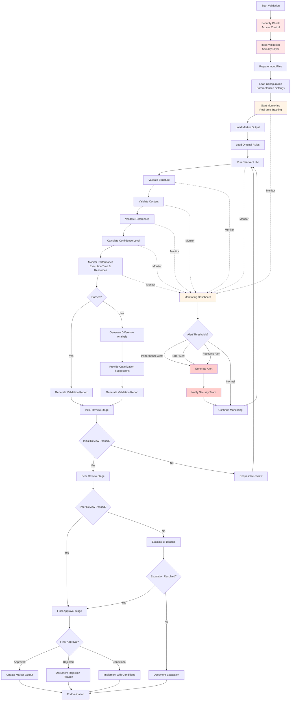
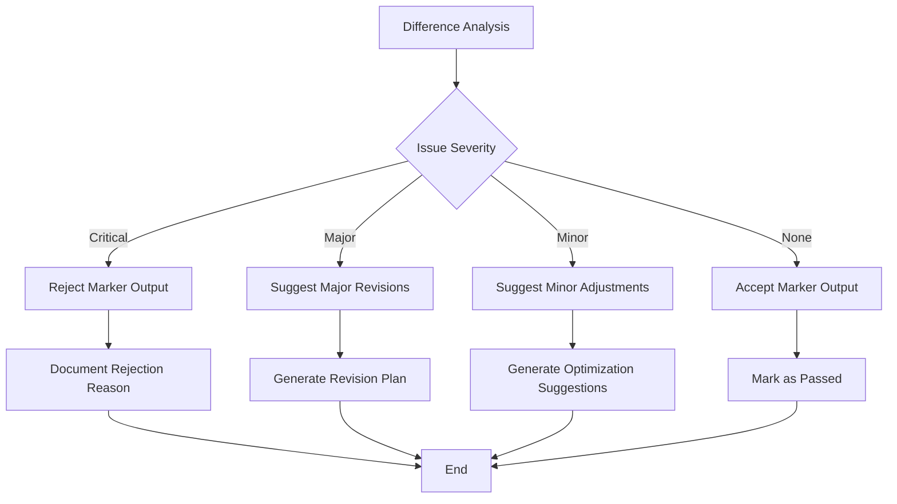
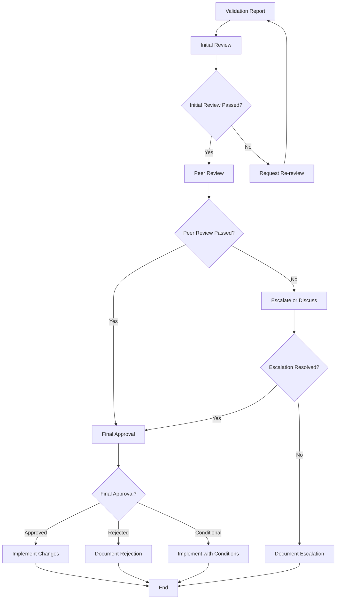
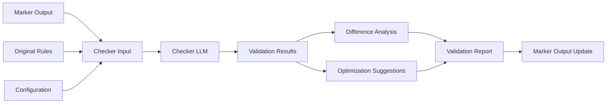

# LLM Checker System - Validation Flowchart

**Version**: 2.0.0
**Last Updated**: 2026-03-18
**Author**: System Administrator

## Overview

This flowchart illustrates the complete validation process of the LLM Checker System, from input preparation to final validation results. This version includes enhanced monitoring, security features, and parameterized configuration capabilities.

## Enhanced System Architecture

The checker system now includes:
- **Real-time Monitoring**: Track execution metrics, performance, and errors
- **Security Layer**: Access control, input validation, and audit logging
- **Parameterized Configuration**: Flexible configuration management
- **Alerting System**: Threshold-based alerts for critical events

## Validation Flow



## Detailed Process Steps

### 1. Input Preparation

- **Marker Output**: Load Prompt 6 (test cases) and Prompt 7 (BDD scenarios) outputs
- **Original Rules**: Load relevant MD files with structured paragraph IDs
- **Configuration**: Load checker configuration settings

### 2. Validation Process

- **Structural Validation**: Check format compliance, required fields, and syntax
- **Content Validation**: Verify rule alignment, parameter validity, and completeness
- **Reference Validation**: Validate rule source references, skill IDs, and test references
- **Confidence Calculation**: Compute confidence level based on validation results

### 3. Analysis and Reporting

- **Passed Outputs**: Generate validation report for successful outputs
- **Failed Outputs**: Generate difference analysis and optimization suggestions
- **Report Generation**: Create comprehensive validation reports

### 4. Review and Action

- **Initial Review**: QA Lead or Business Analyst reviews checker outputs
- **Peer Review**: Senior QA or Technical Lead validates findings
- **Final Approval**: Project Manager or System Owner authorizes implementation
- **Implementation**: Update marker outputs with approved changes
- **Documentation**: Record validation results and decisions

## Decision Points

### Confidence Level Assessment

```mermaid
graph TD
    A[Validation Results] --> B{Confidence Level}
    B -->|High (4-5)| C[Pass - No Changes Needed]
    B -->|Medium (2-3)| D[Pass with Minor Suggestions]
    B -->|Low (0-1)| E[Fail - Major Revisions Needed]
    C --> F[Generate Validation Report]
    D --> G[Generate Report with Suggestions]
    E --> H[Generate Detailed Analysis]
    F --> I[End]
    G --> I
    H --> I
```

### Optimization Decision Flow



### Review Process Flow



## Data Flow



## Validation Criteria

### Structural Validation
- [ ] Test case format compliance
- [ ] BDD scenario Gherkin syntax
- [ ] Required fields presence
- [ ] Relationship mapping integrity

### Content Validation
- [ ] Rule alignment
- [ ] Parameter validity
- [ ] Traceability completeness
- [ ] Language consistency

### Reference Validation
- [ ] Rule source references
- [ ] Skill ID references
- [ ] Test reference consistency
- [ ] Cross-reference validity

## Output Files

- **Validation Report**: `governance/checker/outputs/{prompt}-checker-output.md`
- **Difference Analysis**: `governance/checker/analysis/{prompt}-diff-analysis.md`
- **Optimization Suggestions**: `governance/checker/analysis/{prompt}-optimization.md`

## Conclusion

The validation flowchart provides a visual representation of the complete checker process, from input preparation to final validation results. This structured approach ensures consistent and thorough validation of marker outputs, while preserving passed content and providing targeted optimization suggestions.