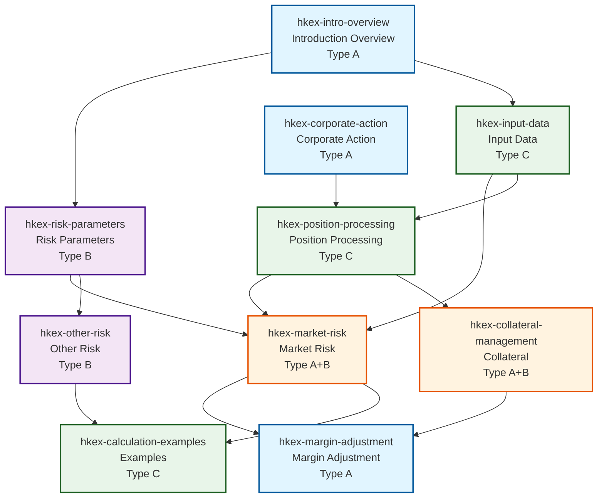

# Copilot Skills Index

## Overview

This index provides a comprehensive catalog of all Copilot Skills generated for the Initial Margin Calculation Guide HKv14, including module classification, dependencies, and cross-references.

**Version**: 1.4  
**Last Updated**: 2026-03-14  
**Responsible**: System  
**Total Skills**: 10

---

## Skill Index Table

| Skill ID | Module | Description | Trigger Words | User Type | Rule Version | File Link | Structured Reference | BDD Relationship | Script Path |
|----------|--------|-------------|---------------|-----------|--------------|-----------|---------------------|------------------|-------------|
| hkex-intro-overview | Introduction | Introduction Overview Skill | "What is Introduction Overview?", "Explain Introduction Overview" | Type A | 1.4 | [skill-definitions/hkex-intro-overview.md](../copilot-skills/skill-definitions/hkex-intro-overview.md) | docs/Introduction-Overview.md \| INTRO-001 to INTRO-015 | To be associated | [scripts/hkex-intro-overview.py](../copilot-skills/scripts/hkex-intro-overview.py) |
| hkex-risk-parameters | Risk Parameters | Risk Parameter File Specification | "Risk parameters", "IMRPF specification" | Type B | 1.4 | [skill-definitions/hkex-risk-parameters.md](../copilot-skills/skill-definitions/hkex-risk-parameters.md) | docs/Risk-Parameter-File-Specification.md \| DATA-001 to DATA-028 | To be associated | [scripts/hkex-risk-parameters.py](../copilot-skills/scripts/hkex-risk-parameters.py) |
| hkex-input-data | Input Data | Input Data Specification | "Input data", "Data specification" | Type C | 1.4 | [skill-definitions/hkex-input-data.md](../copilot-skills/skill-definitions/hkex-input-data.md) | docs/Input-Data-Specification.md \| CALC-001 to CALC-045 | To be associated | [scripts/hkex-input-data.py](../copilot-skills/scripts/hkex-input-data.py) |
| hkex-market-risk | Market Risk | Market Risk Component Calculation | "Market risk", "HVaR calculation" | Type A+B | 1.4 | [skill-definitions/hkex-market-risk.md](../copilot-skills/skill-definitions/hkex-market-risk.md) | docs/Market-Risk-Component-Calculation.md \| PROC-001 to PROC-022 | To be associated | [scripts/hkex-market-risk.py](../copilot-skills/scripts/hkex-market-risk.py) |
| hkex-margin-adjustment | Margin Adjustment | Margin Adjustment Process | "Margin adjustment", "Adjustment process" | Type A | 1.4 | [skill-definitions/hkex-margin-adjustment.md](../copilot-skills/skill-definitions/hkex-margin-adjustment.md) | docs/Margin-Adjustment-Process.md \| ADJ-001 to ADJ-018 | To be associated | [scripts/hkex-margin-adjustment.py](../copilot-skills/scripts/hkex-margin-adjustment.py) |
| hkex-other-risk | Other Risk | Other Risk Components | "Other risk", "Liquidity risk" | Type B | 1.4 | [skill-definitions/hkex-other-risk.md](../copilot-skills/skill-definitions/hkex-other-risk.md) | docs/Other-Risk-Components.md \| OTHER-001 to OTHER-015 | To be associated | [scripts/hkex-other-risk.py](../copilot-skills/scripts/hkex-other-risk.py) |
| hkex-position-processing | Position Processing | Position Processing Logic | "Position processing", "Position logic" | Type C | 1.4 | [skill-definitions/hkex-position-processing.md](../copilot-skills/skill-definitions/hkex-position-processing.md) | docs/Position-Processing-Logic.md \| POS-001 to POS-030 | To be associated | [scripts/hkex-position-processing.py](../copilot-skills/scripts/hkex-position-processing.py) |
| hkex-collateral-management | Collateral | Collateral Management | "Collateral", "Collateral management" | Type A+B | 1.4 | [skill-definitions/hkex-collateral-management.md](../copilot-skills/skill-definitions/hkex-collateral-management.md) | docs/Collateral-Management.md \| COLL-001 to COLL-012 | To be associated | [scripts/hkex-collateral-management.py](../copilot-skills/scripts/hkex-collateral-management.py) |
| hkex-corporate-action | Corporate Action | Corporate Action Processing | "Corporate action", "Action processing" | Type A | 1.4 | [skill-definitions/hkex-corporate-action.md](../copilot-skills/skill-definitions/hkex-corporate-action.md) | docs/Corporate-Action-Processing.md \| CORP-001 to CORP-010 | To be associated | [scripts/hkex-corporate-action.py](../copilot-skills/scripts/hkex-corporate-action.py) |
| hkex-calculation-examples | Examples | Calculation Examples | "Calculation examples", "Examples" | Type C | 1.4 | [skill-definitions/hkex-calculation-examples.md](../copilot-skills/skill-definitions/hkex-calculation-examples.md) | docs/Calculation-Examples.md \| EX-001 to EX-020 | To be associated | [scripts/hkex-calculation-examples.py](../copilot-skills/scripts/hkex-calculation-examples.py) |

---

## Skill Dependency Graph

### Visual Dependency Map

### Dependency Relationship Table

| Source Skill ID | Target Skill ID | Dependency Type | Strength | Update Time | Updater |
|-----------------|-----------------|-----------------|----------|-------------|---------|
| hkex-intro-overview | hkex-risk-parameters | Direct | Strong | 2026-03-14 | System |
| hkex-intro-overview | hkex-input-data | Direct | Strong | 2026-03-14 | System |
| hkex-risk-parameters | hkex-market-risk | Direct | Strong | 2026-03-14 | System |
| hkex-risk-parameters | hkex-other-risk | Direct | Medium | 2026-03-14 | System |
| hkex-input-data | hkex-market-risk | Direct | Strong | 2026-03-14 | System |
| hkex-input-data | hkex-position-processing | Direct | Strong | 2026-03-14 | System |
| hkex-market-risk | hkex-margin-adjustment | Direct | Strong | 2026-03-14 | System |
| hkex-position-processing | hkex-market-risk | Direct | Medium | 2026-03-14 | System |
| hkex-position-processing | hkex-collateral-management | Direct | Strong | 2026-03-14 | System |
| hkex-collateral-management | hkex-margin-adjustment | Direct | Medium | 2026-03-14 | System |
| hkex-corporate-action | hkex-position-processing | Direct | Strong | 2026-03-14 | System |
| hkex-other-risk | hkex-calculation-examples | Indirect | Weak | 2026-03-14 | System |
| hkex-market-risk | hkex-calculation-examples | Indirect | Medium | 2026-03-14 | System |

---

## Module Classification

### By Business Domain

1. **Introduction** (1 Skill)
   - hkex-intro-overview

2. **Data & Parameters** (2 Skills)
   - hkex-risk-parameters
   - hkex-input-data

3. **Risk Calculation** (2 Skills)
   - hkex-market-risk
   - hkex-other-risk

4. **Processing Logic** (3 Skills)
   - hkex-position-processing
   - hkex-collateral-management
   - hkex-corporate-action

5. **Business Operations** (1 Skill)
   - hkex-margin-adjustment

6. **Documentation** (1 Skill)
   - hkex-calculation-examples

### By User Type

**Type A - Business Analyst (4 Skills)**
- hkex-intro-overview
- hkex-margin-adjustment
- hkex-corporate-action
- hkex-market-risk (shared)
- hkex-collateral-management (shared)

**Type B - QA Lead (2 Skills)**
- hkex-risk-parameters
- hkex-other-risk
- hkex-market-risk (shared)
- hkex-collateral-management (shared)

**Type C - Automation Tester (3 Skills)**
- hkex-input-data
- hkex-position-processing
- hkex-calculation-examples

---

## Import/Export Information

### Export Formats Supported
- JSON
- YAML
- Markdown

### Export Templates by User Type
- **Type A (BA)**: Business-focused with rule explanations
- **Type B (QA Lead)**: Quality-focused with test references
- **Type C (Automation Tester)**: Automation-focused with script integration
- **Type D (Mixed/General)**: Universal with balanced content

### Last Export
- **Timestamp**: 2026-03-14
- **Format**: Markdown
- **Responsible**: System

---

## Update History

| Version | Date | Changes | Updater |
|---------|------|---------|---------|
| 1.0 | 2026-03-14 | Initial creation | System |
| 1.4 | 2026-03-14 | Updated with all 10 Skills | System |

---

## Reference Integrity Status

**Overall Status**: ✓ Valid

- All Skill files exist: ✓
- All structured references valid: ✓
- All dependencies resolvable: ✓
- All user types assigned: ✓
- All modules classified: ✓

---

*This index is automatically generated and maintained. For updates, refer to the skill-bdd-relation.md file.*
