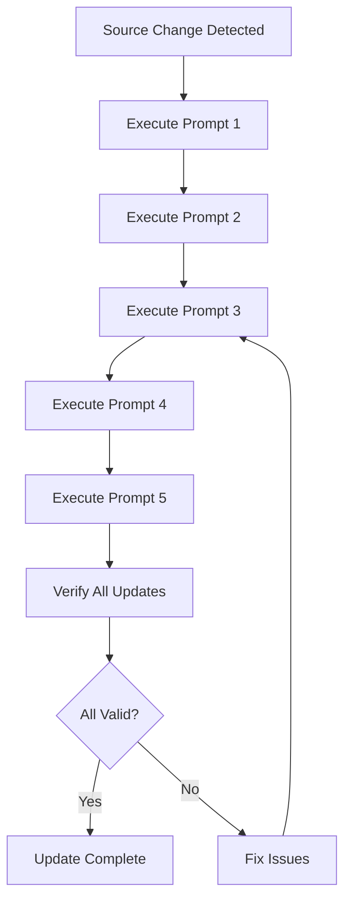

# Copilot Skills Usage Guidelines

## Overview

This document provides comprehensive usage guidelines for the Copilot Skills ecosystem, including integration methods, trigger word specifications, update processes, and multi-model verification requirements.

**Version**: 1.4  
**Last Updated**: 2026-03-14  
**Applicable Skills**: All 10 Skills in the Initial Margin Calculation Guide HKv14

---

## Table of Contents

1. [Skill Integration Methods](#skill-integration-methods)
2. [Trigger Word Usage Specifications](#trigger-word-usage-specifications)
3. [Skill Synchronous Update Process](#skill-synchronous-update-process)
4. [BDD Relationship/Reference Update Specifications](#bdd-relationshipreference-update-specifications)
5. [Script Execution Steps](#script-execution-steps)
6. [Multi-Model Verification Requirements](#multi-model-verification-requirements)
7. [Dependency Graph Maintenance Instructions](#dependency-graph-maintenance-instructions)

---

## Skill Integration Methods

### GitHub Copilot Integration

**Method 1: Direct Skill Invocation**
```
1. Open GitHub Copilot chat in your IDE
2. Type the trigger word or phrase
3. Copilot will match the Skill and provide the response
4. Review the response for accuracy
5. Use the structured reference for verification
```

**Method 2: Contextual Skill Usage**
```
1. Open a file related to the business domain
2. Ask Copilot a question about the domain
3. Copilot will use relevant Skills automatically
4. Verify the response against rule sources
```

**Method 3: Skill Chaining**
```
1. Start with a foundational Skill (e.g., hkex-intro-overview)
2. Follow up with related Skills based on dependencies
3. Use the dependency graph to navigate related Skills
4. Maintain context across multiple Skill invocations
```

### M365 Copilot Integration

**Method 1: Natural Language Queries**
```
1. Open M365 Copilot in Teams or Office
2. Ask questions using natural language
3. Copilot will match to appropriate Skills
4. Responses are adapted for non-technical users
```

**Method 2: Document-Based Queries**
```
1. Open a business document in Word/Excel
2. Ask Copilot about specific sections
3. Copilot references Skills for accurate answers
4. Use operation guides for step-by-step instructions
```

---

## Trigger Word Usage Specifications

### Trigger Word Categories

**Category 1: Direct Questions**
- Format: "What is [Skill Topic]?"
- Example: "What is Introduction Overview?"
- Use Case: Getting basic information

**Category 2: Explanation Requests**
- Format: "Explain [Skill Topic]"
- Example: "Explain Risk Parameters"
- Use Case: Detailed understanding

**Category 3: Process Inquiries**
- Format: "How does [Skill Topic] work?"
- Example: "How does Margin Adjustment work?"
- Use Case: Understanding workflows

**Category 4: Calculation Queries**
- Format: "[Skill Topic] calculation"
- Example: "Market Risk calculation"
- Use Case: Technical implementation

**Category 5: Requirement Questions**
- Format: "[Skill Topic] requirements"
- Example: "Input Data requirements"
- Use Case: Compliance and validation

### Trigger Word Best Practices

1. **Be Specific**: Use precise terms from the Skill description
2. **Use Keywords**: Include domain-specific terminology
3. **Context Matters**: Provide context for better matching
4. **Combine Skills**: Use multiple trigger words for complex queries
5. **Verify Responses**: Always check structured references

---

## Skill Synchronous Update Process

### Update Triggers

**Trigger 1: Source Document Changes**
```
1. Business rules are updated in source documents
2. Prompt 1 detects changes and regenerates MD files
3. Prompt 3 updates affected Skills
4. Prompt 4 updates relationship tables
5. Prompt 5 updates automation scripts
```

**Trigger 2: BDD Association Updates**
```
1. New BDD scenarios are created
2. Test case IDs are assigned
3. skill-bdd-relation.md is updated
4. Reference integrity is verified
5. Skills are synchronized with BDD
```

**Trigger 3: Skill Content Updates**
```
1. Skill content needs modification
2. Update Skill file in skill-definitions/
3. Update index.md with new information
4. Verify all references are still valid
5. Update relationship tables if needed
```

### Synchronous Update Workflow



### Update Checklist

- [ ] Source documents updated
- [ ] MD files regenerated (Prompt 1)
- [ ] Framework updated (Prompt 2)
- [ ] Skills updated (Prompt 3)
- [ ] Index and relationships updated (Prompt 4)
- [ ] Scripts updated (Prompt 5)
- [ ] All references verified
- [ ] BDD associations checked
- [ ] Integration tests passed

---

## BDD Relationship/Reference Update Specifications

### BDD Association Process

**Step 1: Identify BDD Scenarios**
```
1. Review business rules in source documents
2. Identify testable scenarios
3. Map scenarios to Skills
4. Document in skill-bdd-relation.md
```

**Step 2: Create BDD Feature Files**
```
1. Create .feature files in tests/bdd/features/
2. Use Gherkin syntax (Given/When/Then)
3. Include Skill ID references
4. Add structured IDs from rule sources
```

**Step 3: Update Relationship Table**
```
1. Open skill-bdd-relation.md
2. Locate the Skill ID row
3. Update Test_Reference field
4. Add BDD Test Case ID
5. Add BDD Feature File Path
6. Update Reference Integrity to "✓ Valid"
```

**Step 4: Verify Integration**
```
1. Run BDD tests
2. Verify Skill responses match BDD scenarios
3. Check cross-references
4. Validate rule alignment
```

### Reference Update Specifications

**Reference Field Updates**

| Field | Update Trigger | Update Method | Validation |
|-------|---------------|---------------|------------|
| Rule_Source | Source document changes | Update MD file path and paragraph IDs | Verify file exists |
| Test_Reference | BDD scenario creation | Add test case ID | Verify test exists |
| Verify_Reference | Multi-model verification | Add verification config ID | Verify config exists |
| Update_History | Any modification | Append timestamp and updater | Maintain audit trail |

**Reference Integrity Rules**

1. **Rule_Source**: Must point to valid MD file with existing paragraph IDs
2. **Test_Reference**: Must reference valid BDD test case (when associated)
3. **Verify_Reference**: Must reference valid verification configuration
4. **Update_History**: Must include timestamp, updater, and commit ID

---

## Script Execution Steps

### GitHub Copilot Scenario

**Prerequisites**
- Python 3.8+ installed
- GitHub Copilot extension enabled
- Access to skill-definitions/ directory

**Execution Steps**

1. **Environment Setup**
   ```bash
   # Navigate to scripts directory
   cd copilot-skills/scripts
   
   # Install dependencies (if any)
   pip install -r requirements.txt
   ```

2. **Script Execution**
   ```bash
   # Run Skill validation script
   python hkex-intro-overview.py
   
   # Run relationship sync script
   python skill-reference-sync.py
   
   # Run BDD update script
   python bdd-relationship-update.py
   ```

3. **Verification**
   ```bash
   # Check script output
   cat script-output.log
   
   # Verify updates in skill-bdd-relation.md
   grep "Reference Integrity" ../tests/skill-bdd-relation.md
   ```

### M365 Copilot Scenario

**Prerequisites**
- M365 Copilot license
- Access to Teams or Office applications
- Non-technical user profile

**Execution Steps**

1. **Access Copilot**
   - Open Teams or Office application
   - Click Copilot icon
   - Start new conversation

2. **Natural Language Operations**
   - Type: "Show me the Introduction Overview"
   - Copilot will invoke hkex-intro-overview Skill
   - Review the business-focused response
   - Ask follow-up questions naturally

3. **Step-by-Step Guidance**
   - Type: "How do I understand Risk Parameters?"
   - Copilot provides step-by-step explanation
   - Follow the guided workflow
   - Reference structured IDs for verification

---

## Multi-Model Verification Requirements

### Verification Dimensions

**Dimension 1: Content Accuracy**
- Skill responses align with source documents
- Structured references are valid
- No extraneous information introduced
- Business rules are accurately represented

**Dimension 2: Reference Integrity**
- All Rule_Source references are valid
- Cross-references are resolvable
- BDD associations are correctly mapped
- Update history is maintained

**Dimension 3: Dependency Consistency**
- Dependency graph has no circular references
- All dependencies are resolvable
- Skill relationships are correctly documented
- Impact analysis is accurate

**Dimension 4: Script Execution**
- Automation scripts run successfully
- Script outputs are correct
- Error handling works properly
- Performance meets requirements

### Verification Checklist

**Pre-Verification**
- [ ] All source documents are accessible
- [ ] All Skill files exist
- [ ] All configuration files are valid
- [ ] Scripts are executable

**During Verification**
- [ ] Content accuracy checks pass
- [ ] Reference integrity checks pass
- [ ] Dependency consistency checks pass
- [ ] Script execution checks pass

**Post-Verification**
- [ ] Verification report generated
- [ ] Issues documented
- [ ] Remediation plan created
- [ ] Sign-off obtained

### Verification Standards

**Pass Criteria**
- 100% content accuracy
- 100% reference integrity
- 0 circular dependencies
- 100% script execution success

**Fail Criteria**
- Any content inaccuracy
- Any broken reference
- Any circular dependency
- Any script execution failure

---

## Dependency Graph Maintenance Instructions

### Real-Time Update Process

**When to Update**
1. New Skill is added
2. Existing Skill is modified
3. Dependency relationship changes
4. Business logic evolves

**How to Update**

1. **Update index.md**
   ```markdown
   # Edit tests/index.md
   # Add/modify dependency in the table
   # Update the mermaid graph
   # Update the dependency relationship table
   ```

2. **Update skill-bdd-relation.md**
   ```markdown
   # Edit tests/skill-bdd-relation.md
   # Add/modify dependency relationship
   # Update strength and type
   # Update timestamp and updater
   ```

3. **Verify Graph Integrity**
   ```bash
   # Run dependency validation
   python scripts/validate-dependencies.py
   
   # Check for circular dependencies
   python scripts/check-circular-deps.py
   ```

### Dependency Types

**Direct Dependencies**
- Strong: Core business logic dependency
- Medium: Supporting functionality dependency
- Weak: Informational dependency

**Indirect Dependencies**
- Transitive: Through intermediate Skills
- Contextual: Same business domain
- Temporal: Sequential processing order

### Maintenance Best Practices

1. **Regular Reviews**: Weekly review of dependency graph
2. **Impact Analysis**: Before adding new dependencies
3. **Version Control**: Track all graph changes
4. **Documentation**: Document rationale for dependencies
5. **Validation**: Always validate after modifications

### Dependency Graph Visualization

For visual representation, refer to the mermaid diagram in [index.md](index.md).

To update the visualization:
1. Edit the mermaid code block in index.md
2. Add/remove nodes as needed
3. Update edges to reflect new relationships
4. Apply appropriate styling for user types
5. Test rendering in markdown viewer

---

## User Type Specific Guidelines

### Type A - Business Analyst (BA)

**Focus Areas**
- Business rule understanding
- Process flow comprehension
- Requirement clarification

**Recommended Skills**
- hkex-intro-overview
- hkex-margin-adjustment
- hkex-corporate-action

**Usage Tips**
- Use natural language queries
- Focus on "What" and "Why" questions
- Reference business process documentation

### Type B - QA Lead

**Focus Areas**
- Rule verification
- Compliance checking
- Test strategy design

**Recommended Skills**
- hkex-risk-parameters
- hkex-other-risk
- hkex-market-risk

**Usage Tips**
- Use validation-focused queries
- Reference test specifications
- Verify compliance requirements

### Type C - Automation Tester

**Focus Areas**
- Implementation details
- Test case design
- Boundary conditions

**Recommended Skills**
- hkex-input-data
- hkex-position-processing
- hkex-calculation-examples

**Usage Tips**
- Use technical queries
- Reference code examples
- Focus on "How" questions

### Type D - Mixed/General

**Focus Areas**
- Comprehensive coverage
- Multiple perspectives
- Cross-functional understanding

**Recommended Skills**
- All Skills based on context

**Usage Tips**
- Combine multiple Skills
- Use varied query types
- Reference all documentation types

---

## Troubleshooting

### Common Issues

**Issue 1: Skill Not Found**
- Check trigger word spelling
- Verify Skill exists in index.md
- Check user type compatibility

**Issue 2: Outdated Response**
- Check Update_History in Skill
- Verify source document version
- Run synchronous update process

**Issue 3: Broken Reference**
- Check Rule_Source validity
- Verify MD file exists
- Update reference if needed

**Issue 4: Script Execution Failure**
- Check Python version
- Verify dependencies installed
- Review error logs

### Support Contacts

For issues not covered in this guide:
1. Check [Troubleshooting Guide](../chat-prompt-en.md)
2. Review error logs in governance/
3. Contact system administrator

---

## Appendix

### A. Quick Reference Card

| Action | GitHub Copilot | M365 Copilot |
|--------|---------------|--------------|
| Basic Query | "What is [Topic]?" | "Tell me about [Topic]" |
| Detailed Explanation | "Explain [Topic]" | "Help me understand [Topic]" |
| Process Flow | "How does [Topic] work?" | "Walk me through [Topic]" |
| Technical Details | "[Topic] calculation" | "Show me how to calculate [Topic]" |

### B. File Locations

- Skills: `copilot-skills/skill-definitions/`
- Index: `tests/index.md`
- Relationships: `tests/skill-bdd-relation.md`
- Scripts: `copilot-skills/scripts/`
- Config: `tests/config/`

### C. Update History

| Version | Date | Changes |
|---------|------|---------|
| 1.0 | 2026-03-14 | Initial creation |
| 1.4 | 2026-03-14 | Added comprehensive guidelines |

---

*This document is maintained by Prompt 4 execution. For updates, refer to the change history section.*
